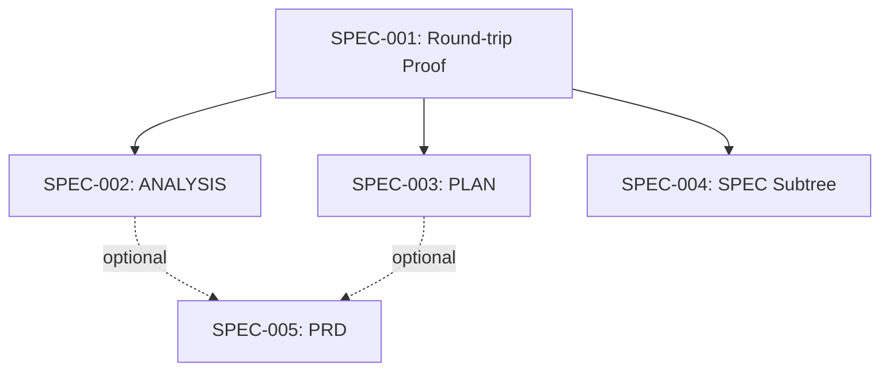

# PLAN-001: Composition Library Build-Out

## Scope

This plan tracks the parallel build-out of the composition library across multiple
specs. SPEC-001 establishes the round-trip proof, SPEC-002 ports the ANALYSIS adapter,
SPEC-003 adds the PLAN adapter with regenerated-section semantics, and SPEC-004
adds the SPEC subtree adapter. Each spec ships independently behind its own merge
gate.

## Phase Progression

- [x] build.SPEC-001 — DONE (round-trip PROOF passing)
- [x] build.SPEC-002 — DONE (ANALYSIS adapter ported)
- [ ] build.SPEC-003 — IN_PROGRESS (PLAN adapter, 4/5 tasks done)
- [ ] build.SPEC-004 — IN_PROGRESS (SPEC subtree adapter)

## Progress Dashboard

| SPEC     | Status      | Tasks | Tests | Notes                  |
| -------- | ----------- | ----- | ----- | ---------------------- |
| SPEC-001 | DONE        | 8/8   | 100%  | PROOF baseline         |
| SPEC-002 | DONE        | 4/4   | 100%  | ANALYSIS done          |
| SPEC-003 | IN_PROGRESS | 4/5   | 90%   | PLAN adapter (this)    |
| SPEC-004 | IN_PROGRESS | 3/5   | 75%   | SPEC subtree adapter   |

## Cross-Part Dependency Graph

## Build Parts

### build.SPEC-001: Composition Library Round-Trip Proof

The foundation. Establishes BaseMarkdownAdapter, AdrAdapter, round-trip property
tests, atomic-write primitives, and the Zod plan schemas. All downstream specs
depend on the contracts locked here.

### build.SPEC-002: ANALYSIS Adapter

Ports the BaseMarkdownAdapter for ANALYSIS index notes. Extends the discriminated
union in `schemas/index.ts` with the `analysis` source_type.

### build.SPEC-003: PLAN Adapter

DISTINCT from BaseMarkdownAdapter — PLAN notes contain regenerated sections
(Progress Dashboard, Cross-Part Dependency Graph) that are excluded from hash
identity. Adds 50% integrity floor enforcement on reverseMutations.

### build.SPEC-004: SPEC Subtree Adapter

Handles SPEC parent notes plus their REQ/DESIGN/TASK children as a single
extraction unit. Per-child mutations + parent-level rollup propagation.

## Observations

- [decision] PLAN adapter is DISTINCT, not extending BaseMarkdownAdapter #architecture #plan-adapter
- [decision] Regenerated sections are listed by heading text, not line range #plan-adapter
- [decision] 50% integrity floor is the recompose safety net #correctness
- [fact] 4 specs ship in parallel under PLAN-001 #parallelism
- [constraint] PLAN frontmatter_map is forward-only — inverse requires explicit spec #plan-adapter
- [insight] Progress Dashboard derives from the Tasks tables; never edit it by hand #derived-views

## Relations

- contains [[SPEC-001: Composition Library Round-Trip Proof]]
- contains [[SPEC-002: ANALYSIS Adapter]]
- contains [[SPEC-003: PLAN Adapter]]
- contains [[SPEC-004: SPEC Subtree Adapter]]
- implements [[ADR-001: Composition Library Architecture]]
- depends_on [[ANALYSIS-001: Multi-Adapter Round-Trip Strategy]]
