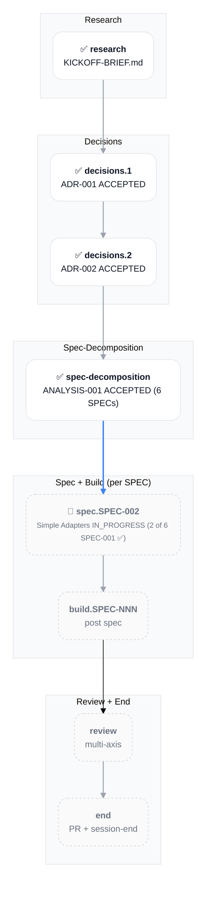
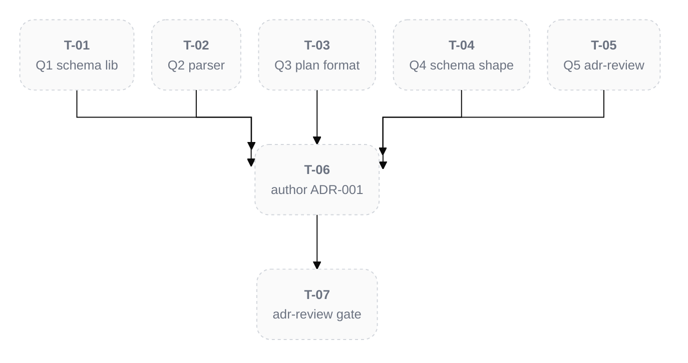
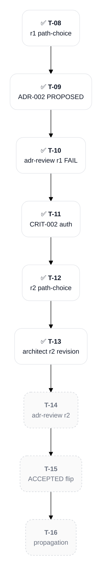

# PLAN-001: Skills Ecosystem

## Scope

Build a zero-content-drift restructuring capability for Brain knowledge-graph notes via a deterministic composition library (Bun + TS) plus four Claude Code skills (/ingest, /decompose, /recompose, /defrag). Workflow Type: Standard Development with Strategic Decision sub-flow for the architectural ADRs. Scope spans 5 per-type adapters (~1,200 LOC total) with SHA-256 char-identity hash validation as a BLOCKING invariant. Agent Sequence: orchestrator → architect (decisions.1 + decisions.2) → analyst (spec-decomposition clustering) → bun-ts-engineer (build) → qa (per-spec coverage gate) → review → end. Complexity: TIER_4. Risk: HIGH — the bootstrapping incident (3,680-line ADR split with 35% content drift on 10/12 D-Ns) is the explicit reason this work exists; the entire architecture exists to make a recurrence mathematically impossible via round-trip property testing.

**Source**: see `KICKOFF-BRIEF.md` in the project root for full background, locked design decisions (8 items), build order, LLM-script division of labor, and the 5 open design questions awaiting adjudication in decisions.1.

## Objectives

- [ ] Composition library at `_shared/composition/` produces SHA-256 char-identity verified decompose/recompose for the ADR adapter (PROOF)
- [ ] Round-trip property test (decompose ∘ recompose = identity on SHA-256) passes for ADR adapter
- [ ] /decompose and /recompose skills operational against ADR notes
- [ ] All 5 adapters (ADR, ANALYSIS, SESSION, PLAN, SPEC subtree) ship with passing round-trip tests
- [ ] /defrag skill operates as periodic curator delegating to /decompose + /recompose
- [ ] /ingest skill ships as Brain-aware variant of memory-ingest with verbatim source preservation
- [ ] Skills installed via symlinks at `~/.claude/skills/<name>` → `~/Dev/skills/<name>`
- [ ] Zero net-new content drift detected in any test fixture or production note touched by the skills

## Progress Dashboard

| Phase | DRAFT | IN_PROGRESS | BLOCKED | DONE | Total |
|:--|:--|:--|:--|:--|:--|
| research | 0 | 0 | 0 | 1 | 1 |
| decisions | 0 | 0 | 0 | 2 | 2 |
| spec-decomposition | 0 | 0 | 0 | 1 | 1 |
| spec.SPEC-NNN | 4 | 1 | 0 | 1 | 6 |
| build.SPEC-NNN | 0 | 0 | 0 | 0 | 0 (created post per-spec spec phase) |
| review | 1 | 0 | 0 | 0 | 1 |
| end | 1 | 0 | 0 | 0 | 1 |
| **Total visible** | **6** | **1** | **0** | **5** | **12** |

## Workflow Plan

Research → decisions (×2 ADRs) → spec-decomposition → per-SPEC spec + build cycles → review → end. Research is short-circuited: the user provided `KICKOFF-BRIEF.md` (a comprehensive PRD-equivalent with locked architectural decisions, build order, and 5 open questions) which substitutes for the analyst-dispatch /research output per explicit user direction.

Heavy /plan create dispatches (analyst first-principles + pre-mortem + critic) were SKIPPED for the bootstrap turn — KICKOFF-BRIEF.md contains baked-in first-principles answers, an explicit post-mortem of the prior drift incident, and an explicit critique target via the 5 open questions adjudicated in Step 5 AskUserQuestion. Per the iterative-phase-reentry rule, validation phases can re-enter if gaps surface during decisions.1 adjudication.

Per-part workflow detail lives in each per-part H3 below.

## Phase Progression

| Phase | Status | Output Artifact |
|:--|:--|:--|
| research | DONE | `KICKOFF-BRIEF.md` (project root file; not a Brain note) |
| decisions.1 | DONE | [[ADR-001: Composition Library Architecture]] |
| decisions.2 | DONE | [[ADR-002: Adapter Contract and Plan Schema]] |
| spec-decomposition | DONE | [[ANALYSIS-001: SPEC Clustering]] |
| spec.SPEC-001 | DONE | [[SPEC-001: Composition Core and ADR Adapter]] (ACCEPTED; ADR coverage + Gate A + Gate B all PASS) |
| spec.SPEC-002 | IN_PROGRESS | SPEC-002 root + subtree (Simple Adapters: ANALYSIS + SESSION; /spec Stage 2 auto-routed this turn) |
| spec.SPEC-003 | READY | SPEC-003 root + subtree (PLAN Adapter; regenerative content carve-out) |
| spec.SPEC-004 | READY | SPEC-004 root + subtree (SPEC Subtree Adapter) |
| spec.SPEC-005 | READY | SPEC-005 root + subtree (Decompose and Recompose Skills) |
| spec.SPEC-006 | READY | SPEC-006 root + subtree (Defrag and Ingest Skills) |
| build.SPEC-NNN | PENDING | per-SPEC implementation + tests + commits (created post per-spec spec phase) |
| review | PENDING | adversarial multi-axis review across feature surface |
| end | PENDING | PR + final session-end checklist |

## Cross-Part Dependency Graph

## Decision Log

- **2026-05-19** — PLAN-001 created via /plan create with `--name skills-ecosystem`. Branch `feat/plan-001-skills-ecosystem` was pre-created during bootstrap Step 1; /plan honored the existing non-main branch per skill branch policy.
- **2026-05-19** — research part marked DONE upfront with `KICKOFF-BRIEF.md` (project root file) as outcome reference (file-path, not wikilink — the brief is a project-config file under the binary-rule, not a Brain note). Justification: user explicitly directed "skip /research dispatch — KICKOFF-BRIEF.md IS the research output". Deviation from outcome-wikilink convention documented here.
- **2026-05-19** — Heavy /plan create dispatches (analyst first-principles + pre-mortem + critic) were SKIPPED for the bootstrap turn. KICKOFF-BRIEF.md contains baked-in first-principles answers, an explicit post-mortem of the prior drift incident, and an explicit critique target via the 5 open questions adjudicated in Step 5 AskUserQuestion. Per the iterative-phase-reentry rule, validation phases can re-enter if gaps surface during decisions.1 adjudication or later.
- **2026-05-19** — complexity_tier set to TIER_4 (multi-skill ecosystem ~1,200 LOC across 5 adapters + 4 skills + composition library with cryptographic invariant). Re-evaluate at spec-decomposition if SPEC count exceeds 6.
- **2026-05-19** — Q1-Q5 of decisions.1 LOCKED via AskUserQuestion (all Recommended options selected). D-1 Zod for plan validation; D-2 unified + remark + remark-frontmatter for markdown AST; D-3 YAML at docs/_restructure/*.yaml for plan files; D-4 unified discriminated union on source_type for plan schema; D-5 YES — /brain:---adr-review BLOCKING gate before ACCEPTED. DoD checkboxes Q1-Q5 checked; D-N substatus table updated. ADR-001 authoring unblocked; awaiting user confirmation per bootstrap pause directive.
- **2026-05-19** — decisions.1 DONE. ADR-001 ACCEPTED at decisions/ADR-001-composition-library-architecture.md after brain:---adr-review Phase 4 convergence PASS round 1 (5 ACCEPT + 1 D&C + 0 BLOCK). P1 themes 1-4 resolved in-ADR refinement (hash protocol formal spec + rollback mechanism + security hardening + LOC scope); P1 themes 5-6 deferred with rationale + quantitative revisit triggers in CRIT-001-ADR-001 debate log. decisions.2 transitioned PENDING → READY.
- **2026-05-19** — decisions.2 IN_PROGRESS. Path-choice: architect direct authoring (no per-D-N AskUserQuestion adjudication) selected via AskUserQuestion. ADR-002 PROPOSED authored at decisions/ADR-002-adapter-contract-and-plan-schema.md (548 lines, 5 D-N design sections — Plan YAML schema, Adapter interface, Capability matrix, Hash extraction strategies, Validator structure).
- **2026-05-19** — ADR-002 round-1 brain:---adr-review FAIL (3 ACCEPT + 3 CONCERNS + 0 BLOCK; below ≥5 ACCEPT threshold). 12 raw P1 findings deduplicated to 10 themes A-J (interface gaps + schema gaps + security refinements + pattern guidance). CRIT-002-ADR-002 authored. Round-2 resolution path-choice: re-dispatch architect with consolidated revision brief (selected via AskUserQuestion).
- **2026-05-19** — ADR-002 round-2 architect revision applied. 10 P1 themes A-J resolved in-ADR: P1-A MutationSpec frontmatter_map; P1-B cross_source_updates Zod shape; P1-C SPEC subtree manifest Zod shape; P1-D nested discriminatedUnion plan_type × source_type; P1-E JSDoc adapter call sequence; P1-F regenerated_sections declarative + 50% integrity floor; P1-G containedPathSchema realpath + path.sep; P1-H injectivity key-value domain disjointness; P1-I hash extracted to shared utility (5-method interface); P1-J BaseMarkdownAdapter pattern documented. ADR-002 line count 548 → 865 (+317 lines, +58%). Status PROPOSED pending round-2 brain:---adr-review re-verification.
- **2026-05-19** — decisions.2 DONE. ADR-002 ACCEPTED at decisions/ADR-002-adapter-contract-and-plan-schema.md after brain:---adr-review Phase 4 convergence PASS round 2 unanimous (6 ACCEPT + 0 CONCERNS + 0 BLOCK + 0 P0 + 0 NEW P1/P2). All 10 round-1 P1 themes A-J confirmed resolved per CRIT-002 Round 2 outcome section. CONCERNS-issuing reviewers from round 1 (critic + security + analyst) all converted to ACCEPT verdict. spec-decomposition transitioned PENDING → READY (decisions.2 dependency now DONE).
- **2026-05-19** — spec-decomposition transitioned READY → IN_PROGRESS (continuation invocation of /plan PLAN-001). Owning session bound to SESSION-2026-05-19_01. Auto-routing to /spec Stage 1 (Contract 2 dispatch shape with source_adrs ADR-001 + ADR-002 — both ACCEPTED architectural ADRs).
- **2026-05-19** — /spec Stage 1 complete. ANALYSIS-001 SPEC Clustering authored by brain:🧠-analyst (Step 1+2; 5-SPEC initial proposal). CVA executed inline (Step 3; validated BaseMarkdownAdapter pattern per ADR-002 D-3; no new abstractions). brain:🧠-critic dispatched (Step 4; ACCEPT verdict + SPEC-003 SPLIT recommendation + 2 P1 amendments). decision-critic stress-test inline (Step 4; SPEC-003 split surfacing recommended). AskUserQuestion adjudication (Step 5; user chose 6 SPECs with SPEC-003 split). spec-decomposition substatus IN_PROGRESS → DONE; outcome ANALYSIS-001 (ACCEPTED). 6 spec.SPEC-NNN parts added to PLAN under new ## Spec phase (Step 6); all READY (dependency spec-decomposition DONE).

## Progress Log

- **2026-05-19** — Bootstrap session started. Branch + docs/ subtree created (Step 1). Brain MCP project created and activated (Step 2). `KICKOFF-BRIEF.md` written verbatim (Step 3). PLAN-001 authored (Step 4). Pending: 5 open design question adjudication via AskUserQuestion (Step 5).
- **2026-05-19** — Step 5 complete: 5 open design questions adjudicated via AskUserQuestion (Q1-Q4 batched + Q5 follow-up). All Recommended options selected. PLAN updated with locked decisions in DoD checkboxes + D-N substatus table + Decision Log. Paused per bootstrap directive; ready to proceed to ADR-001 authoring via brain:🧠-architect dispatch + brain:---adr-review BLOCKING gate on user confirmation.
- **2026-05-19** — Step 6 (decisions.1 ADR-001 ACCEPTED) complete: /decisions Steps 5-9 executed (architect dispatch + detail-parity audit + 6-agent adr-review debate + Phase 3 P1 resolutions + CRIT authoring + ACCEPTED flip + state propagation). ADR-001 at decisions/ADR-001-composition-library-architecture.md (501 lines after Phase 3 refinements). decisions.2 READY; next-ready part on resume.
- **2026-05-19** — decisions.2 IN_PROGRESS (continuation invocation of /plan PLAN-001). Owning session bound to SESSION-2026-05-19_01. Path-choice + ADR-002 PROPOSED + round-1 adr-review FAIL + CRIT-002 auth + round-2 architect revision all completed this turn; per the user's critical state-propagation rule applied this turn — PLAN-001 sections fully propagated (Progress Dashboard decisions row IP 0→1; Phase Progression decisions.2 IN_PROGRESS; decisions.2 H3 subsections Workflow Plan / Tasks / Intra-part Deps Graph / D-N substatus list / Editor Mirror IDs / Pending User Decisions all updated; DoD checkboxes 4 of 6 flipped [x]; Cross-Part Deps Graph d1+d2 class updates).
- **2026-05-19** — decisions.2 closed out via /decisions Steps 7-9: brain:---adr-review round-2 dispatch (6 parallel reviewers) → all ACCEPT unanimous → ADR-002 ACCEPTED flip → decisions.2 IN_PROGRESS → DONE + completing_session bound + outcome wikilink. CRIT-002 Round 2 outcome section appended with R1→R2 verdict transitions + 12/12 P1 resolution confirmation. PLAN-001 comprehensive propagation applied same turn per user's critical rule (Progress Dashboard decisions row DONE 2/2; Phase Progression decisions.2 DONE + spec-decomposition READY; Cross-Part Deps Graph d2 ✅; decisions.2 H3 + DoD + Tasks + Pending User Decisions all updated; spec-decomposition H3 + substatus transitioned READY). Decisions phase fully complete; next-ready part is spec-decomposition.
- **2026-05-19** — spec-decomposition IN_PROGRESS (continuation invocation of /plan PLAN-001). Auto-routing to /spec Stage 1 with source_adrs=ADR-001 + ADR-002 (both ACCEPTED). Expected Stage 1 output: analyst-proposed SPEC clustering + conditional CVA + user adjudication via AskUserQuestion locking 4-6 SPEC clusters aligned to KICKOFF-BRIEF.md build order.
- **2026-05-19** — spec-decomposition DONE. /spec Stage 1 closed out (Steps 1-7 executed): analyst dispatch → ANALYSIS-001 5-SPEC proposal; CVA + critic + decision-critic review; AskUserQuestion locked 6 SPECs (SPEC-003 split applied per critic recommendation); /plan added 6 spec.SPEC-NNN parts under new ## Spec H2; set-part-done outcome ANALYSIS-001 (ACCEPTED). Next-ready parts: spec.SPEC-001 through spec.SPEC-006 all READY simultaneously. User picks first SPEC to author via /plan continue invocation (multiple READY parts → AskUserQuestion).
- **2026-05-19** — spec.SPEC-001 IN_PROGRESS. User selected SPEC-001 Composition Core and ADR Adapter (PROOF) via AskUserQuestion (Recommended default per /plan lowest-numbered rule + KICKOFF-BRIEF.md build order). Auto-routing to /spec Stage 2 to author SPEC-001 subtree (REQ → DESIGN → TASK → SPEC root).
- **2026-05-19** — /spec Stage 2 Steps 1-6 complete. brain:🧠-architect dispatch authored SPEC-001 subtree (21 notes 8 REQ + 3 DESIGN + 9 TASK + 1 SPEC root; 2012 lines total; Pattern 2 three-phase write for each; bi-directional relations added to ADR-001 + ADR-002 + ANALYSIS-001). Per user critical-rule directive on standards inline-ness, compliance audit ran post-dispatch; 20 notes had `type: note` drift (per CONVENTIONS Section 3 forbidden generic type) corrected to canonical types (requirement / design / task). Verified Observations min 3, Relations min 2, final-two-sections invariant, status + effort + estimate fields, ADR coverage gate (both ACCEPTED ADRs have implemented_by SPEC-001). Stage 2 Steps 7-10 pending Gate A semantic gap + Gate B 4 binary drift checks before set-part-done.
- **2026-05-19** — spec.SPEC-001 DONE. /spec Stage 2 fully closed out (Steps 7-10): Gate A semantic gap analysis PASS (6 of 8 REQs VERIFIABLE; 2 REQs refined per NEEDS_REFINEMENT findings — REQ-002 extractByRange boundary semantics clarified, REQ-007 heading-inclusion convention specified); Gate B 4 binary drift checks all PASS (REQ-to-ADR + scope conservation + TASK-to-REQ + Scope-In match; no P1 issues from critic); SPEC-001 root born ACCEPTED per /spec invariant; set-part-done executed inline (substatus IN_PROGRESS → DONE; outcome wikilink resolved; completing_session bound). spec.SPEC-002..SPEC-006 remain READY simultaneously for /plan continue invocation.
- **2026-05-19** — spec.SPEC-002 IN_PROGRESS (user selected SPEC-002 Simple Adapters via AskUserQuestion per /plan lowest-numbered rule). Owning session bound. Auto-routing to /spec Stage 2 (Contract 2 dispatch with spec=SPEC-002 source_adrs=ADR-001 + ADR-002 source_clustering=ANALYSIS-001 + source_proof=SPEC-001 BaseMarkdownAdapter).

## Blockers

None. Awaiting user adjudication on 5 open design questions before decisions.1 can proceed.

## Analysis

### research — Bootstrap research (DONE)

**Substatus**: DONE
**Owning session**: [[SESSION-2026-05-19_01: Skills Bootstrap and PLAN-001]]
**Completing session**: [[SESSION-2026-05-19_01: Skills Bootstrap and PLAN-001]]
**Outcome**: `KICKOFF-BRIEF.md` (project root file; not a Brain note — see Decision Log 2026-05-19)
**Source artifacts**: prior session work — ADR-001 split incident in the `brain` project; `~/.claude/skills/plan/references/scope-evaluation-and-split.md`

**DoD**:

- [x] Background captured: drift root cause + architectural fix direction
- [x] Locked design decisions enumerated (8 items in KICKOFF-BRIEF.md)
- [x] Build order specified (ADR adapter FIRST; PROOF before extension)
- [x] Open questions enumerated (5 items pending decisions.1 adjudication)

#### Workflow Plan (for research)

Research-by-substitution: user provided KICKOFF-BRIEF.md as pre-baked research output. No analyst dispatch was run. Brief contains: mission, why-this-exists (post-mortem of ADR-001 split incident), locked architecture, LLM-script division of labor, per-type adapter build order, /defrag and /ingest scope, round-trip property test specification, key file references, 5 open design questions, non-negotiable constraints, out-of-scope items.

#### Tasks (for research)

None — research part is DONE.

#### Intra-part Deps Graph

N/A — single-step part.

#### Editor Mirror IDs

N/A — no tasks to mirror.

#### Pending User Decisions

None.

## Decisions

### decisions.1 — Composition library architecture ADR (DONE)

**Substatus**: DONE
**Owning session**: [[SESSION-2026-05-19_01: Skills Bootstrap and PLAN-001]]
**Completing session**: [[SESSION-2026-05-19_01: Skills Bootstrap and PLAN-001]]
**Outcome**: [[ADR-001: Composition Library Architecture]]
**Source artifacts**: `KICKOFF-BRIEF.md` (sections: Architecture, LLM-script division of labor, Constraints, Open design questions Q1-Q5)

**DoD**:

- [x] Q1 LOCKED — **Zod** for plan validation
- [x] Q2 LOCKED — **unified + remark + remark-frontmatter** for markdown AST
- [x] Q3 LOCKED — **YAML at docs/_restructure/*.yaml** for plan files
- [x] Q4 LOCKED — **Unified discriminated union on source_type** for plan schema
- [x] Q5 LOCKED — **YES — /brain:---adr-review BLOCKING gate** on architecture ADRs
- [ ] All 8 locked design decisions from KICKOFF-BRIEF.md restated verbatim in ADR-001
- [ ] ADR-001 frontmatter `status: ACCEPTED`; `date` + `updated` populated
- [ ] /brain:---adr-review PASS verdict before downstream phases (if Q5 = YES)

#### Workflow Plan (for decisions.1)

Per-D-N micro-cycle: decision-critic stress-test → AskUserQuestion (one decision at a time with Recommended default) → verbatim echo → diff approval → 2-step edit (PLAN + SESSION) → commit, repeated for D-1 through D-5. Composite ADR-001 authored once all D-Ns are locked, via `brain:🧠-architect` dispatch with detail-parity mandate. `brain:---adr-review` gates ACCEPTED status if Q5 resolves to YES.

#### Tasks (for decisions.1)

| T-ID | Group | Subject | Agent | Files | Effort | Created |
|:--|:--|:--|:--|:--|:--|:--|
| T-01 | D-1 | Adjudicate Q1: JSON Schema vs Zod | orchestrator | — | XS | (this PLAN) |
| T-02 | D-2 | Adjudicate Q2: AST vs regex parser | orchestrator | — | XS | (this PLAN) |
| T-03 | D-3 | Adjudicate Q3: plan file format | orchestrator | — | XS | (this PLAN) |
| T-04 | D-4 | Adjudicate Q4: unified vs per-adapter plan schema | orchestrator | — | XS | (this PLAN) |
| T-05 | D-5 | Adjudicate Q5: adr-review gate policy | orchestrator | — | XS | (this PLAN) |
| T-06 | ADR auth | Author ADR-001 (composite) | brain:🧠-architect | `docs/decisions/ADR-001-skills-ecosystem.md` | M | (this PLAN) |
| T-07 | ADR gate | Run brain:---adr-review on ADR-001 | brain:---adr-review | — | S | (this PLAN) |

#### Intra-part Deps Graph

#### D-N substatus list (for decisions.1)

| ID | Status | Topic |
|:--|:--|:--|
| D-1 | LOCKED | Q1 → **Zod** (TS-native, type inference, single source of truth) |
| D-2 | LOCKED | Q2 → **unified + remark + remark-frontmatter** (AST required for SPEC subtree accuracy) |
| D-3 | LOCKED | Q3 → **YAML at docs/_restructure/*.yaml** (human-readable, LLM-friendly authoring) |
| D-4 | LOCKED | Q4 → **Unified discriminated union on source_type** (clean type narrowing per adapter) |
| D-5 | LOCKED | Q5 → **YES — BLOCKING gate** (adr-review PASS required for ACCEPTED status) |

#### Editor Mirror IDs (for decisions.1)

| T-ID | CC-ID | Cursor-ID | Last synced |
|:--|:--|:--|:--|
| T-01 | — | — | not yet |
| T-02 | — | — | not yet |
| T-03 | — | — | not yet |
| T-04 | — | — | not yet |
| T-05 | — | — | not yet |
| T-06 | — | — | not yet |
| T-07 | — | — | not yet |

#### Pending User Decisions (for decisions.1)

All 5 open questions from `KICKOFF-BRIEF.md` ("Open design questions for early adjudication") surfaced via AskUserQuestion in Step 5 of the user-provided bootstrap. Adjudication unlocks ADR-001 authoring.

### decisions.2 — Adapter contract + plan schema ADR (DONE)

**Substatus**: DONE
**Owning session**: [[SESSION-2026-05-19_01: Skills Bootstrap and PLAN-001]]
**Completing session**: [[SESSION-2026-05-19_01: Skills Bootstrap and PLAN-001]]
**Outcome**: [[ADR-002: Adapter Contract and Plan Schema]]
**Source artifacts**: `KICKOFF-BRIEF.md` (Per-type adapter specifics), [[ADR-001: Composition Library Architecture]] (Q1-Q4 outcomes)

**DoD**:

- [x] Plan schema shape defined (Distribution + Composition plan YAML structures) — ADR-002 D-1 + D-5 (nested discriminatedUnion plan_type × source_type)
- [x] Adapter interface contract specified (parse / extract-by-range / renumber / wikilink-rewrite / serialize) — ADR-002 D-2 (CompositionAdapter 5-method interface; hash extracted to shared utility; MutationSpec extended with frontmatter_map + regenerated_sections)
- [x] Per-type adapter capability matrix (ADR / ANALYSIS / SESSION / PLAN / SPEC subtree) — ADR-002 D-3 (5 adapters with LOC + complexity; BaseMarkdownAdapter pattern for 3 simple types; PLAN + SPEC distinct)
- [x] Hash-validation invariant codified (pre-mutation source hash vs post-reverse-mutation destination hash) — ADR-002 D-4 refines ADR-001 F-8 per-type (single-pass replacement + key-value disjointness + PLAN regenerative-section carve-out)
- [x] ADR-002 frontmatter status: ACCEPTED; date + updated populated (flipped 2026-05-19 post round-2 brain:---adr-review PASS)
- [x] /brain:---adr-review PASS verdict before downstream phases — Round 2 PASS 6 ACCEPT + 0 BLOCK + 0 P0 + 0 NEW P1/P2 unanimous; all 10 round-1 P1 themes A-J confirmed resolved per CRIT-002 Round 2 outcome section

#### Workflow Plan (for decisions.2)

Path-choice: architect direct authoring (user-adjudicated 2026-05-19 via AskUserQuestion). 5 design D-Ns defined by architect during composite ADR-002 authoring; no per-D-N AskUserQuestion adjudication since the choices are derivative from ADR-001 locks + KICKOFF-BRIEF.md adapter specs. Round 1 brain:---adr-review FAILED convergence 2026-05-19 (3 ACCEPT + 3 CONCERNS + 0 BLOCK; 10 P1 themes deduplicated; documented in CRIT-002-ADR-002). Round-2 resolution path-choice: re-dispatch architect with consolidated revision brief (user-adjudicated 2026-05-19 via AskUserQuestion). Round 2 architect revision applied 2026-05-19: 10 P1 themes A-J resolved in-ADR (D-1 schema shape with cross_source_updates + subtree_manifest + nested discriminatedUnion; D-2 frontmatter_map + JSDoc + hash extracted from interface; D-3 BaseMarkdownAdapter pattern note; D-4 single-pass replacement disjointness + regenerated_sections declarative; D-5 nested discriminatedUnion + realpath path containment + injectivity disjointness). ADR-002 line count 548 → 865 (+317 lines, +58%). Pending: round 2 brain:---adr-review re-verification. Per /decisions Step 7 iteration budget rounds 2 of 3 available before HALT.

#### Tasks (for decisions.2)

| T-ID | Group | Subject | Agent | Files | Effort | Created | Resolved |
|:--|:--|:--|:--|:--|:--|:--|:--|
| T-08 | path-choice | AskUserQuestion: D-N enumeration vs architect-direct vs pause | orchestrator | — | XS | Event 12 | Event 12 |
| T-09 | ADR auth | Author ADR-002 PROPOSED (composite design ADR via architect direct) | brain:🧠-architect | `docs/decisions/ADR-002-adapter-contract-and-plan-schema.md` | M | Event 13 | Event 13 (548 lines) |
| T-10 | ADR gate r1 | Dispatch 6-agent adr-review round 1 (parallel) | 6× brain:🧠-* | — | M | Event 14 | Event 14 (FAIL 3A+3C+0B) |
| T-11 | CRIT auth | Author CRIT-002-ADR-002 debate log capturing 10 P1 themes | orchestrator | `docs/critique/CRIT-002-ADR-002-...md` | S | Event 14 | Event 14 |
| T-12 | resolution path | AskUserQuestion: architect-r2 vs orchestrator-inline vs pause | orchestrator | — | XS | Event 14 | Event 14 (architect-r2 chosen) |
| T-13 | revision r2 | Re-dispatch architect round 2 with 10 P1 themes | brain:🧠-architect | `docs/decisions/ADR-002-adapter-contract-and-plan-schema.md` | M | Event 15 | Event 15 (865 lines) |
| T-14 | ADR gate r2 | Dispatch 6-agent adr-review round 2 (parallel) | 6× brain:🧠-* | — | M | Event 16 | Event 16 (PASS 6A+0C+0B unanimous) |
| T-15 | ACCEPTED flip | Flip ADR-002 PROPOSED → ACCEPTED post round 2 PASS | orchestrator | `docs/decisions/ADR-002-adapter-contract-and-plan-schema.md` | XS | Event 16 | Event 16 |
| T-16 | propagation | Propagate decisions.2 DONE state across PLAN sections | orchestrator | `docs/planning/PLAN-001-skills-ecosystem.md` + `docs/sessions/SESSION-2026-05-19_01-...md` + CRIT-002 | S | Event 16 | Event 16 (this turn) |

#### Intra-part Deps Graph

#### D-N substatus list (for decisions.2)

| ID | Status | Topic |
|:--|:--|:--|
| D-1 | LOCKED | Plan YAML schema shape — Distribution + Composition plans; nested discriminatedUnion (plan_type × source_type); concrete Zod shapes for cross_source_updates + subtree_manifest; YAML skeletons per type (round-2 revised) |
| D-2 | LOCKED | CompositionAdapter interface — 5 methods (parse / extractByRange / applyMutations / reverseMutations / serialize); hash extracted to shared utility; MutationSpec includes frontmatter_map + regenerated_sections; JSDoc documents call sequence (round-2 revised) |
| D-3 | LOCKED | Per-type capability matrix — 5 adapters with LOC + complexity; BaseMarkdownAdapter impl pattern for ADR + ANALYSIS + SESSION (config-only overrides); PLAN + SPEC distinct |
| D-4 | LOCKED | Hash validation per-type extraction — refines ADR-001 F-8 per adapter type; single-pass replacement semantics + key-value domain disjointness; PLAN regenerative-content carve-out via regenerated_sections (round-2 revised) |
| D-5 | LOCKED | Plan YAML validator structure — modular Zod schemas nested by plan_type × source_type; injectivity enforces key-value disjointness; containedPathSchema uses realpath + path.sep; 50% integrity floor on regenerated_sections (round-2 revised) |

#### Editor Mirror IDs (for decisions.2)

| T-ID | CC-ID | Cursor-ID | Last synced |
|:--|:--|:--|:--|
| T-08 | — | — | Event 12 (archived) |
| T-09 | — | — | Event 13 (archived) |
| T-10 | — | — | Event 14 (archived) |
| T-11 | — | — | Event 14 (archived) |
| T-12 | — | — | Event 14 (archived) |
| T-13 | — | — | Event 15 (archived) |
| T-14 | — | — | not yet |
| T-15 | — | — | not yet |
| T-16 | — | — | not yet |

#### Pending User Decisions (for decisions.2)

None — decisions.2 part DONE 2026-05-19. ADR-002 ACCEPTED via brain:---adr-review round-2 unanimous PASS (6 ACCEPT + 0 BLOCK). Path-choices resolved 2026-05-19 during this session: (1) architect direct authoring (no per-D-N adjudication); (2) re-dispatch architect round 2 with consolidated revision brief. Both via AskUserQuestion. Decisions phase fully complete; spec-decomposition is the next-ready part on /plan continue invocation.

## Spec-Decomposition

### spec-decomposition — Cluster ADRs into SPECs (DONE)

**Substatus**: DONE
**Owning session**: [[SESSION-2026-05-19_01: Skills Bootstrap and PLAN-001]]
**Completing session**: [[SESSION-2026-05-19_01: Skills Bootstrap and PLAN-001]]
**Outcome**: [[ANALYSIS-001: SPEC Clustering]] (6 SPECs locked post user adjudication; SPEC-003 split applied per critic + analyst recommendation)
**Source artifacts**: [[ADR-001: Composition Library Architecture]], [[ADR-002: Adapter Contract and Plan Schema]] (both pending authorship)

**DoD**:

- [ ] All ACCEPTED ADRs analyzed for coverage clustering
- [ ] SPEC decomposition surfaced via AskUserQuestion before locking
- [ ] N SPEC root notes authored (one per feature cluster)
- [ ] ADR coverage gate passes (every accepted ADR D-N is referenced by at least one SPEC)
- [ ] Conditional CVA dispatched if 3+ similar adapters share variability matrix

#### Workflow Plan (for spec-decomposition)

Stage 1 of /spec: analyst clustering dispatch + conditional CVA analysis → proposed SPEC decomposition → user adjudication via AskUserQuestion. Expected output: 4-6 SPECs aligned to KICKOFF-BRIEF.md build order (composition core + ADR adapter as SPEC-001 PROOF; subsequent adapters + skills in subsequent SPECs).

#### Tasks (for spec-decomposition)

| T-ID | Group | Subject | Agent | Files | Effort | Created | Resolved |
|:--|:--|:--|:--|:--|:--|:--|:--|
| T-17 | analyst | Dispatch brain:🧠-analyst for SPEC clustering (Stage 1 Step 1+2) | brain:🧠-analyst | `docs/analysis/ANALYSIS-001-spec-clustering.md` | M | Event 18 | Event 18 (~320 lines, 5 SPECs proposed) |
| T-18 | CVA + decision-critic | CVA + decision-critic inline (Stage 1 Step 3+4) | orchestrator | — | S | Event 19 | Event 19 (CVA validated; SPEC-003 split surfaced) |
| T-19 | critic | Dispatch brain:🧠-critic (Stage 1 Step 4) | brain:🧠-critic | — | M | Event 19 | Event 19 (ACCEPT verdict; SPEC-003 SPLIT recommendation) |
| T-20 | AskUserQuestion | Stage 1 Step 5 user adjudication of SPEC clustering | orchestrator | — | XS | Event 20 | Event 20 (6 SPECs chosen; SPEC-003 split applied) |
| T-21 | set-part-done | Stage 1 Step 6+7: add 6 spec.SPEC-NNN parts + set-part-done | orchestrator | `docs/planning/PLAN-001-skills-ecosystem.md` | S | Event 20 | Event 20 (this turn) |

#### Intra-part Deps Graph

Populated by /spec on auto-route this turn — analyst dispatch → conditional CVA → AskUserQuestion SPEC clustering → SPEC root authoring per cluster. Mermaid graph rendered when task set is known.

#### Editor Mirror IDs (for spec-decomposition)

Populated as /spec creates tasks (T-17, T-18, ...). Initial state: empty.

#### Pending User Decisions (for spec-decomposition)

None — spec-decomposition part DONE 2026-05-19. ANALYSIS-001 SPEC Clustering authored + reviewed (CVA + critic + decision-critic) + adjudicated via AskUserQuestion. User chose 6 SPECs (SPEC-003 split into SPEC-003 PLAN + SPEC-004 SPEC subtree). ANALYSIS-001 status flipped DRAFT → ACCEPTED. 6 spec.SPEC-NNN parts now READY (all depend on spec-decomposition DONE). User picks first SPEC to author via /plan continue (multiple READY parts → AskUserQuestion).

## Spec

### spec.SPEC-001 — Composition Core and ADR Adapter (DONE)

**Substatus**: DONE
**Owning session**: [[SESSION-2026-05-19_01: Skills Bootstrap and PLAN-001]]
**Completing session**: [[SESSION-2026-05-19_01: Skills Bootstrap and PLAN-001]]
**Outcome**: [[SPEC-001: Composition Core and ADR Adapter]] (ACCEPTED at creation per /spec invariant; 21-note subtree authored 2026-05-19; ADR coverage + Gate A + Gate B all PASS)
**Source artifacts**: ADR-001 + ADR-002 (both ACCEPTED) + ANALYSIS-001 SPEC Clustering (ACCEPTED)

**DoD**:

- [x] SPEC-001 root note authored at docs/specs/SPEC-001-composition-core-and-adr-adapter/SPEC-001-composition-core-and-adr-adapter.md (ACCEPTED at creation per /spec invariant)
- [x] REQ notes authored at requirements/ — 8 notes (REQ-001..REQ-008)
- [x] DESIGN note(s) authored at design/ — 3 notes (DESIGN-001..DESIGN-003)
- [x] TASK notes authored at tasks/ — 9 notes (TASK-001..TASK-009)
- [x] ADR coverage gate PASS — ADR-001 + ADR-002 both have implemented_by SPEC-001
- [x] Gate A semantic gap analysis PASS — 6 of 8 REQs VERIFIABLE; 2 (REQ-002 + REQ-007) refined per analyst NEEDS_REFINEMENT findings (extractByRange boundary semantics + heading-inclusion clarification)
- [x] Gate B 4 binary drift checks PASS — all 4 (REQ→ADR; scope conservation; TASK→REQ; Scope-In match) verified by critic with no P1 issues
- [x] SPEC-001 root status ACCEPTED (born so per /spec invariant; not flipped from DRAFT)

#### Workflow Plan (for spec.SPEC-001)

/spec Stage 2 per-SPEC authoring (REQ → DESIGN → TASK → SPEC root; order non-negotiable). Scope: composition library core (CompositionAdapter 5-method interface, BaseMarkdownAdapter base class with config-only overrides, sha256 shared utility, Zod plan validator base with nested discriminatedUnion, atomic write-to-temp-then-rename rollback) + ADR adapter (PROOF; ~250 LOC). Round-trip property test SHA-256(original) === SHA-256(recomposed) for ADR adapter is the PROOF gate. PROOF outcome unlocks downstream adapter SPECs.

#### Tasks (for spec.SPEC-001)

Populated by /spec Stage 2 dispatch on /plan continue (REQ + DESIGN + TASK authoring per Steps 2-4).

#### Intra-part Deps Graph

Populated by /spec Stage 2 dispatch.

#### Editor Mirror IDs (for spec.SPEC-001)

Populated as /spec creates tasks.

#### Pending User Decisions (for spec.SPEC-001)

Pending — surfaced by /spec Stage 2 if REQ/DESIGN refinements needed.

### spec.SPEC-002 — Simple Adapters: ANALYSIS + SESSION (IN_PROGRESS)

**Substatus**: IN_PROGRESS
**Owning session**: [[SESSION-2026-05-19_01: Skills Bootstrap and PLAN-001]]
**Completing session**: —
**Outcome**: — (will be SPEC-002 root note + REQ + DESIGN + TASK subtree at docs/specs/SPEC-002-simple-adapters/)
**Source artifacts**: ADR-001 + ADR-002 (both ACCEPTED) + ANALYSIS-001 SPEC Clustering (ACCEPTED) + spec.SPEC-001 PROOF outcome

**DoD**:

- [ ] SPEC-002 root note authored at docs/specs/SPEC-002-simple-adapters/SPEC-002-simple-adapters.md
- [ ] REQ notes authored at requirements/
- [ ] DESIGN note(s) authored at design/
- [ ] TASK notes authored at tasks/
- [ ] ADR coverage gate PASS
- [ ] Gate A semantic gap analysis PASS
- [ ] Gate B 4 binary drift checks PASS
- [ ] SPEC-002 root status DRAFT → ACCEPTED post Gate A + Gate B PASS

#### Workflow Plan (for spec.SPEC-002)

/spec Stage 2 per-SPEC authoring. Scope: ANALYSIS adapter (~50 LOC delta extending BaseMarkdownAdapter with section_delimiter `## ` + item-N identifier) + SESSION adapter (~100 LOC delta extending BaseMarkdownAdapter with section_delimiter `## Event ` + Event-NN identifier + cross_source_updates field per ADR-002 D-3 for PLAN coordination). Both extend the BaseMarkdownAdapter base class from SPEC-001; SESSION adds cross-source-mutation capability.

#### Tasks (for spec.SPEC-002)

Populated by /spec Stage 2 dispatch.

#### Intra-part Deps Graph

Populated by /spec Stage 2 dispatch.

#### Editor Mirror IDs (for spec.SPEC-002)

Populated as /spec creates tasks.

#### Pending User Decisions (for spec.SPEC-002)

Pending — surfaced by /spec Stage 2 if REQ/DESIGN refinements needed.

### spec.SPEC-003 — PLAN Adapter (READY)

**Substatus**: READY
**Owning session**: —
**Completing session**: —
**Outcome**: — (will be SPEC-003 root note + REQ + DESIGN + TASK subtree at docs/specs/SPEC-003-plan-adapter/)
**Source artifacts**: ADR-001 + ADR-002 (both ACCEPTED) + ANALYSIS-001 SPEC Clustering (ACCEPTED) + spec.SPEC-001 PROOF outcome

**DoD**:

- [ ] SPEC-003 root note authored at docs/specs/SPEC-003-plan-adapter/SPEC-003-plan-adapter.md
- [ ] REQ notes authored at requirements/
- [ ] DESIGN note(s) authored at design/
- [ ] TASK notes authored at tasks/
- [ ] ADR coverage gate PASS
- [ ] Gate A semantic gap analysis PASS
- [ ] Gate B 4 binary drift checks PASS
- [ ] SPEC-003 root status DRAFT → ACCEPTED post Gate A + Gate B PASS

#### Workflow Plan (for spec.SPEC-003)

/spec Stage 2 per-SPEC authoring. Scope: PLAN adapter (~250 LOC delta; distinct implementation NOT extending BaseMarkdownAdapter due to regenerative content). Per ADR-002 D-3 capability matrix: section_delimiter `### {phase}.{part-id}` + phase+part-id identifier + regenerated_sections field with 50% integrity floor per ADR-002 D-5. Regenerative sections (Progress Dashboard, Cross-Part Dependency Graph Mermaid) skipped from hash validation per ADR-002 D-4 PLAN extraction strategy. branches[] frontmatter mutation handled via frontmatter_map field per ADR-002 D-2 MutationSpec.

#### Tasks (for spec.SPEC-003)

Populated by /spec Stage 2 dispatch.

#### Intra-part Deps Graph

Populated by /spec Stage 2 dispatch.

#### Editor Mirror IDs (for spec.SPEC-003)

Populated as /spec creates tasks.

#### Pending User Decisions (for spec.SPEC-003)

Pending — surfaced by /spec Stage 2 if REQ/DESIGN refinements needed.

### spec.SPEC-004 — SPEC Subtree Adapter (READY)

**Substatus**: READY
**Owning session**: —
**Completing session**: —
**Outcome**: — (will be SPEC-004 root note + REQ + DESIGN + TASK subtree at docs/specs/SPEC-004-spec-subtree-adapter/)
**Source artifacts**: ADR-001 + ADR-002 (both ACCEPTED) + ANALYSIS-001 SPEC Clustering (ACCEPTED) + spec.SPEC-001 PROOF outcome

**DoD**:

- [ ] SPEC-004 root note authored at docs/specs/SPEC-004-spec-subtree-adapter/SPEC-004-spec-subtree-adapter.md
- [ ] REQ notes authored at requirements/
- [ ] DESIGN note(s) authored at design/
- [ ] TASK notes authored at tasks/
- [ ] ADR coverage gate PASS
- [ ] Gate A semantic gap analysis PASS
- [ ] Gate B 4 binary drift checks PASS
- [ ] SPEC-004 root status DRAFT → ACCEPTED post Gate A + Gate B PASS

#### Workflow Plan (for spec.SPEC-004)

/spec Stage 2 per-SPEC authoring. Scope: SPEC subtree adapter (~500 LOC delta; the HARDEST adapter). Per ADR-002 D-3 capability matrix: recursive multi-file scope (root + children); frontmatter_map mutation surface (title + permalink); filename_rewrite_map per child. Per ADR-002 D-4 hash protocol: per-file char-identity validation (each REQ + DESIGN + TASK + SPEC root file independently). Per ADR-002 D-1 schema shape: specSubtreeManifestSchema with explicit root + children distinction.

#### Tasks (for spec.SPEC-004)

Populated by /spec Stage 2 dispatch.

#### Intra-part Deps Graph

Populated by /spec Stage 2 dispatch.

#### Editor Mirror IDs (for spec.SPEC-004)

Populated as /spec creates tasks.

#### Pending User Decisions (for spec.SPEC-004)

Pending — surfaced by /spec Stage 2 if REQ/DESIGN refinements needed.

### spec.SPEC-005 — Decompose and Recompose Skills (READY)

**Substatus**: READY
**Owning session**: —
**Completing session**: —
**Outcome**: — (will be SPEC-005 root note + REQ + DESIGN + TASK subtree at docs/specs/SPEC-005-decompose-and-recompose-skills/)
**Source artifacts**: ADR-001 + ADR-002 (both ACCEPTED) + ANALYSIS-001 SPEC Clustering (ACCEPTED) + spec.SPEC-001 PROOF outcome

**DoD**:

- [ ] SPEC-005 root note authored at docs/specs/SPEC-005-decompose-and-recompose-skills/SPEC-005-decompose-and-recompose-skills.md
- [ ] REQ notes authored at requirements/
- [ ] DESIGN note(s) authored at design/
- [ ] TASK notes authored at tasks/
- [ ] ADR coverage gate PASS
- [ ] Gate A semantic gap analysis PASS
- [ ] Gate B 4 binary drift checks PASS
- [ ] SPEC-005 root status DRAFT → ACCEPTED post Gate A + Gate B PASS

#### Workflow Plan (for spec.SPEC-005)

/spec Stage 2 per-SPEC authoring. Scope: /decompose + /recompose Claude Code skills. Each skill is a thin orchestrator — LLM authors plan YAML, user adjudicates plan via AskUserQuestion, deterministic composition library script consumes plan and executes mutations per ADR-002 D-2 adapter interface. CLI entry points + incremental adapter registration (per critic P1 amendment: adapter registration is incremental; /decompose and /recompose work for ADR adapter at SPEC-005 ship; other adapter types require their respective SPECs SPEC-002 + SPEC-003 + SPEC-004 to complete first for broader coverage).

#### Tasks (for spec.SPEC-005)

Populated by /spec Stage 2 dispatch.

#### Intra-part Deps Graph

Populated by /spec Stage 2 dispatch.

#### Editor Mirror IDs (for spec.SPEC-005)

Populated as /spec creates tasks.

#### Pending User Decisions (for spec.SPEC-005)

Pending — surfaced by /spec Stage 2 if REQ/DESIGN refinements needed.

### spec.SPEC-006 — Defrag and Ingest Skills (READY)

**Substatus**: READY
**Owning session**: —
**Completing session**: —
**Outcome**: — (will be SPEC-006 root note + REQ + DESIGN + TASK subtree at docs/specs/SPEC-006-defrag-and-ingest-skills/)
**Source artifacts**: KICKOFF-BRIEF.md (Brain-awareness requirements per critic P1 amendment) + ANALYSIS-001 SPEC Clustering (ACCEPTED) + spec.SPEC-001 PROOF outcome + spec.SPEC-005 outcome (/decompose + /recompose primitives)

**DoD**:

- [ ] SPEC-006 root note authored at docs/specs/SPEC-006-defrag-and-ingest-skills/SPEC-006-defrag-and-ingest-skills.md
- [ ] REQ notes authored at requirements/
- [ ] DESIGN note(s) authored at design/
- [ ] TASK notes authored at tasks/
- [ ] ADR coverage gate PASS (Brain-awareness scope is non-ADR per critic P1 amendment; KICKOFF-BRIEF.md sourced)
- [ ] Gate A semantic gap analysis PASS
- [ ] Gate B 4 binary drift checks PASS
- [ ] SPEC-006 root status DRAFT → ACCEPTED post Gate A + Gate B PASS

#### Workflow Plan (for spec.SPEC-006)

/spec Stage 2 per-SPEC authoring. Scope: /defrag (periodic curator skill that audits memory state and delegates to /decompose + /recompose for split + merge candidates; native delete after confirmation for stale entries; cron-runnable) + /ingest (outside → graph; Brain-aware variant of memory-ingest with verbatim source preservation; coexists with existing ~/Dev/basic-memory-skills/memory-ingest per locked design decision F-3). Per critic P1 amendment: /ingest Brain-awareness requirements (CONVENTIONS, Pattern 2 three-phase write, 16 canonical entity types, observation category prefix + tags, final-two-sections invariant) derive from KICKOFF-BRIEF.md not ADRs. These requirements are NON-ADR scope; documented as such per critic recommendation. ADR coverage gate evaluates the SPEC against ADRs; non-ADR requirements are documented separately in SPEC scope.

#### Tasks (for spec.SPEC-006)

Populated by /spec Stage 2 dispatch.

#### Intra-part Deps Graph

Populated by /spec Stage 2 dispatch.

#### Editor Mirror IDs (for spec.SPEC-006)

Populated as /spec creates tasks.

#### Pending User Decisions (for spec.SPEC-006)

Pending — surfaced by /spec Stage 2 if REQ/DESIGN refinements needed.

## Review

### review — Multi-axis adversarial review (PENDING)

**Substatus**: PENDING
**Owning session**: —
**Completing session**: —
**Outcome**: — (will be CRIT note(s))
**Source artifacts**: all built SPECs + composition library + skills

**DoD**:

- [ ] All applicable axes (CODE / DOCS / CONFIG / TEST PR-type classification) pass per /review skill protocol
- [ ] All P0 + P1 findings resolved or explicitly deferred with rationale
- [ ] Verdict ACCEPT (or DISAGREE_AND_COMMIT with rationale)

#### Workflow Plan (for review)

/review skill default flow.

## End

### end — PR creation + session-end checklist (PENDING)

**Substatus**: PENDING
**Owning session**: —
**Completing session**: —
**Outcome**: — (will be PR URL or session-end final commit SHA if local-only)
**Source artifacts**: full PLAN-001 history

**DoD**:

- [ ] All PLAN parts DONE or explicitly DEFERRED/ABANDONED
- [ ] Session-end checklist complete (all [x] in current session note)
- [ ] PR created (note: project is local-only initially per locked design decision 4; PR step is gated on the user opting to add a remote)
- [ ] `npx markdownlint-cli2 --fix "**/*.md"` clean
- [ ] All commits pushed to local branch

#### Workflow Plan (for end)

/end skill default flow. PR step contingent on remote being added; if local-only, /end stops at session-end checklist completion + final session-end commit.

## Risks

1. **Content drift in subagent dispatch** — HIGH probability, HIGH impact. Mitigation: the entire composition library architecture IS the mitigation; round-trip property test gates protocol changes; LLM removed from content-modifying loop entirely.
2. **Hash validation false positives from deterministic mutations** — MEDIUM probability, MEDIUM impact. Mitigation: extract pre-mutation source, apply reverse mutation to destination, then compare. Tests exercise this on synthetic fixtures before any production note touched.
3. **Adapter complexity creep on SPEC subtree** — MEDIUM probability, MEDIUM impact (~500 LOC, recursive rewrite of filenames + relations). Mitigation: build simplest adapter FIRST (ADR ~250 LOC PROOF); validate architecture before tackling SPEC subtree.
4. **Symlink-based skill installation breaks on Claude Code reload semantics** — LOW probability, MEDIUM impact. Mitigation: install.sh provides both symlink and copy modes; if symlinks misbehave, fall back to rsync-copy install.
5. **Coexistence drift with existing memory-ingest / memory-defrag** — LOW probability, LOW impact. Mitigation: explicit locked design decision to coexist (not delete or rename); /ingest auto-detects Brain vs Basic Memory from frontmatter type and routes accordingly.

## Observations

- [decision] PLAN-001 created 2026-05-19 covering Standard Development workflow (research + decisions ×2 + spec-decomposition + per-SPEC spec/build + review + end) for the skills-ecosystem project #plan-bootstrap #workflow
- [decision] research part marked DONE upfront; KICKOFF-BRIEF.md substitutes for analyst-dispatch research output per explicit user direction #research-substitution #bootstrap
- [decision] Heavy /plan create dispatches (analyst + pre-mortem + critic) deferred to iterative re-entry post decisions.1 adjudication if gaps surface #pragmatic-bootstrap #iterative-phase-reentry
- [decision] complexity_tier = TIER_4 (multi-skill ecosystem ~1,200 LOC across 5 adapters + 4 skills + composition library with cryptographic invariant) #complexity
- [constraint] SHA-256 char-identity hash check is BLOCKING invariant — failed validation = ROLLBACK, never partial write; LLM authors plans only, never modifies content bytes #zero-drift #hash-validation
- [constraint] LLM-for-plan + script-for-execution architectural pattern is the explicit anti-drift mechanism #architecture
- [constraint] Build order: ADR adapter FIRST as PROOF (~250 LOC); validate architecture before extending to other 4 adapters #build-order
- [requirement] Every IN_PROGRESS part must have an owning session for recoverability #recoverability
- [requirement] Every DONE part must have both completing_session AND outcome reference #provenance
- [risk] Content drift in subagent dispatch is the explicit reason this work exists — the bootstrapping incident (3,680-line ADR split, 35% drift on 10/12 D-Ns) is documented in KICKOFF-BRIEF.md as the post-mortem #drift-prevention
- [risk] SPEC subtree adapter is the hardest (~500 LOC, recursive rewrite); deferred behind ADR PROOF to validate architecture first #adapter-complexity

## Relations
- contains [[SESSION-2026-05-19_01: Skills Bootstrap and PLAN-001]]
- pairs_with [[brain:---adr-review]]
- pairs_with [[sync-jira]]
