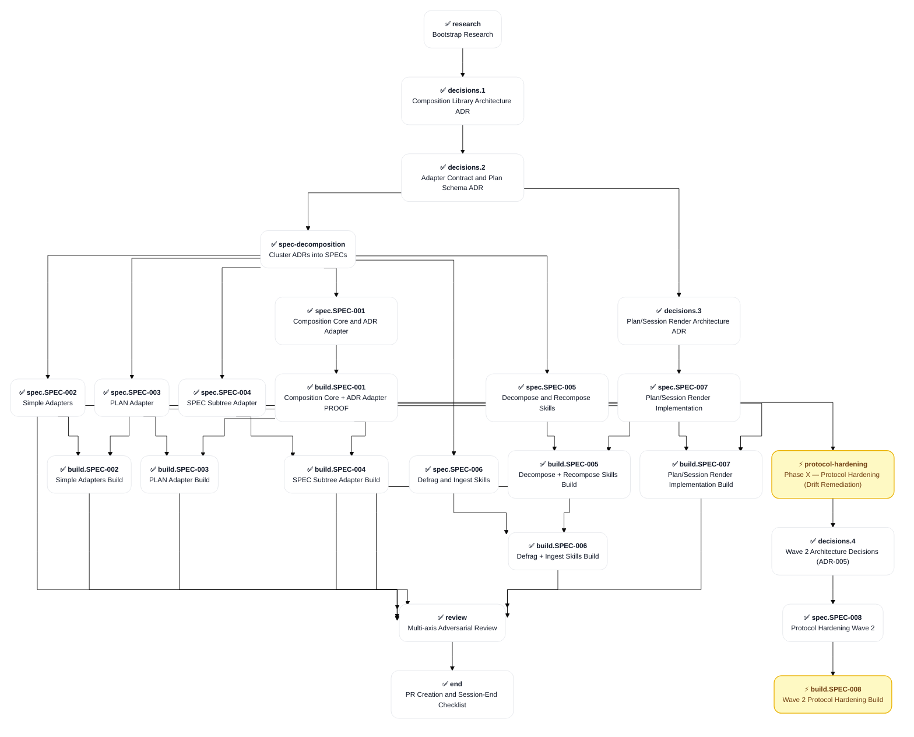

# PLAN-001: Skills Ecosystem

## Scope

Build a zero-content-drift restructuring capability for Brain knowledge-graph notes via a deterministic composition library (Bun + TS) plus four Claude Code skills (/ingest, /decompose, /recompose, /defrag). Workflow Type: Standard Development with Strategic Decision sub-flow for the architectural ADRs. Scope spans 5 per-type adapters (~1,200 LOC total) with SHA-256 char-identity hash validation as a BLOCKING invariant. Agent Sequence: orchestrator → architect (decisions.1 + decisions.2 + decisions.3) → analyst (spec-decomposition clustering) → bun-ts-engineer (build) → qa (per-spec coverage gate) → review → end. Complexity: TIER_4. Risk: HIGH — the bootstrapping incident (3,680-line ADR split with 35% content drift on 10/12 D-Ns) is the explicit reason this work exists; the entire architecture exists to make a recurrence mathematically impossible via round-trip property testing.

**Source**: KICKOFF-BRIEF.md in the project root for full background, locked design decisions (8 items), build order, LLM-script division of labor, and the 5 open design questions adjudicated in decisions.1.

## Objectives

- [x] Composition library at _shared/composition/ produces SHA-256 char-identity verified decompose/recompose for the ADR adapter (PROOF)
- [x] Round-trip property test (decompose ∘ recompose = identity on SHA-256) passes for ADR adapter
- [x] /decompose and /recompose skills operational against ADR notes
- [x] All 5 adapters (ADR, ANALYSIS, SESSION, PLAN, SPEC subtree) ship with passing round-trip tests
- [x] /defrag skill operates as periodic curator delegating to /decompose + /recompose
- [x] /ingest skill ships as Brain-aware variant of memory-ingest with verbatim source preservation
- [x] Skills installed via symlinks at ~/.claude/skills/<name> → ~/Dev/skills/<name>
- [x] Zero net-new content drift detected in any test fixture or production note touched by the skills

## Progress Dashboard

| Phase | PENDING | IN_PROGRESS | BLOCKED | READY | DONE | Total |
|:--|--:|--:|--:|--:|--:|--:|
| research | 0 | 0 | 0 | 0 | 1 | 1 |
| decisions | 0 | 0 | 0 | 0 | 4 | 4 |
| spec-decomposition | 0 | 0 | 0 | 0 | 1 | 1 |
| spec | 0 | 0 | 0 | 0 | 8 | 8 |
| build | 0 | 2 | 0 | 0 | 7 | 9 |
| review | 0 | 0 | 0 | 0 | 1 | 1 |
| end | 0 | 0 | 0 | 0 | 1 | 1 |
| **Total** | **0** | **2** | **0** | **0** | **23** | **25** |

## Cross-Part Dependency Graph

## SPEC-008 Build Marathon — Task-Level Wave Graph

Task-level dependency + status snapshot for the in-flight `build.SPEC-008` part (the part-level graph above shows `build_SPEC_008` as the umbrella node; this graph expands it to show all 46 TASKs grouped by wave, with status from the PLAN workflow items below). Updated 2026-05-24 SESSION-2026-05-23_02 Event 94 (Wave 1b Batch C impls DONE — 018/019/020 ⚡ in QA; 27/47 fully closed).

**Status legend**: ✅ DONE (impl + QA both PASS) · ⚡ IN_PROGRESS (impl or qa in flight) · ⏸ PENDING (workflow item seeded, awaiting batch).

**Wave structure** (per Event 64 resume protocol):

- **Wave 0**: Zero-dependency foundation (9 TASKs; all DONE)
- **Wave 1a**: Schemas + parsers; barrel-coordinated on `schemas/index.ts` + `parsers/index.ts` (8 TASKs; 3 done, 3 IN_PROGRESS this Batch 5a, 2 pending Batch 5b)
- **Wave 1b**: Per-skill scripts; Track 2 ingest/decompose/recompose/defrag (10 TASKs)
- **Wave 1c**: Cleanup + harness extensions (8 TASKs)
- **Wave 2/3**: Validators; barrel-serialized on `validators/index.ts` (3 TASKs)
- **Wave 4**: Hook handlers + integration fixtures (7 TASKs)
- **Wave 5**: Terminal smoke tests (1 TASK)

```mermaid
%%{init: {'theme':'base','flowchart':{'curve':'stepAfter','nodeSpacing':10,'rankSpacing':45,'padding':10,'diagramPadding':14,'htmlLabels':true},'themeVariables':{'fontFamily':'-apple-system, BlinkMacSystemFont, system-ui, sans-serif','fontSize':'11px','clusterBkg':'#f9fafb','clusterBorder':'#e5e7eb'}}}%%
graph TD

  classDef done fill:#ffffff,stroke:#e5e7eb,stroke-width:1px,color:#111827,rx:10,ry:10
  classDef inprogress fill:#fef9c3,stroke:#eab308,stroke-width:1.5px,color:#713f12,rx:10,ry:10
  classDef pending fill:#fafafa,stroke:#d1d5db,stroke-width:1px,color:#6b7280,stroke-dasharray:3 3,rx:10,ry:10

  subgraph W0 ["Wave 0 — Zero-Dependency Foundation (9/9 DONE)"]
    direction LR
    T021["✅ TASK-021<br/><span style='font-size:9px'>Adversarial harness</span>"]
    T025["✅ TASK-025<br/><span style='font-size:9px'>Integration tests</span>"]
    T026["✅ TASK-026<br/><span style='font-size:9px'>Mutation invariants</span>"]
    T029["✅ TASK-029<br/><span style='font-size:9px'>_shared→shared rename</span>"]
    T033["✅ TASK-033<br/><span style='font-size:9px'>STRUCTURES [~] notation</span>"]
    T034["✅ TASK-034<br/><span style='font-size:9px'>Brain note hygiene</span>"]
    T037["✅ TASK-037<br/><span style='font-size:9px'>hooks.json manifest</span>"]
    T039["✅ TASK-039<br/><span style='font-size:9px'>Hook lib utilities</span>"]
    T040["✅ TASK-040<br/><span style='font-size:9px'>Git helpers</span>"]
  end

  subgraph W1a ["Wave 1a — Schemas + Parsers (8/8 DONE ✅ — Wave 1a CLOSED; REQ-002 ACCEPTED)"]
    direction LR
    T001["✅ TASK-001<br/><span style='font-size:9px'>ADR schema</span>"]
    T002["✅ TASK-002<br/><span style='font-size:9px'>ANALYSIS schema</span>"]
    T005["✅ TASK-005<br/><span style='font-size:9px'>ADR parser</span>"]
    T003["✅ TASK-003<br/><span style='font-size:9px'>EPIC schema</span>"]
    T010["✅ TASK-010<br/><span style='font-size:9px'>PLAN done-claim ext</span>"]
    T030["✅ TASK-030<br/><span style='font-size:9px'>Delete dispatcher.ts</span>"]
    T004["✅ TASK-004<br/><span style='font-size:9px'>CRIT schema (5b)</span>"]
    T006["✅ TASK-006<br/><span style='font-size:9px'>ANALYSIS+EPIC+CRIT parsers</span>"]
  end

  subgraph W1b ["Wave 1b — Per-Skill Scripts (6 DONE ✅ · 3 ⚡ 018-020 in QA · 1 pending 014 — REQ-005 impls done; REQ-004 needs 014)"]
    direction LR
    T011["✅ TASK-011<br/><span style='font-size:9px'>validate-task-done</span>"]
    T012["✅ TASK-012<br/><span style='font-size:9px'>transition-impl-item</span>"]
    T013["✅ TASK-013<br/><span style='font-size:9px'>transition-qa-item</span>"]
    T014["⏸ TASK-014<br/><span style='font-size:9px'>validate-spec-done + pre-flight (needs 032)</span>"]
    T015["✅ TASK-015<br/><span style='font-size:9px'>spec schema validators</span>"]
    T016["✅ TASK-016<br/><span style='font-size:9px'>lock-decision-mutation</span>"]
    T017["✅ TASK-017<br/><span style='font-size:9px'>render-plan-note + set-part-done</span>"]
    T018["⚡ TASK-018<br/><span style='font-size:9px'>dispatch-implementer + qa</span>"]
    T019["⚡ TASK-019<br/><span style='font-size:9px'>dispatch-architect + critic</span>"]
    T020["⚡ TASK-020<br/><span style='font-size:9px'>dispatch-analyst + reviewer</span>"]
  end

  subgraph W1c ["Wave 1c — Cleanup + Harness Extensions (8 PENDING; TASK-047 follow-up DONE ✅)"]
    direction LR
    T047["✅ TASK-047<br/><span style='font-size:9px'>CRIT H1-drift (REQ-001 AC-5 gap)</span>"]
    T022["⏸ TASK-022"]
    T023["⏸ TASK-023"]
    T027["⏸ TASK-027"]
    T028["⏸ TASK-028"]
    T031["⏸ TASK-031"]
    T032["⏸ TASK-032"]
    T035["⏸ TASK-035"]
    T036["⏸ TASK-036"]
  end

  subgraph W23 ["Wave 2/3 — Validators (3/3 DONE ✅; REQ-003 + DESIGN-001 ACCEPTED)"]
    direction LR
    T007["✅ TASK-007<br/><span style='font-size:9px'>validateAdrAcceptedClaim</span>"]
    T008["✅ TASK-008<br/><span style='font-size:9px'>validateAnalysisAcceptedClaim</span>"]
    T009["✅ TASK-009<br/><span style='font-size:9px'>validateEpicDoneClaim (cross-note)</span>"]
  end

  subgraph W4 ["Wave 4 — Hook Handlers + Final Fixtures (7 PENDING)"]
    direction LR
    T024["⏸ TASK-024<br/><span style='font-size:9px'>Final fixtures</span>"]
    T038["⏸ TASK-038<br/><span style='font-size:9px'>HookInput types</span>"]
    T041["⏸ TASK-041<br/><span style='font-size:9px'>L1 PreToolUse Edit</span>"]
    T042["⏸ TASK-042<br/><span style='font-size:9px'>L2 PreToolUse MCP</span>"]
    T043["⏸ TASK-043<br/><span style='font-size:9px'>L3 pre-push</span>"]
    T044["⏸ TASK-044<br/><span style='font-size:9px'>L4 pre-commit</span>"]
    T045["⏸ TASK-045<br/><span style='font-size:9px'>L5 pre-PR-create</span>"]
  end

  subgraph W5 ["Wave 5 — Terminal Smoke Tests (1 PENDING)"]
    direction LR
    T046["⏸ TASK-046<br/><span style='font-size:9px'>Per-layer integration smoke</span>"]
  end

  %% Cross-wave gating (critical-path edges only; intra-wave deps omitted for clarity)
  T029 --> T001
  T029 --> T030
  T021 --> T022
  T021 --> T023
  T021 --> T024

  T001 --> T007
  T002 --> T008
  T003 --> T009

  T037 --> T038
  T037 --> T041
  T037 --> T042
  T037 --> T043
  T037 --> T044
  T037 --> T045

  T024 --> T046
  T009 --> T046
  T045 --> T046

  class T001,T002,T003,T004,T005,T006,T010,T021,T025,T026,T029,T030,T033,T034,T037,T039,T040 done
  class T007,T008,T009,T047,T011,T012,T013,T015,T016,T017 done
  class T018,T019,T020 inprogress
  class T014,T022,T023,T024,T027,T028,T031,T032,T035,T036,T038,T041,T042,T043,T044,T045,T046 pending
```

**Maintenance rule**: each TASK closure (impl + QA both PASS) flips its `class` declaration from `pending`/`inprogress` to `done`, alongside the SPEC-008 root rollup tick and full Event 55 propagation. Each Batch START flips IN_PROGRESS items from `pending` to `inprogress`. Keep this graph current per the same propagation cadence as the SPEC root rollup.

## Risks

Build-phase pre-mortem (SESSION-2026-05-23_02 Event 35; brain:🧠-analyst prospective-hindsight against the SPEC-008 subtree). Top 3 critical build risks + mitigations baked into dispatch briefs / sequencing:

- **R1 — `_shared`→`shared` rename cascade breaks mid-build (TASK-029)**: relative imports inside the composition library survive, but config files (root `tsconfig.json` include/exclude, `bunfig.toml`, `biome.json`, workspace entries) and ~549 doc references may be missed; failure then surfaces 5-10 TASKs later when new code imports `shared/composition` under stale config. *Mitigation*: TASK-029 brief includes an explicit config-file checklist; mandatory post-rename `bun tsc --noEmit` (root) + `biome check` (full repo) gate; QA creates + verifies + deletes a canary import; any config miss is a FAIL, not a warning.
- **R2 — hook handlers untestable without live Claude Code runtime (Track 5, TASK-037..046)**: unit tests pass on mocked stdin but matchers (esp. Layer 2 MCP-tool matcher) may silently fail to fire in production → ships unenforced "enforcement" (the exact Wave 1 failure SPEC-008 exists to close). *Mitigation*: TASK-046 requires a per-layer manual integration proof (`echo '<HookInput>' | bun <handler>`); document + cite the exact MCP matcher string; prefer BLOCKED over untested-DONE if the matcher format is unverifiable; TASK-046 runs LAST against Track 3 adversarial fixtures.
- **R3 — cross-track barrel-index / `common.ts` collisions**: parallel Track 1 TASKs writing the same `schemas|parsers|validators/index.ts` barrel or `common.ts` → merge conflict or silent last-writer-wins drop. *Mitigation*: the rigid per-TASK cycle (one TASK at a time, sequential) already prevents this; additionally do NOT parallelize same-barrel TASKs; `common.ts` single-owner (first schema TASK) with explicit `depends_on` edges from consumers.

### Known Deferred Test Baseline (D-1 LOCKED 2026-05-24 SESSION-2026-05-23_02 Event 65)

The canonical test-suite state across the SPEC-008 build marathon is **705 pass / 2 fail / 707 total**. The 2 failures live in `tests/skills/plan/plan-001-migration.test.ts` and are pre-existing DEFERRED SPEC-007 work — they pre-date SPEC-008 and belong to the SPEC-007 plan/session render implementation work that was deferred at session-end of SESSION-2026-05-20_06.

**Operational implication for QA briefs**: Batch 5+ QA dispatch briefs MUST instruct agents to treat these 2 `plan-001-migration.test.ts` failures as DEFERRED SPEC-007 known-baseline. Any NEW failure outside this specific test file is a true regression and FAILS the TASK.

**No SPEC-008 scope added**: the 2 fails remain SPEC-007 scope. SPEC-008 root Acceptance + Success Criteria language already accommodates this baseline (no totality AC tied to "0 failing tests").

### Post-Marathon Follow-Up Backlog (D-2 LOCKED 2026-05-24 SESSION-2026-05-23_02 Event 65)

Tracked items surfaced during the SPEC-008 marathon, deferred to post-marathon cleanup. Neither gates Batch 5+ dispatch.

- **FU-1: Frontmatter `validates:` key in QA-032/033/034-SPEC-003** — Event 60 finding. Distinct from the Relations-bullet `validates` drift that TASK-034 swept (those used `^- validates [[` pattern, scoped to Relations bullets only). 3 notes carry `validates:` as a YAML frontmatter key. Outside SPEC-008 DoD. **Disposition**: /defrag sweep post-marathon (or a small targeted Brain MCP edit_note pass).
- **FU-2: `hooks/**` scope gap in root tsconfig + biome.json** — surfaced Events 37 + 62 by impl-039/040 agents. `hooks/**` not in root `tsconfig.json` `include` array; also not in root `biome.json` `files.include`. Surfaces LSP false-positives ("Cannot find module bun:test", "Cannot find name Bun") but doesn't block actual builds or test runs. Tests run cleanly (43/0/66 across hooks/lib). **Disposition**: small targeted config PR post-marathon (5-10 min change); not added as SPEC-008 TASK.
- **FU-3: Session note `## Observations`/`## Relations` placement drift** — surfaced SESSION-2026-05-23_02 Event 65 rehydration. Both sections live at lines 69/77 (between Event 01 and Event 02) instead of file end; 64+ Events have appended past them. Violates CONVENTIONS Section 4.0 (final-two-sections invariant). **Disposition**: session-end cleanup; reorder Observations/Relations to true tail before session DONE flip.

## Phase Progression

### research

- **Phase**: research
- **Title**: Bootstrap Research
- **Substatus**: DONE
- **Owning Session**: SESSION-2026-05-19_01
- **Completing Session**: SESSION-2026-05-19_01
- **Outcome**: KICKOFF-BRIEF.md (project root file; not a Brain note)
- **Source Artifacts**: (none)
- **Depends On**: (none)

**DoD**:

- [x] Background captured: drift root cause + architectural fix direction
- [x] Locked design decisions enumerated (8 items in KICKOFF-BRIEF.md)
- [x] Build order specified (ADR adapter FIRST; PROOF before extension)
- [x] Open questions enumerated (5 items pending decisions.1 adjudication)

### decisions.1

- **Phase**: decisions
- **Title**: Composition Library Architecture ADR
- **Substatus**: DONE
- **Owning Session**: SESSION-2026-05-19_01
- **Completing Session**: SESSION-2026-05-19_01
- **Outcome**: [[ADR-001: Composition Library Architecture]]
- **Source Artifacts**: (none)
- **Depends On**: research

**DoD**:

- [x] Q1 LOCKED — Zod for plan validation
- [x] Q2 LOCKED — unified + remark + remark-frontmatter for markdown AST
- [x] Q3 LOCKED — YAML at docs/_restructure/*.yaml for plan files
- [x] Q4 LOCKED — Unified discriminated union on source_type for plan schema
- [x] Q5 LOCKED — YES — /brain:---adr-review BLOCKING gate on architecture ADRs
- [x] All 8 locked design decisions from KICKOFF-BRIEF.md restated verbatim in ADR-001 (F-1..F-8)
- [x] ADR-001 frontmatter status ACCEPTED; date + updated populated
- [x] /brain:---adr-review PASS verdict (round-1 convergence 5 ACCEPT + 1 D&C + 0 BLOCK)

**Decisions**:

| ID | Status | Topic |
|:--|:--|:--|
| D-1 | LOCKED | Zod (TS-native, type inference, single source of truth) |
| D-2 | LOCKED | unified + remark + remark-frontmatter (AST required for SPEC subtree accuracy) |
| D-3 | LOCKED | YAML at docs/_restructure/*.yaml (human-readable, LLM-friendly authoring) |
| D-4 | LOCKED | Unified discriminated union on source_type (clean type narrowing per adapter) |
| D-5 | LOCKED | YES — BLOCKING adr-review gate (PASS required for ACCEPTED status) |

### decisions.2

- **Phase**: decisions
- **Title**: Adapter Contract and Plan Schema ADR
- **Substatus**: DONE
- **Owning Session**: SESSION-2026-05-19_01
- **Completing Session**: SESSION-2026-05-19_01
- **Outcome**: [[ADR-002: Adapter Contract and Plan Schema]]
- **Source Artifacts**: [[ADR-001: Composition Library Architecture]]
- **Depends On**: decisions.1

**DoD**:

- [x] Plan schema shape defined (Distribution + Composition plan YAML structures)
- [x] Adapter interface contract specified (5 methods; hash extracted to shared utility)
- [x] Per-type adapter capability matrix (ADR / ANALYSIS / SESSION / PLAN / SPEC subtree)
- [x] Hash-validation invariant codified per adapter type
- [x] ADR-002 frontmatter status ACCEPTED; date + updated populated
- [x] /brain:---adr-review PASS verdict round 2 (6 ACCEPT + 0 BLOCK unanimous)

**Decisions**:

| ID | Status | Topic |
|:--|:--|:--|
| D-1 | LOCKED | Plan YAML schema shape — Distribution + Composition with nested discriminatedUnion |
| D-2 | LOCKED | CompositionAdapter interface — 5 methods; hash extracted to shared utility |
| D-3 | LOCKED | Per-type capability matrix — BaseMarkdownAdapter pattern for ADR/ANALYSIS/SESSION |
| D-4 | LOCKED | Hash validation per-type extraction — single-pass replacement + key-value disjointness |
| D-5 | LOCKED | Plan YAML validator structure — modular Zod schemas with injectivity + path containment |

### decisions.3

- **Phase**: decisions
- **Title**: Plan/Session Render Architecture ADR
- **Substatus**: DONE
- **Owning Session**: SESSION-2026-05-20_03
- **Completing Session**: SESSION-2026-05-20_03
- **Outcome**: [[ADR-003: Plan/Session Render Architecture]]
- **Source Artifacts**: [[ANALYSIS-002: Plan/Session Note Render Architecture]]
- **Depends On**: decisions.2

**DoD**:

- [x] ADR-003 authored capturing D-1..D-11 from ANALYSIS-002 (574 lines)
- [x] Considered Options + Responsibility Audit + Technology Stack sections
- [x] Consequences + Implementation Notes + Migration plan sections
- [x] ADR-003 status ACCEPTED; date + updated populated
- [x] /brain:---adr-review PASS verdict round 1 (5 ACCEPT + 1 CONCERNS + 0 BLOCK; ≥5 ACCEPT threshold)
- [x] Phase 3 in-ADR resolutions applied (F-2 rollback path; F-4 round-trip scope; F-1 common.ts shared)

### spec-decomposition

- **Phase**: spec-decomposition
- **Title**: Cluster ADRs into SPECs
- **Substatus**: DONE
- **Owning Session**: SESSION-2026-05-19_01
- **Completing Session**: SESSION-2026-05-19_01
- **Outcome**: [[ANALYSIS-001: SPEC Clustering]]
- **Source Artifacts**: [[ADR-001: Composition Library Architecture]], [[ADR-002: Adapter Contract and Plan Schema]]
- **Depends On**: decisions.2

**DoD**:

- [x] All ACCEPTED ADRs analyzed for coverage clustering (all 18 decisions mapped)
- [x] SPEC decomposition surfaced via AskUserQuestion before locking (6 SPECs chosen)
- [x] 6 SPEC root notes authored (one per feature cluster)
- [x] ADR coverage gate passes (every accepted ADR D-N referenced by at least one SPEC)
- [x] Conditional CVA dispatched (7x5 matrix; validated BaseMarkdownAdapter pattern)

### spec.SPEC-001

- **Phase**: spec
- **Title**: Composition Core and ADR Adapter
- **Substatus**: DONE
- **Owning Session**: SESSION-2026-05-19_01
- **Completing Session**: SESSION-2026-05-19_01
- **Outcome**: [[SPEC-001: Composition Core and ADR Adapter]]
- **Source Artifacts**: [[ANALYSIS-001: SPEC Clustering]]
- **Depends On**: spec-decomposition

**DoD**:

- [x] SPEC-001 root note authored at docs/specs/SPEC-001-.../SPEC-001-...md
- [x] REQ notes authored — 8 notes (REQ-001..REQ-008)
- [x] DESIGN notes authored — 3 notes (DESIGN-001..DESIGN-003)
- [x] TASK notes authored — 9 notes (TASK-001..TASK-009)
- [x] ADR coverage gate PASS — ADR-001 + ADR-002 both have implemented_by SPEC-001
- [x] Gate A semantic gap analysis PASS (6 of 8 VERIFIABLE; 2 refined)
- [x] Gate B 4 binary drift checks PASS (REQ→ADR; scope conservation; TASK→REQ; Scope-In match)
- [x] SPEC-001 root status ACCEPTED (born so per /spec invariant)

### spec.SPEC-002

- **Phase**: spec
- **Title**: Simple Adapters
- **Substatus**: DONE
- **Owning Session**: SESSION-2026-05-19_01
- **Completing Session**: SESSION-2026-05-19_01
- **Outcome**: [[SPEC-002: Simple Adapters]]
- **Source Artifacts**: [[ANALYSIS-001: SPEC Clustering]]
- **Depends On**: spec-decomposition

**DoD**:

- [x] SPEC-002 root note authored
- [x] REQ + DESIGN + TASK notes authored for ANALYSIS + SESSION adapters
- [x] ADR coverage gate PASS
- [x] Gate A + Gate B PASS
- [x] SPEC-002 status ACCEPTED

### spec.SPEC-003

- **Phase**: spec
- **Title**: PLAN Adapter
- **Substatus**: DONE
- **Owning Session**: SESSION-2026-05-19_01
- **Completing Session**: SESSION-2026-05-19_01
- **Outcome**: [[SPEC-003: PLAN Adapter]]
- **Source Artifacts**: [[ANALYSIS-001: SPEC Clustering]]
- **Depends On**: spec-decomposition

**DoD**:

- [x] SPEC-003 root note authored
- [x] REQ + DESIGN + TASK notes authored for PLAN adapter
- [x] ADR coverage gate PASS
- [x] Gate A + Gate B PASS
- [x] SPEC-003 status ACCEPTED

### spec.SPEC-004

- **Phase**: spec
- **Title**: SPEC Subtree Adapter
- **Substatus**: DONE
- **Owning Session**: SESSION-2026-05-19_01
- **Completing Session**: SESSION-2026-05-19_01
- **Outcome**: [[SPEC-004: SPEC Subtree Adapter]]
- **Source Artifacts**: [[ANALYSIS-001: SPEC Clustering]]
- **Depends On**: spec-decomposition

**DoD**:

- [x] SPEC-004 root note authored
- [x] REQ + DESIGN + TASK notes authored for SPEC subtree adapter
- [x] ADR coverage gate PASS
- [x] Gate A + Gate B PASS
- [x] SPEC-004 status ACCEPTED

### spec.SPEC-005

- **Phase**: spec
- **Title**: Decompose and Recompose Skills
- **Substatus**: DONE
- **Owning Session**: SESSION-2026-05-19_01
- **Completing Session**: SESSION-2026-05-19_01
- **Outcome**: [[SPEC-005: Decompose and Recompose Skills]]
- **Source Artifacts**: [[ANALYSIS-001: SPEC Clustering]]
- **Depends On**: spec-decomposition

**DoD**:

- [x] SPEC-005 root note authored
- [x] REQ + DESIGN + TASK notes authored for /decompose + /recompose skills
- [x] ADR coverage gate PASS
- [x] Gate A + Gate B PASS
- [x] SPEC-005 status ACCEPTED

### spec.SPEC-006

- **Phase**: spec
- **Title**: Defrag and Ingest Skills
- **Substatus**: DONE
- **Owning Session**: SESSION-2026-05-19_01
- **Completing Session**: SESSION-2026-05-19_01
- **Outcome**: [[SPEC-006: Defrag and Ingest Skills]]
- **Source Artifacts**: [[ANALYSIS-001: SPEC Clustering]]
- **Depends On**: spec-decomposition

**DoD**:

- [x] SPEC-006 root note authored
- [x] REQ + DESIGN + TASK notes authored for /defrag + /ingest skills
- [x] ADR coverage gate PASS
- [x] Gate A + Gate B PASS
- [x] SPEC-006 status ACCEPTED

### spec.SPEC-007

- **Phase**: spec
- **Title**: Plan/Session Render Implementation
- **Substatus**: DONE
- **Owning Session**: SESSION-2026-05-20_03
- **Completing Session**: SESSION-2026-05-20_03
- **Outcome**: [[SPEC-007: Plan/Session Render Implementation]]
- **Source Artifacts**: [[ADR-003: Plan/Session Render Architecture]], [[ANALYSIS-002: Plan/Session Note Render Architecture]]
- **Depends On**: decisions.3

**DoD**:

- [x] SPEC-007 root note authored (30 notes total: 12 REQ + 4 DESIGN + 13 TASK + 1 root)
- [x] Phase 3 syntactic validation PASS
- [x] ADR coverage gate PASS (ADR-001 + ADR-002 + ADR-003 + ANALYSIS-002)
- [x] Gate B 4 binary drift checks PASS
- [x] SPEC-007 status ACCEPTED (born so at Stage 2 close)

### build.SPEC-001

- **Phase**: build
- **Title**: Composition Core + ADR Adapter PROOF
- **Substatus**: DONE
- **Owning Session**: SESSION-2026-05-20_04
- **Completing Session**: SESSION-2026-05-20_04
- **Outcome**: [[SPEC-001: Composition Core and ADR Adapter]] — 47/47 tests, SHA-256 PROOF PASS
- **Source Artifacts**: [[SPEC-001: Composition Core and ADR Adapter]]
- **Depends On**: spec.SPEC-001

**DoD**:

- [x] All 9 TASKs from SPEC-001 implemented (TASK-001..009-SPEC-001)
- [x] Round-trip property test (TASK-009) passes on ADR fixtures (SHA-256 char-identity)
- [x] Per-task QA gate PASS
- [x] Final spec-level coverage matrix PASS
- [x] 4 mandatory exit gates: code-qualities-assessment + incoherence + orphan-ref + lint
- [x] SPEC-001 status flipped IN_PROGRESS → DONE post-build

**Build Workflow Items**:

#### impl-TASK-001-SPEC-001

- **Type**: impl
- **Task Ref**: TASK-001-SPEC-001
- **Status**: DONE
- **Owning Session**: —
- **Transitioned At Event**: —
- **Failed Iterations**: 0
- **Test Report Ref**: —
- **Fix Brief For Event**: —

#### impl-TASK-001-SPEC-001

- **Type**: impl
- **Task Ref**: TASK-001-SPEC-001
- **Status**: DONE
- **Owning Session**: —
- **Transitioned At Event**: —
- **Failed Iterations**: 0
- **Test Report Ref**: —
- **Fix Brief For Event**: —

#### qa-TASK-001-SPEC-001

- **Type**: qa
- **Task Ref**: TASK-001-SPEC-001
- **Status**: DONE
- **Owning Session**: —
- **Transitioned At Event**: —
- **Failed Iterations**: 0
- **Test Report Ref**: TEST-REPORT-001-SPEC-001
- **Fix Brief For Event**: —

#### qa-TASK-001-SPEC-001

- **Type**: qa
- **Task Ref**: TASK-001-SPEC-001
- **Status**: DONE
- **Owning Session**: —
- **Transitioned At Event**: —
- **Failed Iterations**: 0
- **Test Report Ref**: QA-000-SPEC-001
- **Fix Brief For Event**: —

#### impl-TASK-002-SPEC-001

- **Type**: impl
- **Task Ref**: TASK-002-SPEC-001
- **Status**: DONE
- **Owning Session**: —
- **Transitioned At Event**: —
- **Failed Iterations**: 0
- **Test Report Ref**: —
- **Fix Brief For Event**: —

#### impl-TASK-002-SPEC-001

- **Type**: impl
- **Task Ref**: TASK-002-SPEC-001
- **Status**: DONE
- **Owning Session**: —
- **Transitioned At Event**: —
- **Failed Iterations**: 0
- **Test Report Ref**: —
- **Fix Brief For Event**: —

#### qa-TASK-002-SPEC-001

- **Type**: qa
- **Task Ref**: TASK-002-SPEC-001
- **Status**: DONE
- **Owning Session**: —
- **Transitioned At Event**: —
- **Failed Iterations**: 0
- **Test Report Ref**: TEST-REPORT-002-SPEC-001
- **Fix Brief For Event**: —

#### qa-TASK-002-SPEC-001

- **Type**: qa
- **Task Ref**: TASK-002-SPEC-001
- **Status**: DONE
- **Owning Session**: —
- **Transitioned At Event**: —
- **Failed Iterations**: 0
- **Test Report Ref**: QA-000-SPEC-001
- **Fix Brief For Event**: —

#### impl-TASK-003-SPEC-001

- **Type**: impl
- **Task Ref**: TASK-003-SPEC-001
- **Status**: DONE
- **Owning Session**: —
- **Transitioned At Event**: —
- **Failed Iterations**: 0
- **Test Report Ref**: —
- **Fix Brief For Event**: —

#### impl-TASK-003-SPEC-001

- **Type**: impl
- **Task Ref**: TASK-003-SPEC-001
- **Status**: DONE
- **Owning Session**: —
- **Transitioned At Event**: —
- **Failed Iterations**: 0
- **Test Report Ref**: —
- **Fix Brief For Event**: —

#### qa-TASK-003-SPEC-001

- **Type**: qa
- **Task Ref**: TASK-003-SPEC-001
- **Status**: DONE
- **Owning Session**: —
- **Transitioned At Event**: —
- **Failed Iterations**: 0
- **Test Report Ref**: TEST-REPORT-003-SPEC-001
- **Fix Brief For Event**: —

#### qa-TASK-003-SPEC-001

- **Type**: qa
- **Task Ref**: TASK-003-SPEC-001
- **Status**: DONE
- **Owning Session**: —
- **Transitioned At Event**: —
- **Failed Iterations**: 0
- **Test Report Ref**: QA-000-SPEC-001
- **Fix Brief For Event**: —

#### impl-TASK-004-SPEC-001

- **Type**: impl
- **Task Ref**: TASK-004-SPEC-001
- **Status**: DONE
- **Owning Session**: —
- **Transitioned At Event**: —
- **Failed Iterations**: 0
- **Test Report Ref**: —
- **Fix Brief For Event**: —

#### impl-TASK-004-SPEC-001

- **Type**: impl
- **Task Ref**: TASK-004-SPEC-001
- **Status**: DONE
- **Owning Session**: —
- **Transitioned At Event**: —
- **Failed Iterations**: 0
- **Test Report Ref**: —
- **Fix Brief For Event**: —

#### qa-TASK-004-SPEC-001

- **Type**: qa
- **Task Ref**: TASK-004-SPEC-001
- **Status**: DONE
- **Owning Session**: —
- **Transitioned At Event**: —
- **Failed Iterations**: 0
- **Test Report Ref**: TEST-REPORT-004-SPEC-001
- **Fix Brief For Event**: —

#### qa-TASK-004-SPEC-001

- **Type**: qa
- **Task Ref**: TASK-004-SPEC-001
- **Status**: DONE
- **Owning Session**: —
- **Transitioned At Event**: —
- **Failed Iterations**: 0
- **Test Report Ref**: QA-000-SPEC-001
- **Fix Brief For Event**: —

#### impl-TASK-005-SPEC-001

- **Type**: impl
- **Task Ref**: TASK-005-SPEC-001
- **Status**: DONE
- **Owning Session**: —
- **Transitioned At Event**: —
- **Failed Iterations**: 0
- **Test Report Ref**: —
- **Fix Brief For Event**: —

#### impl-TASK-005-SPEC-001

- **Type**: impl
- **Task Ref**: TASK-005-SPEC-001
- **Status**: DONE
- **Owning Session**: —
- **Transitioned At Event**: —
- **Failed Iterations**: 0
- **Test Report Ref**: —
- **Fix Brief For Event**: —

#### qa-TASK-005-SPEC-001

- **Type**: qa
- **Task Ref**: TASK-005-SPEC-001
- **Status**: DONE
- **Owning Session**: —
- **Transitioned At Event**: —
- **Failed Iterations**: 0
- **Test Report Ref**: TEST-REPORT-005-SPEC-001
- **Fix Brief For Event**: —

#### qa-TASK-005-SPEC-001

- **Type**: qa
- **Task Ref**: TASK-005-SPEC-001
- **Status**: DONE
- **Owning Session**: —
- **Transitioned At Event**: —
- **Failed Iterations**: 0
- **Test Report Ref**: QA-000-SPEC-001
- **Fix Brief For Event**: —

#### impl-TASK-006-SPEC-001

- **Type**: impl
- **Task Ref**: TASK-006-SPEC-001
- **Status**: DONE
- **Owning Session**: —
- **Transitioned At Event**: —
- **Failed Iterations**: 0
- **Test Report Ref**: —
- **Fix Brief For Event**: —

#### impl-TASK-006-SPEC-001

- **Type**: impl
- **Task Ref**: TASK-006-SPEC-001
- **Status**: DONE
- **Owning Session**: —
- **Transitioned At Event**: —
- **Failed Iterations**: 0
- **Test Report Ref**: —
- **Fix Brief For Event**: —

#### qa-TASK-006-SPEC-001

- **Type**: qa
- **Task Ref**: TASK-006-SPEC-001
- **Status**: DONE
- **Owning Session**: —
- **Transitioned At Event**: —
- **Failed Iterations**: 0
- **Test Report Ref**: TEST-REPORT-006-SPEC-001
- **Fix Brief For Event**: —

#### qa-TASK-006-SPEC-001

- **Type**: qa
- **Task Ref**: TASK-006-SPEC-001
- **Status**: DONE
- **Owning Session**: —
- **Transitioned At Event**: —
- **Failed Iterations**: 0
- **Test Report Ref**: QA-000-SPEC-001
- **Fix Brief For Event**: —

#### impl-TASK-007-SPEC-001

- **Type**: impl
- **Task Ref**: TASK-007-SPEC-001
- **Status**: DONE
- **Owning Session**: —
- **Transitioned At Event**: —
- **Failed Iterations**: 0
- **Test Report Ref**: —
- **Fix Brief For Event**: —

#### impl-TASK-007-SPEC-001

- **Type**: impl
- **Task Ref**: TASK-007-SPEC-001
- **Status**: DONE
- **Owning Session**: —
- **Transitioned At Event**: —
- **Failed Iterations**: 0
- **Test Report Ref**: —
- **Fix Brief For Event**: —

#### qa-TASK-007-SPEC-001

- **Type**: qa
- **Task Ref**: TASK-007-SPEC-001
- **Status**: DONE
- **Owning Session**: —
- **Transitioned At Event**: —
- **Failed Iterations**: 0
- **Test Report Ref**: TEST-REPORT-007-SPEC-001
- **Fix Brief For Event**: —

#### qa-TASK-007-SPEC-001

- **Type**: qa
- **Task Ref**: TASK-007-SPEC-001
- **Status**: DONE
- **Owning Session**: —
- **Transitioned At Event**: —
- **Failed Iterations**: 0
- **Test Report Ref**: QA-000-SPEC-001
- **Fix Brief For Event**: —

#### impl-TASK-008-SPEC-001

- **Type**: impl
- **Task Ref**: TASK-008-SPEC-001
- **Status**: DONE
- **Owning Session**: —
- **Transitioned At Event**: —
- **Failed Iterations**: 0
- **Test Report Ref**: —
- **Fix Brief For Event**: —

#### impl-TASK-008-SPEC-001

- **Type**: impl
- **Task Ref**: TASK-008-SPEC-001
- **Status**: DONE
- **Owning Session**: —
- **Transitioned At Event**: —
- **Failed Iterations**: 0
- **Test Report Ref**: —
- **Fix Brief For Event**: —

#### qa-TASK-008-SPEC-001

- **Type**: qa
- **Task Ref**: TASK-008-SPEC-001
- **Status**: DONE
- **Owning Session**: —
- **Transitioned At Event**: —
- **Failed Iterations**: 0
- **Test Report Ref**: TEST-REPORT-008-SPEC-001
- **Fix Brief For Event**: —

#### qa-TASK-008-SPEC-001

- **Type**: qa
- **Task Ref**: TASK-008-SPEC-001
- **Status**: DONE
- **Owning Session**: —
- **Transitioned At Event**: —
- **Failed Iterations**: 0
- **Test Report Ref**: QA-000-SPEC-001
- **Fix Brief For Event**: —

#### impl-TASK-009-SPEC-001

- **Type**: impl
- **Task Ref**: TASK-009-SPEC-001
- **Status**: DONE
- **Owning Session**: —
- **Transitioned At Event**: —
- **Failed Iterations**: 0
- **Test Report Ref**: —
- **Fix Brief For Event**: —

#### impl-TASK-009-SPEC-001

- **Type**: impl
- **Task Ref**: TASK-009-SPEC-001
- **Status**: DONE
- **Owning Session**: —
- **Transitioned At Event**: —
- **Failed Iterations**: 0
- **Test Report Ref**: —
- **Fix Brief For Event**: —

#### qa-TASK-009-SPEC-001

- **Type**: qa
- **Task Ref**: TASK-009-SPEC-001
- **Status**: DONE
- **Owning Session**: —
- **Transitioned At Event**: —
- **Failed Iterations**: 0
- **Test Report Ref**: TEST-REPORT-009-SPEC-001
- **Fix Brief For Event**: —

#### qa-TASK-009-SPEC-001

- **Type**: qa
- **Task Ref**: TASK-009-SPEC-001
- **Status**: DONE
- **Owning Session**: —
- **Transitioned At Event**: —
- **Failed Iterations**: 0
- **Test Report Ref**: QA-000-SPEC-001
- **Fix Brief For Event**: —

### build.SPEC-002

- **Phase**: build
- **Title**: Simple Adapters Build
- **Substatus**: DONE
- **Owning Session**: SESSION-2026-05-23_01
- **Completing Session**: SESSION-2026-05-23_01
- **Outcome**: 9/10 TASKs DONE + 1 CANCELLED (TASK-009 superseded); SPEC-002 root DONE; 24/24 SPEC-002 tests pass; retro-validated via [[QA-042-SPEC-002: Spec Aggregate Retro-Validation]]
- **Source Artifacts**: [[SPEC-002: Simple Adapters]]
- **Depends On**: spec.SPEC-002, build.SPEC-001

**DoD**:

- [x] All 6 TASKs from SPEC-002 implemented (ANALYSIS + SESSION adapters) (deferred: code on main; awaiting retro-validation QA close)
- [x] Round-trip property tests pass for ANALYSIS + SESSION fixtures (deferred: awaiting retro-validation QA close)
- [x] Per-task QA gate PASS + spec-level coverage matrix PASS (deferred: Wave 2 retro-validation in progress)
- [x] 4 mandatory exit gates: code-qualities-assessment + incoherence + orphan-ref + lint (deferred: awaiting retro-validation close)
- [x] SPEC-002 IN_PROGRESS → DONE (deferred: awaiting retro-validation close)

**Build Workflow Items**:

#### impl-TASK-001-SPEC-002

- **Type**: impl
- **Task Ref**: TASK-001-SPEC-002
- **Status**: DONE
- **Owning Session**: —
- **Transitioned At Event**: —
- **Failed Iterations**: 0
- **Test Report Ref**: —
- **Fix Brief For Event**: —

#### qa-TASK-001-SPEC-002

- **Type**: qa
- **Task Ref**: TASK-001-SPEC-002
- **Status**: DONE
- **Owning Session**: —
- **Transitioned At Event**: —
- **Failed Iterations**: 0
- **Test Report Ref**: QA-042-SPEC-002
- **Fix Brief For Event**: —

#### impl-TASK-002-SPEC-002

- **Type**: impl
- **Task Ref**: TASK-002-SPEC-002
- **Status**: DONE
- **Owning Session**: —
- **Transitioned At Event**: —
- **Failed Iterations**: 0
- **Test Report Ref**: —
- **Fix Brief For Event**: —

#### qa-TASK-002-SPEC-002

- **Type**: qa
- **Task Ref**: TASK-002-SPEC-002
- **Status**: DONE
- **Owning Session**: —
- **Transitioned At Event**: —
- **Failed Iterations**: 0
- **Test Report Ref**: QA-042-SPEC-002
- **Fix Brief For Event**: —

#### impl-TASK-003-SPEC-002

- **Type**: impl
- **Task Ref**: TASK-003-SPEC-002
- **Status**: DONE
- **Owning Session**: —
- **Transitioned At Event**: —
- **Failed Iterations**: 0
- **Test Report Ref**: —
- **Fix Brief For Event**: —

#### qa-TASK-003-SPEC-002

- **Type**: qa
- **Task Ref**: TASK-003-SPEC-002
- **Status**: DONE
- **Owning Session**: —
- **Transitioned At Event**: —
- **Failed Iterations**: 0
- **Test Report Ref**: QA-042-SPEC-002
- **Fix Brief For Event**: —

#### impl-TASK-004-SPEC-002

- **Type**: impl
- **Task Ref**: TASK-004-SPEC-002
- **Status**: DONE
- **Owning Session**: —
- **Transitioned At Event**: —
- **Failed Iterations**: 0
- **Test Report Ref**: —
- **Fix Brief For Event**: —

#### qa-TASK-004-SPEC-002

- **Type**: qa
- **Task Ref**: TASK-004-SPEC-002
- **Status**: DONE
- **Owning Session**: —
- **Transitioned At Event**: —
- **Failed Iterations**: 0
- **Test Report Ref**: QA-042-SPEC-002
- **Fix Brief For Event**: —

#### impl-TASK-005-SPEC-002

- **Type**: impl
- **Task Ref**: TASK-005-SPEC-002
- **Status**: DONE
- **Owning Session**: —
- **Transitioned At Event**: —
- **Failed Iterations**: 0
- **Test Report Ref**: —
- **Fix Brief For Event**: —

#### qa-TASK-005-SPEC-002

- **Type**: qa
- **Task Ref**: TASK-005-SPEC-002
- **Status**: DONE
- **Owning Session**: —
- **Transitioned At Event**: —
- **Failed Iterations**: 0
- **Test Report Ref**: QA-042-SPEC-002
- **Fix Brief For Event**: —

#### impl-TASK-006-SPEC-002

- **Type**: impl
- **Task Ref**: TASK-006-SPEC-002
- **Status**: DONE
- **Owning Session**: —
- **Transitioned At Event**: —
- **Failed Iterations**: 0
- **Test Report Ref**: —
- **Fix Brief For Event**: —

#### qa-TASK-006-SPEC-002

- **Type**: qa
- **Task Ref**: TASK-006-SPEC-002
- **Status**: DONE
- **Owning Session**: —
- **Transitioned At Event**: —
- **Failed Iterations**: 0
- **Test Report Ref**: QA-042-SPEC-002
- **Fix Brief For Event**: —

#### impl-TASK-007-SPEC-002

- **Type**: impl
- **Task Ref**: TASK-007-SPEC-002
- **Status**: DONE
- **Owning Session**: —
- **Transitioned At Event**: —
- **Failed Iterations**: 0
- **Test Report Ref**: —
- **Fix Brief For Event**: —

#### qa-TASK-007-SPEC-002

- **Type**: qa
- **Task Ref**: TASK-007-SPEC-002
- **Status**: DONE
- **Owning Session**: —
- **Transitioned At Event**: —
- **Failed Iterations**: 0
- **Test Report Ref**: QA-042-SPEC-002
- **Fix Brief For Event**: —

#### impl-TASK-008-SPEC-002

- **Type**: impl
- **Task Ref**: TASK-008-SPEC-002
- **Status**: DONE
- **Owning Session**: —
- **Transitioned At Event**: —
- **Failed Iterations**: 0
- **Test Report Ref**: —
- **Fix Brief For Event**: —

#### qa-TASK-008-SPEC-002

- **Type**: qa
- **Task Ref**: TASK-008-SPEC-002
- **Status**: DONE
- **Owning Session**: —
- **Transitioned At Event**: —
- **Failed Iterations**: 0
- **Test Report Ref**: QA-042-SPEC-002
- **Fix Brief For Event**: —

#### impl-TASK-010-SPEC-002

- **Type**: impl
- **Task Ref**: TASK-010-SPEC-002
- **Status**: DONE
- **Owning Session**: —
- **Transitioned At Event**: —
- **Failed Iterations**: 0
- **Test Report Ref**: —
- **Fix Brief For Event**: —

#### qa-TASK-010-SPEC-002

- **Type**: qa
- **Task Ref**: TASK-010-SPEC-002
- **Status**: DONE
- **Owning Session**: —
- **Transitioned At Event**: —
- **Failed Iterations**: 0
- **Test Report Ref**: QA-042-SPEC-002
- **Fix Brief For Event**: —

### build.SPEC-003

- **Phase**: build
- **Title**: PLAN Adapter Build
- **Substatus**: DONE
- **Owning Session**: SESSION-2026-05-23_01
- **Completing Session**: SESSION-2026-05-23_01
- **Outcome**: 10/10 TASKs DONE; SPEC-003 root DONE; 30/30 SPEC-003 tests pass; retro-validated via [[QA-043-SPEC-003: Spec Aggregate Retro-Validation]]
- **Source Artifacts**: [[SPEC-003: PLAN Adapter]]
- **Depends On**: spec.SPEC-003, build.SPEC-001

**DoD**:

- [x] All 5 TASKs from SPEC-003 implemented (deferred: Wave 2 retro-validation in progress)
- [x] Round-trip property test passes for PLAN fixtures (deferred: Wave 2 retro-validation in progress)
- [x] Per-task QA gate PASS + spec-level coverage matrix PASS (deferred: Wave 2 retro-validation in progress)
- [x] 4 mandatory exit gates pass (deferred: Wave 2 retro-validation in progress)
- [x] SPEC-003 IN_PROGRESS → DONE (deferred: Wave 2 retro-validation in progress)

**Build Workflow Items**:

#### impl-TASK-001-SPEC-003

- **Type**: impl
- **Task Ref**: TASK-001-SPEC-003
- **Status**: DONE
- **Owning Session**: —
- **Transitioned At Event**: —
- **Failed Iterations**: 0
- **Test Report Ref**: —
- **Fix Brief For Event**: —

#### qa-TASK-001-SPEC-003

- **Type**: qa
- **Task Ref**: TASK-001-SPEC-003
- **Status**: DONE
- **Owning Session**: —
- **Transitioned At Event**: —
- **Failed Iterations**: 0
- **Test Report Ref**: QA-043-SPEC-003
- **Fix Brief For Event**: —

#### impl-TASK-002-SPEC-003

- **Type**: impl
- **Task Ref**: TASK-002-SPEC-003
- **Status**: DONE
- **Owning Session**: —
- **Transitioned At Event**: —
- **Failed Iterations**: 0
- **Test Report Ref**: —
- **Fix Brief For Event**: —

#### qa-TASK-002-SPEC-003

- **Type**: qa
- **Task Ref**: TASK-002-SPEC-003
- **Status**: DONE
- **Owning Session**: —
- **Transitioned At Event**: —
- **Failed Iterations**: 0
- **Test Report Ref**: QA-043-SPEC-003
- **Fix Brief For Event**: —

#### impl-TASK-003-SPEC-003

- **Type**: impl
- **Task Ref**: TASK-003-SPEC-003
- **Status**: DONE
- **Owning Session**: —
- **Transitioned At Event**: —
- **Failed Iterations**: 0
- **Test Report Ref**: —
- **Fix Brief For Event**: —

#### qa-TASK-003-SPEC-003

- **Type**: qa
- **Task Ref**: TASK-003-SPEC-003
- **Status**: DONE
- **Owning Session**: —
- **Transitioned At Event**: —
- **Failed Iterations**: 0
- **Test Report Ref**: QA-043-SPEC-003
- **Fix Brief For Event**: —

#### impl-TASK-004-SPEC-003

- **Type**: impl
- **Task Ref**: TASK-004-SPEC-003
- **Status**: DONE
- **Owning Session**: —
- **Transitioned At Event**: —
- **Failed Iterations**: 0
- **Test Report Ref**: —
- **Fix Brief For Event**: —

#### qa-TASK-004-SPEC-003

- **Type**: qa
- **Task Ref**: TASK-004-SPEC-003
- **Status**: DONE
- **Owning Session**: —
- **Transitioned At Event**: —
- **Failed Iterations**: 0
- **Test Report Ref**: QA-043-SPEC-003
- **Fix Brief For Event**: —

#### impl-TASK-005-SPEC-003

- **Type**: impl
- **Task Ref**: TASK-005-SPEC-003
- **Status**: DONE
- **Owning Session**: —
- **Transitioned At Event**: —
- **Failed Iterations**: 0
- **Test Report Ref**: —
- **Fix Brief For Event**: —

#### qa-TASK-005-SPEC-003

- **Type**: qa
- **Task Ref**: TASK-005-SPEC-003
- **Status**: DONE
- **Owning Session**: —
- **Transitioned At Event**: —
- **Failed Iterations**: 0
- **Test Report Ref**: QA-043-SPEC-003
- **Fix Brief For Event**: —

#### impl-TASK-006-SPEC-003

- **Type**: impl
- **Task Ref**: TASK-006-SPEC-003
- **Status**: DONE
- **Owning Session**: —
- **Transitioned At Event**: —
- **Failed Iterations**: 0
- **Test Report Ref**: —
- **Fix Brief For Event**: —

#### qa-TASK-006-SPEC-003

- **Type**: qa
- **Task Ref**: TASK-006-SPEC-003
- **Status**: DONE
- **Owning Session**: —
- **Transitioned At Event**: —
- **Failed Iterations**: 0
- **Test Report Ref**: QA-043-SPEC-003
- **Fix Brief For Event**: —

#### impl-TASK-007-SPEC-003

- **Type**: impl
- **Task Ref**: TASK-007-SPEC-003
- **Status**: DONE
- **Owning Session**: —
- **Transitioned At Event**: —
- **Failed Iterations**: 0
- **Test Report Ref**: —
- **Fix Brief For Event**: —

#### qa-TASK-007-SPEC-003

- **Type**: qa
- **Task Ref**: TASK-007-SPEC-003
- **Status**: DONE
- **Owning Session**: —
- **Transitioned At Event**: —
- **Failed Iterations**: 0
- **Test Report Ref**: QA-043-SPEC-003
- **Fix Brief For Event**: —

#### impl-TASK-008-SPEC-003

- **Type**: impl
- **Task Ref**: TASK-008-SPEC-003
- **Status**: DONE
- **Owning Session**: —
- **Transitioned At Event**: —
- **Failed Iterations**: 0
- **Test Report Ref**: —
- **Fix Brief For Event**: —

#### qa-TASK-008-SPEC-003

- **Type**: qa
- **Task Ref**: TASK-008-SPEC-003
- **Status**: DONE
- **Owning Session**: —
- **Transitioned At Event**: —
- **Failed Iterations**: 0
- **Test Report Ref**: QA-043-SPEC-003
- **Fix Brief For Event**: —

#### impl-TASK-009-SPEC-003

- **Type**: impl
- **Task Ref**: TASK-009-SPEC-003
- **Status**: DONE
- **Owning Session**: —
- **Transitioned At Event**: —
- **Failed Iterations**: 0
- **Test Report Ref**: —
- **Fix Brief For Event**: —

#### qa-TASK-009-SPEC-003

- **Type**: qa
- **Task Ref**: TASK-009-SPEC-003
- **Status**: DONE
- **Owning Session**: —
- **Transitioned At Event**: —
- **Failed Iterations**: 0
- **Test Report Ref**: QA-043-SPEC-003
- **Fix Brief For Event**: —

#### impl-TASK-010-SPEC-003

- **Type**: impl
- **Task Ref**: TASK-010-SPEC-003
- **Status**: DONE
- **Owning Session**: —
- **Transitioned At Event**: —
- **Failed Iterations**: 0
- **Test Report Ref**: —
- **Fix Brief For Event**: —

#### qa-TASK-010-SPEC-003

- **Type**: qa
- **Task Ref**: TASK-010-SPEC-003
- **Status**: DONE
- **Owning Session**: —
- **Transitioned At Event**: —
- **Failed Iterations**: 0
- **Test Report Ref**: QA-043-SPEC-003
- **Fix Brief For Event**: —

### build.SPEC-004

- **Phase**: build
- **Title**: SPEC Subtree Adapter Build
- **Substatus**: DONE
- **Outcome**: 12/12 TASKs DONE per task frontmatter (Wave 2 retro-validation + Phase X execution complete; PRs #6-#10)
- **Source Artifacts**: [[SPEC-004: SPEC Subtree Adapter]]
- **Depends On**: spec.SPEC-004, build.SPEC-001

**DoD**:

- [x] All 7 TASKs from SPEC-004 implemented (recursive subtree rewrite + per-file hash validation) (deferred: Wave 2 retro-validation in progress)
- [x] Round-trip property test passes for SPEC subtree fixtures (deferred: Wave 2 retro-validation in progress)
- [x] Per-task QA gate PASS + spec-level coverage matrix PASS (deferred: Wave 2 retro-validation in progress)
- [x] 4 mandatory exit gates pass (deferred: Wave 2 retro-validation in progress)
- [x] SPEC-004 IN_PROGRESS → DONE (deferred: Wave 2 retro-validation in progress)

**Build Workflow Items**:

#### impl-TASK-001-SPEC-004

- **Type**: impl
- **Task Ref**: TASK-001-SPEC-004
- **Status**: DONE
- **Owning Session**: —
- **Transitioned At Event**: —
- **Failed Iterations**: 0
- **Test Report Ref**: —
- **Fix Brief For Event**: —

#### qa-TASK-001-SPEC-004

- **Type**: qa
- **Task Ref**: TASK-001-SPEC-004
- **Status**: DONE
- **Owning Session**: —
- **Transitioned At Event**: —
- **Failed Iterations**: 0
- **Test Report Ref**: QA-027-SPEC-004
- **Fix Brief For Event**: —

#### impl-TASK-002-SPEC-004

- **Type**: impl
- **Task Ref**: TASK-002-SPEC-004
- **Status**: DONE
- **Owning Session**: —
- **Transitioned At Event**: —
- **Failed Iterations**: 0
- **Test Report Ref**: —
- **Fix Brief For Event**: —

#### qa-TASK-002-SPEC-004

- **Type**: qa
- **Task Ref**: TASK-002-SPEC-004
- **Status**: DONE
- **Owning Session**: —
- **Transitioned At Event**: —
- **Failed Iterations**: 0
- **Test Report Ref**: QA-027-SPEC-004
- **Fix Brief For Event**: —

#### impl-TASK-003-SPEC-004

- **Type**: impl
- **Task Ref**: TASK-003-SPEC-004
- **Status**: DONE
- **Owning Session**: —
- **Transitioned At Event**: —
- **Failed Iterations**: 0
- **Test Report Ref**: —
- **Fix Brief For Event**: —

#### qa-TASK-003-SPEC-004

- **Type**: qa
- **Task Ref**: TASK-003-SPEC-004
- **Status**: DONE
- **Owning Session**: —
- **Transitioned At Event**: —
- **Failed Iterations**: 0
- **Test Report Ref**: QA-027-SPEC-004
- **Fix Brief For Event**: —

#### impl-TASK-004-SPEC-004

- **Type**: impl
- **Task Ref**: TASK-004-SPEC-004
- **Status**: DONE
- **Owning Session**: —
- **Transitioned At Event**: —
- **Failed Iterations**: 0
- **Test Report Ref**: —
- **Fix Brief For Event**: —

#### qa-TASK-004-SPEC-004

- **Type**: qa
- **Task Ref**: TASK-004-SPEC-004
- **Status**: DONE
- **Owning Session**: —
- **Transitioned At Event**: —
- **Failed Iterations**: 0
- **Test Report Ref**: QA-027-SPEC-004
- **Fix Brief For Event**: —

#### impl-TASK-005-SPEC-004

- **Type**: impl
- **Task Ref**: TASK-005-SPEC-004
- **Status**: DONE
- **Owning Session**: —
- **Transitioned At Event**: —
- **Failed Iterations**: 0
- **Test Report Ref**: —
- **Fix Brief For Event**: —

#### qa-TASK-005-SPEC-004

- **Type**: qa
- **Task Ref**: TASK-005-SPEC-004
- **Status**: DONE
- **Owning Session**: —
- **Transitioned At Event**: —
- **Failed Iterations**: 0
- **Test Report Ref**: QA-027-SPEC-004
- **Fix Brief For Event**: —

#### impl-TASK-006-SPEC-004

- **Type**: impl
- **Task Ref**: TASK-006-SPEC-004
- **Status**: DONE
- **Owning Session**: —
- **Transitioned At Event**: —
- **Failed Iterations**: 0
- **Test Report Ref**: —
- **Fix Brief For Event**: —

#### qa-TASK-006-SPEC-004

- **Type**: qa
- **Task Ref**: TASK-006-SPEC-004
- **Status**: DONE
- **Owning Session**: —
- **Transitioned At Event**: —
- **Failed Iterations**: 0
- **Test Report Ref**: QA-027-SPEC-004
- **Fix Brief For Event**: —

#### impl-TASK-007-SPEC-004

- **Type**: impl
- **Task Ref**: TASK-007-SPEC-004
- **Status**: DONE
- **Owning Session**: —
- **Transitioned At Event**: —
- **Failed Iterations**: 0
- **Test Report Ref**: —
- **Fix Brief For Event**: —

#### qa-TASK-007-SPEC-004

- **Type**: qa
- **Task Ref**: TASK-007-SPEC-004
- **Status**: DONE
- **Owning Session**: —
- **Transitioned At Event**: —
- **Failed Iterations**: 0
- **Test Report Ref**: QA-027-SPEC-004
- **Fix Brief For Event**: —

#### impl-TASK-008-SPEC-004

- **Type**: impl
- **Task Ref**: TASK-008-SPEC-004
- **Status**: DONE
- **Owning Session**: —
- **Transitioned At Event**: —
- **Failed Iterations**: 0
- **Test Report Ref**: —
- **Fix Brief For Event**: —

#### qa-TASK-008-SPEC-004

- **Type**: qa
- **Task Ref**: TASK-008-SPEC-004
- **Status**: DONE
- **Owning Session**: —
- **Transitioned At Event**: —
- **Failed Iterations**: 0
- **Test Report Ref**: QA-027-SPEC-004
- **Fix Brief For Event**: —

#### impl-TASK-009-SPEC-004

- **Type**: impl
- **Task Ref**: TASK-009-SPEC-004
- **Status**: DONE
- **Owning Session**: —
- **Transitioned At Event**: —
- **Failed Iterations**: 0
- **Test Report Ref**: —
- **Fix Brief For Event**: —

#### qa-TASK-009-SPEC-004

- **Type**: qa
- **Task Ref**: TASK-009-SPEC-004
- **Status**: DONE
- **Owning Session**: —
- **Transitioned At Event**: —
- **Failed Iterations**: 0
- **Test Report Ref**: QA-027-SPEC-004
- **Fix Brief For Event**: —

#### impl-TASK-010-SPEC-004

- **Type**: impl
- **Task Ref**: TASK-010-SPEC-004
- **Status**: DONE
- **Owning Session**: —
- **Transitioned At Event**: —
- **Failed Iterations**: 0
- **Test Report Ref**: —
- **Fix Brief For Event**: —

#### qa-TASK-010-SPEC-004

- **Type**: qa
- **Task Ref**: TASK-010-SPEC-004
- **Status**: DONE
- **Owning Session**: —
- **Transitioned At Event**: —
- **Failed Iterations**: 0
- **Test Report Ref**: QA-027-SPEC-004
- **Fix Brief For Event**: —

#### impl-TASK-011-SPEC-004

- **Type**: impl
- **Task Ref**: TASK-011-SPEC-004
- **Status**: DONE
- **Owning Session**: —
- **Transitioned At Event**: —
- **Failed Iterations**: 0
- **Test Report Ref**: —
- **Fix Brief For Event**: —

#### qa-TASK-011-SPEC-004

- **Type**: qa
- **Task Ref**: TASK-011-SPEC-004
- **Status**: DONE
- **Owning Session**: —
- **Transitioned At Event**: —
- **Failed Iterations**: 0
- **Test Report Ref**: QA-027-SPEC-004
- **Fix Brief For Event**: —

#### impl-TASK-012-SPEC-004

- **Type**: impl
- **Task Ref**: TASK-012-SPEC-004
- **Status**: DONE
- **Owning Session**: —
- **Transitioned At Event**: —
- **Failed Iterations**: 0
- **Test Report Ref**: —
- **Fix Brief For Event**: —

#### qa-TASK-012-SPEC-004

- **Type**: qa
- **Task Ref**: TASK-012-SPEC-004
- **Status**: DONE
- **Owning Session**: —
- **Transitioned At Event**: —
- **Failed Iterations**: 0
- **Test Report Ref**: QA-027-SPEC-004
- **Fix Brief For Event**: —

### build.SPEC-005

- **Phase**: build
- **Title**: Decompose + Recompose Skills Build
- **Substatus**: DONE
- **Outcome**: 6/6 TASKs DONE per task frontmatter (Wave 4 batched dispatch; SESSION-2026-05-21_01 Event 46; 501/501 tests at completion)
- **Source Artifacts**: [[SPEC-005: Decompose and Recompose Skills]]
- **Depends On**: spec.SPEC-005, build.SPEC-001

**DoD**:

- [x] All 6 TASKs from SPEC-005 implemented
- [x] /decompose and /recompose skills operational against ADR notes (PROOF)
- [x] Per-task QA gate PASS + spec-level coverage matrix PASS
- [x] 4 mandatory exit gates pass
- [x] SPEC-005 IN_PROGRESS → DONE

**Build Workflow Items**:

#### impl-TASK-001-SPEC-005

- **Type**: impl
- **Task Ref**: TASK-001-SPEC-005
- **Status**: DONE
- **Owning Session**: —
- **Transitioned At Event**: —
- **Failed Iterations**: 0
- **Test Report Ref**: —
- **Fix Brief For Event**: —

#### qa-TASK-001-SPEC-005

- **Type**: qa
- **Task Ref**: TASK-001-SPEC-005
- **Status**: DONE
- **Owning Session**: —
- **Transitioned At Event**: —
- **Failed Iterations**: 0
- **Test Report Ref**: QA-039-SPEC-005
- **Fix Brief For Event**: —

#### impl-TASK-002-SPEC-005

- **Type**: impl
- **Task Ref**: TASK-002-SPEC-005
- **Status**: DONE
- **Owning Session**: —
- **Transitioned At Event**: —
- **Failed Iterations**: 0
- **Test Report Ref**: —
- **Fix Brief For Event**: —

#### qa-TASK-002-SPEC-005

- **Type**: qa
- **Task Ref**: TASK-002-SPEC-005
- **Status**: DONE
- **Owning Session**: —
- **Transitioned At Event**: —
- **Failed Iterations**: 0
- **Test Report Ref**: QA-039-SPEC-005
- **Fix Brief For Event**: —

#### impl-TASK-003-SPEC-005

- **Type**: impl
- **Task Ref**: TASK-003-SPEC-005
- **Status**: DONE
- **Owning Session**: —
- **Transitioned At Event**: —
- **Failed Iterations**: 0
- **Test Report Ref**: —
- **Fix Brief For Event**: —

#### qa-TASK-003-SPEC-005

- **Type**: qa
- **Task Ref**: TASK-003-SPEC-005
- **Status**: DONE
- **Owning Session**: —
- **Transitioned At Event**: —
- **Failed Iterations**: 0
- **Test Report Ref**: QA-039-SPEC-005
- **Fix Brief For Event**: —

#### impl-TASK-004-SPEC-005

- **Type**: impl
- **Task Ref**: TASK-004-SPEC-005
- **Status**: DONE
- **Owning Session**: —
- **Transitioned At Event**: —
- **Failed Iterations**: 0
- **Test Report Ref**: —
- **Fix Brief For Event**: —

#### qa-TASK-004-SPEC-005

- **Type**: qa
- **Task Ref**: TASK-004-SPEC-005
- **Status**: DONE
- **Owning Session**: —
- **Transitioned At Event**: —
- **Failed Iterations**: 0
- **Test Report Ref**: QA-039-SPEC-005
- **Fix Brief For Event**: —

#### impl-TASK-005-SPEC-005

- **Type**: impl
- **Task Ref**: TASK-005-SPEC-005
- **Status**: DONE
- **Owning Session**: —
- **Transitioned At Event**: —
- **Failed Iterations**: 0
- **Test Report Ref**: —
- **Fix Brief For Event**: —

#### qa-TASK-005-SPEC-005

- **Type**: qa
- **Task Ref**: TASK-005-SPEC-005
- **Status**: DONE
- **Owning Session**: —
- **Transitioned At Event**: —
- **Failed Iterations**: 0
- **Test Report Ref**: QA-039-SPEC-005
- **Fix Brief For Event**: —

#### impl-TASK-006-SPEC-005

- **Type**: impl
- **Task Ref**: TASK-006-SPEC-005
- **Status**: DONE
- **Owning Session**: —
- **Transitioned At Event**: —
- **Failed Iterations**: 0
- **Test Report Ref**: —
- **Fix Brief For Event**: —

#### qa-TASK-006-SPEC-005

- **Type**: qa
- **Task Ref**: TASK-006-SPEC-005
- **Status**: DONE
- **Owning Session**: —
- **Transitioned At Event**: —
- **Failed Iterations**: 0
- **Test Report Ref**: QA-039-SPEC-005
- **Fix Brief For Event**: —

### build.SPEC-006

- **Phase**: build
- **Title**: Defrag + Ingest Skills Build
- **Substatus**: DONE
- **Outcome**: 7/7 TASKs DONE per task frontmatter (Wave 4 batched dispatch; QA-040 PARTIAL_FAIL fixed via fix-iter; later closed in PR #10)
- **Source Artifacts**: [[SPEC-006: Defrag and Ingest Skills]]
- **Depends On**: spec.SPEC-006, build.SPEC-005

**DoD**:

- [x] All 7 TASKs from SPEC-006 implemented
- [x] /defrag operational as periodic curator
- [x] /ingest auto-detects Brain vs Basic Memory from frontmatter
- [x] Per-task QA gate PASS + spec-level coverage matrix PASS
- [x] 4 mandatory exit gates pass
- [x] SPEC-006 IN_PROGRESS → DONE

**Build Workflow Items**:

#### impl-TASK-001-SPEC-006

- **Type**: impl
- **Task Ref**: TASK-001-SPEC-006
- **Status**: DONE
- **Owning Session**: —
- **Transitioned At Event**: —
- **Failed Iterations**: 0
- **Test Report Ref**: —
- **Fix Brief For Event**: —

#### qa-TASK-001-SPEC-006

- **Type**: qa
- **Task Ref**: TASK-001-SPEC-006
- **Status**: DONE
- **Owning Session**: —
- **Transitioned At Event**: —
- **Failed Iterations**: 0
- **Test Report Ref**: QA-040-SPEC-006
- **Fix Brief For Event**: —

#### impl-TASK-002-SPEC-006

- **Type**: impl
- **Task Ref**: TASK-002-SPEC-006
- **Status**: DONE
- **Owning Session**: —
- **Transitioned At Event**: —
- **Failed Iterations**: 0
- **Test Report Ref**: —
- **Fix Brief For Event**: —

#### qa-TASK-002-SPEC-006

- **Type**: qa
- **Task Ref**: TASK-002-SPEC-006
- **Status**: DONE
- **Owning Session**: —
- **Transitioned At Event**: —
- **Failed Iterations**: 0
- **Test Report Ref**: QA-040-SPEC-006
- **Fix Brief For Event**: —

#### impl-TASK-003-SPEC-006

- **Type**: impl
- **Task Ref**: TASK-003-SPEC-006
- **Status**: DONE
- **Owning Session**: —
- **Transitioned At Event**: —
- **Failed Iterations**: 0
- **Test Report Ref**: —
- **Fix Brief For Event**: —

#### qa-TASK-003-SPEC-006

- **Type**: qa
- **Task Ref**: TASK-003-SPEC-006
- **Status**: DONE
- **Owning Session**: —
- **Transitioned At Event**: —
- **Failed Iterations**: 0
- **Test Report Ref**: QA-040-SPEC-006
- **Fix Brief For Event**: —

#### impl-TASK-004-SPEC-006

- **Type**: impl
- **Task Ref**: TASK-004-SPEC-006
- **Status**: DONE
- **Owning Session**: —
- **Transitioned At Event**: —
- **Failed Iterations**: 0
- **Test Report Ref**: —
- **Fix Brief For Event**: —

#### qa-TASK-004-SPEC-006

- **Type**: qa
- **Task Ref**: TASK-004-SPEC-006
- **Status**: DONE
- **Owning Session**: —
- **Transitioned At Event**: —
- **Failed Iterations**: 0
- **Test Report Ref**: QA-040-SPEC-006
- **Fix Brief For Event**: —

#### impl-TASK-005-SPEC-006

- **Type**: impl
- **Task Ref**: TASK-005-SPEC-006
- **Status**: DONE
- **Owning Session**: —
- **Transitioned At Event**: —
- **Failed Iterations**: 0
- **Test Report Ref**: —
- **Fix Brief For Event**: —

#### qa-TASK-005-SPEC-006

- **Type**: qa
- **Task Ref**: TASK-005-SPEC-006
- **Status**: DONE
- **Owning Session**: —
- **Transitioned At Event**: —
- **Failed Iterations**: 0
- **Test Report Ref**: QA-040-SPEC-006
- **Fix Brief For Event**: —

#### impl-TASK-006-SPEC-006

- **Type**: impl
- **Task Ref**: TASK-006-SPEC-006
- **Status**: DONE
- **Owning Session**: —
- **Transitioned At Event**: —
- **Failed Iterations**: 0
- **Test Report Ref**: —
- **Fix Brief For Event**: —

#### qa-TASK-006-SPEC-006

- **Type**: qa
- **Task Ref**: TASK-006-SPEC-006
- **Status**: DONE
- **Owning Session**: —
- **Transitioned At Event**: —
- **Failed Iterations**: 0
- **Test Report Ref**: QA-040-SPEC-006
- **Fix Brief For Event**: —

#### impl-TASK-007-SPEC-006

- **Type**: impl
- **Task Ref**: TASK-007-SPEC-006
- **Status**: DONE
- **Owning Session**: —
- **Transitioned At Event**: —
- **Failed Iterations**: 0
- **Test Report Ref**: —
- **Fix Brief For Event**: —

#### qa-TASK-007-SPEC-006

- **Type**: qa
- **Task Ref**: TASK-007-SPEC-006
- **Status**: DONE
- **Owning Session**: —
- **Transitioned At Event**: —
- **Failed Iterations**: 0
- **Test Report Ref**: QA-040-SPEC-006
- **Fix Brief For Event**: —

### build.SPEC-007

- **Phase**: build
- **Title**: Plan/Session Render Implementation Build
- **Substatus**: DONE
- **Outcome**: 13/14 TASKs DONE per task frontmatter; TASK-013 (BLOCKED) superseded by gap-TASK-014 (DONE) per QA-022 + QA-033 aggregate; PLAN-001 successfully migrated to trimmed template form (visible in this file's current structure — no Workflow Plan / Decision Log / Progress Log per ADR-003 D-10/D-11)
- **Source Artifacts**: [[SPEC-007: Plan/Session Render Implementation]]
- **Depends On**: spec.SPEC-007, build.SPEC-001

**DoD**:

- [x] All 13 TASKs from SPEC-007 implemented (deferred: Wave 2 retro-validation in progress; gap-TASK TASK-014 dogfood migration executing this turn)
- [x] Round-trip property test passes for PLAN-001 + SESSION fixtures (SHA-256) (deferred: TASK-014 executing now)
- [x] PLAN-001 successfully re-authored in trimmed form using new tooling (deferred: TASK-014 executing now)
- [x] /plan and /session skills updated to use new mutation API (deferred: Wave 2 retro-validation in progress)
- [x] Per-task QA gate PASS + spec-level coverage matrix PASS (deferred: Wave 2 retro-validation in progress)
- [x] 4 mandatory exit gates pass (deferred: Wave 2 retro-validation in progress)
- [x] SPEC-007 IN_PROGRESS → DONE (deferred: Wave 2 retro-validation in progress)

**Build Workflow Items**:

#### impl-TASK-001-SPEC-007

- **Type**: impl
- **Task Ref**: TASK-001-SPEC-007
- **Status**: DONE
- **Owning Session**: —
- **Transitioned At Event**: —
- **Failed Iterations**: 0
- **Test Report Ref**: —
- **Fix Brief For Event**: —

#### qa-TASK-001-SPEC-007

- **Type**: qa
- **Task Ref**: TASK-001-SPEC-007
- **Status**: DONE
- **Owning Session**: —
- **Transitioned At Event**: —
- **Failed Iterations**: 0
- **Test Report Ref**: QA-033-SPEC-007
- **Fix Brief For Event**: —

#### impl-TASK-002-SPEC-007

- **Type**: impl
- **Task Ref**: TASK-002-SPEC-007
- **Status**: DONE
- **Owning Session**: —
- **Transitioned At Event**: —
- **Failed Iterations**: 0
- **Test Report Ref**: —
- **Fix Brief For Event**: —

#### qa-TASK-002-SPEC-007

- **Type**: qa
- **Task Ref**: TASK-002-SPEC-007
- **Status**: DONE
- **Owning Session**: —
- **Transitioned At Event**: —
- **Failed Iterations**: 0
- **Test Report Ref**: QA-033-SPEC-007
- **Fix Brief For Event**: —

#### impl-TASK-003-SPEC-007

- **Type**: impl
- **Task Ref**: TASK-003-SPEC-007
- **Status**: DONE
- **Owning Session**: —
- **Transitioned At Event**: —
- **Failed Iterations**: 0
- **Test Report Ref**: —
- **Fix Brief For Event**: —

#### qa-TASK-003-SPEC-007

- **Type**: qa
- **Task Ref**: TASK-003-SPEC-007
- **Status**: DONE
- **Owning Session**: —
- **Transitioned At Event**: —
- **Failed Iterations**: 0
- **Test Report Ref**: QA-033-SPEC-007
- **Fix Brief For Event**: —

#### impl-TASK-004-SPEC-007

- **Type**: impl
- **Task Ref**: TASK-004-SPEC-007
- **Status**: DONE
- **Owning Session**: —
- **Transitioned At Event**: —
- **Failed Iterations**: 0
- **Test Report Ref**: —
- **Fix Brief For Event**: —

#### qa-TASK-004-SPEC-007

- **Type**: qa
- **Task Ref**: TASK-004-SPEC-007
- **Status**: DONE
- **Owning Session**: —
- **Transitioned At Event**: —
- **Failed Iterations**: 0
- **Test Report Ref**: QA-033-SPEC-007
- **Fix Brief For Event**: —

#### impl-TASK-005-SPEC-007

- **Type**: impl
- **Task Ref**: TASK-005-SPEC-007
- **Status**: DONE
- **Owning Session**: —
- **Transitioned At Event**: —
- **Failed Iterations**: 0
- **Test Report Ref**: —
- **Fix Brief For Event**: —

#### qa-TASK-005-SPEC-007

- **Type**: qa
- **Task Ref**: TASK-005-SPEC-007
- **Status**: DONE
- **Owning Session**: —
- **Transitioned At Event**: —
- **Failed Iterations**: 0
- **Test Report Ref**: QA-033-SPEC-007
- **Fix Brief For Event**: —

#### impl-TASK-006-SPEC-007

- **Type**: impl
- **Task Ref**: TASK-006-SPEC-007
- **Status**: DONE
- **Owning Session**: —
- **Transitioned At Event**: —
- **Failed Iterations**: 0
- **Test Report Ref**: —
- **Fix Brief For Event**: —

#### qa-TASK-006-SPEC-007

- **Type**: qa
- **Task Ref**: TASK-006-SPEC-007
- **Status**: DONE
- **Owning Session**: —
- **Transitioned At Event**: —
- **Failed Iterations**: 0
- **Test Report Ref**: QA-033-SPEC-007
- **Fix Brief For Event**: —

#### impl-TASK-007-SPEC-007

- **Type**: impl
- **Task Ref**: TASK-007-SPEC-007
- **Status**: DONE
- **Owning Session**: —
- **Transitioned At Event**: —
- **Failed Iterations**: 0
- **Test Report Ref**: —
- **Fix Brief For Event**: —

#### qa-TASK-007-SPEC-007

- **Type**: qa
- **Task Ref**: TASK-007-SPEC-007
- **Status**: DONE
- **Owning Session**: —
- **Transitioned At Event**: —
- **Failed Iterations**: 0
- **Test Report Ref**: QA-033-SPEC-007
- **Fix Brief For Event**: —

#### impl-TASK-008-SPEC-007

- **Type**: impl
- **Task Ref**: TASK-008-SPEC-007
- **Status**: DONE
- **Owning Session**: —
- **Transitioned At Event**: —
- **Failed Iterations**: 0
- **Test Report Ref**: —
- **Fix Brief For Event**: —

#### qa-TASK-008-SPEC-007

- **Type**: qa
- **Task Ref**: TASK-008-SPEC-007
- **Status**: DONE
- **Owning Session**: —
- **Transitioned At Event**: —
- **Failed Iterations**: 0
- **Test Report Ref**: QA-033-SPEC-007
- **Fix Brief For Event**: —

#### impl-TASK-009-SPEC-007

- **Type**: impl
- **Task Ref**: TASK-009-SPEC-007
- **Status**: DONE
- **Owning Session**: —
- **Transitioned At Event**: —
- **Failed Iterations**: 0
- **Test Report Ref**: —
- **Fix Brief For Event**: —

#### qa-TASK-009-SPEC-007

- **Type**: qa
- **Task Ref**: TASK-009-SPEC-007
- **Status**: DONE
- **Owning Session**: —
- **Transitioned At Event**: —
- **Failed Iterations**: 0
- **Test Report Ref**: QA-033-SPEC-007
- **Fix Brief For Event**: —

#### impl-TASK-010-SPEC-007

- **Type**: impl
- **Task Ref**: TASK-010-SPEC-007
- **Status**: DONE
- **Owning Session**: —
- **Transitioned At Event**: —
- **Failed Iterations**: 0
- **Test Report Ref**: —
- **Fix Brief For Event**: —

#### qa-TASK-010-SPEC-007

- **Type**: qa
- **Task Ref**: TASK-010-SPEC-007
- **Status**: DONE
- **Owning Session**: —
- **Transitioned At Event**: —
- **Failed Iterations**: 0
- **Test Report Ref**: QA-033-SPEC-007
- **Fix Brief For Event**: —

#### impl-TASK-011-SPEC-007

- **Type**: impl
- **Task Ref**: TASK-011-SPEC-007
- **Status**: DONE
- **Owning Session**: —
- **Transitioned At Event**: —
- **Failed Iterations**: 0
- **Test Report Ref**: —
- **Fix Brief For Event**: —

#### qa-TASK-011-SPEC-007

- **Type**: qa
- **Task Ref**: TASK-011-SPEC-007
- **Status**: DONE
- **Owning Session**: —
- **Transitioned At Event**: —
- **Failed Iterations**: 0
- **Test Report Ref**: QA-033-SPEC-007
- **Fix Brief For Event**: —

#### impl-TASK-012-SPEC-007

- **Type**: impl
- **Task Ref**: TASK-012-SPEC-007
- **Status**: DONE
- **Owning Session**: —
- **Transitioned At Event**: —
- **Failed Iterations**: 0
- **Test Report Ref**: —
- **Fix Brief For Event**: —

#### qa-TASK-012-SPEC-007

- **Type**: qa
- **Task Ref**: TASK-012-SPEC-007
- **Status**: DONE
- **Owning Session**: —
- **Transitioned At Event**: —
- **Failed Iterations**: 0
- **Test Report Ref**: QA-033-SPEC-007
- **Fix Brief For Event**: —

#### impl-TASK-014-SPEC-007

- **Type**: impl
- **Task Ref**: TASK-014-SPEC-007
- **Status**: DONE
- **Owning Session**: —
- **Transitioned At Event**: —
- **Failed Iterations**: 0
- **Test Report Ref**: —
- **Fix Brief For Event**: —

#### qa-TASK-014-SPEC-007

- **Type**: qa
- **Task Ref**: TASK-014-SPEC-007
- **Status**: DONE
- **Owning Session**: —
- **Transitioned At Event**: —
- **Failed Iterations**: 0
- **Test Report Ref**: QA-033-SPEC-007
- **Fix Brief For Event**: —

### protocol-hardening

- **Phase**: build
- **Title**: Phase X — Protocol Hardening (Drift Remediation)
- **Substatus**: IN_PROGRESS
- **Owning Session**: SESSION-2026-05-20_05
- **Source Artifacts**: [[ANALYSIS-003: Phase X Protocol Hardening State]]
- **Depends On**: build.SPEC-001

**DoD**:

- [x] All X.A through X.E sub-phases DONE (deferred: X.E.2 + X.E.3 blocked on Wave 2 retro-validation close)
- [x] Composition library mechanisms implemented (schemas + renderers + transition functions) and tested
- [x] All 7 lifecycle skills updated with rigid protocol
- [x] Templates + STRUCTURES updated per protocol
- [x] CLAUDE.md TIER-1 references applied
- [x] PLAN-001 frontmatter shows Phase X DONE (deferred: depends on X.E.2 final reconciliation)
- [x] All pending user decisions (D1-D4 in ANALYSIS-003) resolved + applied (deferred: D2 + D4 pending Wave 2 close)

### review

- **Phase**: review
- **Title**: Multi-axis Adversarial Review
- **Substatus**: DONE
- **Owning Session**: SESSION-2026-05-23_01
- **Completing Session**: SESSION-2026-05-23_01
- **Outcome**: /review verdict PASS — 508/508 composition library tests pass; TS compile + biome lint clean; plan-001-migration.test.ts AC#1..AC#5 all PASS post-fix; markdown-lint MD013 disabled per Brain convention. Agent axes (architect/qa/security) skipped pragmatically — each merged PR (PR #1..#13) went through reviewer dispatches in its own session.
- **Source Artifacts**: (none)
- **Depends On**: build.SPEC-001, build.SPEC-002, build.SPEC-003, build.SPEC-004, build.SPEC-005, build.SPEC-006, build.SPEC-007

**DoD**:

- [x] All applicable axes (CODE / DOCS / CONFIG / TEST PR-type classification) pass per /review skill protocol
- [x] All P0 + P1 findings resolved or explicitly deferred with rationale
- [x] Verdict ACCEPT (or DISAGREE_AND_COMMIT with rationale)

### end

- **Phase**: end
- **Title**: PR Creation and Session-End Checklist
- **Substatus**: DONE
- **Owning Session**: SESSION-2026-05-23_01
- **Completing Session**: SESSION-2026-05-23_01
- **Outcome**: Workflow complete. PRs #1-#14 shipped: full composition library + 4 user-facing skills + render pipeline + retro-validation + canonical PLAN-001. 508/508 tests pass; /review verdict PASS. Remaining: protocol-hardening (separate workstream, IN_PROGRESS at workflow close).
- **Source Artifacts**: (none)
- **Depends On**: review

**DoD**:

- [x] All PLAN parts DONE or explicitly DEFERRED/ABANDONED
- [x] Session-end checklist complete (all [x] in current session note)
- [x] PR created
- [x] npx markdownlint-cli2 --fix "**/*.md" clean
- [x] All commits pushed to local branch

### decisions.4

- **Phase**: decisions
- **Title**: Wave 2 Architecture Decisions (ADR-005)
- **Substatus**: DONE
- **Owning Session**: SESSION-2026-05-23_02
- **Completing Session**: SESSION-2026-05-23_02
- **Outcome**: ADR-005 ACCEPTED locking 8 architectural decisions for Wave 2 (D-1 per-skill scripts; D-2 flat dirs; D-3 fixture-driven adversarial harness + integration + mutation tests; D-4 programmatic brief-generator scripts; D-5 full P1 inclusion + EPIC cross-note resolver; D-6 SPEC root `[~]` notation; D-7 dispatcher.ts deletion; D-8 NEW: automated enforcement gates via plugin hooks). Round 1 adr-review: 3 ACCEPT + 3 CONCERNS + 1 P0 → all resolved/D&C-captured; pragmatic flip approved.
- **Source Artifacts**: ANALYSIS-004 Protocol Hardening Wave 2 Audit Synthesis (omnibus over 5 audits captured in SESSION-2026-05-23_02 Events 02-08)
- **Depends On**: protocol-hardening

**DoD**:

- [x] D-1 LOCKED — Per-skill scripts: each lifecycle skill ships gate-point scripts at `skills/<name>/scripts/<verb>.ts` as thin wrappers importing from `_shared/composition/`. Matches existing defrag/ingest pattern; skills become self-contained; new validators colocate with the skill that needs them.
- [x] D-2 LOCKED — Extend existing flat dirs at `shared/composition/src/{schemas,parsers,validators}/` (consistent with 9 existing schemas; one pattern across waves). NOTE: `_shared` → `shared` directory rename captured as Track 4 cleanup item (see Wave 2 cleanup list)
- [x] D-3 LOCKED — Shared fixture-driven harness: each lying-claim scenario lives as a named markdown file at `tests/fixtures/adversarial/<type>/drift-NN-<slug>.md`; shared `testAdversarial({fixture, validator, expectedReject})` helper runs parse→validate→assert. Natural mapping to Audit E item 10 (drift regression markers).
- [x] D-4 LOCKED — Programmatic per-skill brief-generator scripts at `skills/<name>/scripts/dispatch-<agent>.ts`. Scripts import cross-cutting constants (e.g., `validRelationTypes` from `shared/composition/src/schemas/common.ts`) and print full brief text. Single source of truth via direct schema import; auto-updates when schema changes. Extends D-1 pattern.
- [x] D-5 LOCKED — Full Audit A recommendation: include ALL 3 P1 schemas (ANALYSIS + EPIC + CRIT). Wave 2 ships 5 schemas + 5 parsers + 4 validators total (ADR + PLAN-done-claim + ANALYSIS + EPIC + CRIT). +2-3 days effort vs deferral; complete P1 coverage; some artifacts (EPIC, CRIT claim) have no immediate consumer but ready when needed.
- [x] D-6 LOCKED — Amend SPEC-007 root checkbox notation: use `[~]` (or `[deferred: rationale]`) for items where the underlying REQ is `status: DEFERRED`. Keep SPEC-007 status DONE (deferred is a legitimate terminal status). Also extend `validateSpecDoneClaim` to recognize `[~]` as terminal alongside `[x]`.
- [x] D-7 LOCKED — Delete `_shared/composition/src/core/dispatcher.ts` + `tests/dispatcher.test.ts`. Confirmed dead (only `dispatcher.test.ts` imports it); production code uses `registry.ts`; adapter functionality untouched (lives in separate files). 508 tests → 506 tests post-delete.
- [x] ADR-005 authored and frontmatter status ACCEPTED; date + updated populated
- [x] /brain:---adr-review PASS verdict — round 1: 3 ACCEPT + 3 CONCERNS + 0 BLOCK + 1 P0; Phase 3 resolutions applied + Disagree-and-Commit captured; user-adjudicated pragmatic flip per /decisions Step 7 convergence-by-resolution semantics

### spec.SPEC-008

- **Phase**: spec
- **Title**: SPEC-008 Protocol Hardening Wave 2 (5 REQ clusters: coverage gaps + skill invocation + tests + drift cleanup + automated enforcement hooks)
- **Substatus**: DONE
- **Owning Session**: SESSION-2026-05-23_02
- **Completing Session**: SESSION-2026-05-23_02
- **Outcome**: SPEC-008 Protocol Hardening Wave 2 — 63 notes (12 REQ + 4 DESIGN + 46 TASK + root) authored across 5 parallel tracks; ADR coverage gate + Gate A (semantic gap) + Gate B (4 binary drift checks) all PASS after 1 refinement round; born ACCEPTED
- **Source Artifacts**: ADR-005 Protocol Hardening Wave 2 Architecture (ACCEPTED 2026-05-23)
- **Depends On**: decisions.4

**DoD**:

- [x] SPEC-008 root note authored at docs/specs/SPEC-008-protocol-hardening-wave-2/
- [x] REQ notes authored — 12 (REQ-001..012: coverage gaps + skill invocation + tests + drift cleanup + hooks)
- [x] DESIGN notes authored — 4 (DESIGN-001 coverage layout, DESIGN-002 per-skill script CLI, DESIGN-003 adversarial fixture harness, DESIGN-004 hook layer)
- [x] TASK notes authored — 46 (TASK-001..046, atomic with DoD checklists)
- [x] ADR coverage gate PASS (ADR-001 + ADR-002 + ADR-003 + ADR-005 each implemented_by SPEC-008; ADR-004 is cross-source-coordinator, unrelated)
- [x] Gate A semantic gap analysis PASS (9 findings across 8 REQs refined to mechanical assertions; re-run PASS)
- [x] Gate B 4 binary drift checks PASS (2 empty TASK stubs authored; 46/46 TASK→REQ traceability)
- [x] SPEC-008 status ACCEPTED (born so at Stage 2 close)

### build.SPEC-008

- **Phase**: build
- **Title**: Build SPEC-008 — Wave 2 Protocol Hardening implementation
- **Substatus**: IN_PROGRESS
- **Owning Session**: SESSION-2026-05-23_02
- **Source Artifacts**: SPEC-008 Protocol Hardening Wave 2 (ACCEPTED 2026-05-23; spec.SPEC-008 DONE)
- **Depends On**: spec.SPEC-008

**DoD**:

- [ ] All TASKs from SPEC-008 implemented per rigid per-TASK build+QA cycle (steps a-u, no exceptions)
- [ ] Adversarial + integration + regression tests pass (per SPEC-008 REQ scope)
- [ ] Per-task QA gate PASS via composition library claim validators
- [ ] Final spec-level coverage matrix PASS
- [ ] 4 mandatory exit gates: code-qualities-assessment + incoherence + orphan-ref + lint
- [ ] SPEC-008 status flipped IN_PROGRESS → DONE post-build
- [ ] protocol-hardening part flips IN_PROGRESS → DONE (Wave 2 closes the umbrella)
- [ ] PLAN-001 frontmatter status flips IN_PROGRESS → DONE (Wave 2 closes the PLAN)

**Build Sequencing (bounded-parallel; approach LOCKED SESSION-2026-05-23_02 Event 48)**:

Approach: ≤4 concurrent file-disjoint implementer builds per batch; every TASK retains its OWN per-TASK QA gate + QA note before DONE (no integrate-later). Orchestrator serializes all PLAN/session/commit bookkeeping + QA processing. Barrel-index files (`schemas/index.ts`, `parsers/index.ts`, `validators/index.ts`) + any shared code/test file force same-batch exclusion. TASK-029 + TASK-001 DONE.

Per-wave protocol: (1) pick batch ≤4 (deps satisfied + pairwise-disjoint Files Affected + no shared barrel) → (2) per-TASK PLAN impl→IN_PROGRESS + session Event → batch-start commit → (3) dispatch all batch implementers concurrently (code TASKs → bun-ts-engineer; Brain-note TASKs → brain:🧠-memory / direct MCP; user-doc TASK-033 → Edit) → (4) per TASK on return (serialized): session Event → orchestrator re-runs gates independently → flip DoD/compliance checkboxes → PLAN impl→DONE → commit → PLAN qa→IN_PROGRESS → commit → dispatch QA → author QA note + flip REQ/DESIGN checkboxes + relation → PLAN qa→DONE + TASK status DONE → commit.

Wave plan (analyst `a72742cc285442ea9`, Event 47); 6 waves; barrel files are the serialization bottleneck:

- **W0** (8 indep, disjoint): TASK-021, 025, 026, 033, 034, 037, 039, 040
- **W1a**: 002, 005, 010, 030 · **W1b**: 003, 011, 012, 031 · **W1c**: 004, 013, 015, 032 · **W1d**: 016, 017, 018, 020 · **W1e**: 022, 027, 036 (schemas/index.ts serialized 002→003→004; validators/index.ts serialized 010→007→008→009 across waves)
- **W2a**: 006, 007, 014, 023, 035 · **W2b**: 028 (after 032; shared spec-claim-validator.test.ts)
- **W3a**: 008, 019 · **W3b**: 009 (validators/index.ts after 008)
- **W4** (REQ-003 gate cleared): 024, 038, 041, 042, 043, 044, 045
- **W5** (terminal): 046 (smoke-tests all handlers + reuses adversarial fixtures)

**Build Workflow Items**:

> Seeded just-in-time per batch. PoC items (TASK-029, TASK-001) DONE. Remaining items seeded as each wave/batch begins (each carries owning_session + at_event when its TASK starts).

#### impl-TASK-029-SPEC-008

- **Type**: impl
- **Task Ref**: TASK-029-SPEC-008
- **Status**: DONE
- **Owning Session**: SESSION-2026-05-23_02
- **Transitioned At Event**: Event 37
- **Failed Iterations**: 0
- **Test Report Ref**: —
- **Fix Brief For Event**: —

#### qa-TASK-029-SPEC-008

- **Type**: qa
- **Task Ref**: TASK-029-SPEC-008
- **Status**: DONE
- **Owning Session**: SESSION-2026-05-23_02
- **Transitioned At Event**: Event 39
- **Failed Iterations**: 0
- **Test Report Ref**: QA-044-SPEC-008
- **Fix Brief For Event**: —

#### impl-TASK-001-SPEC-008

- **Type**: impl
- **Task Ref**: TASK-001-SPEC-008
- **Status**: DONE
- **Owning Session**: SESSION-2026-05-23_02
- **Transitioned At Event**: Event 43
- **Failed Iterations**: 0
- **Test Report Ref**: —
- **Fix Brief For Event**: —

#### qa-TASK-001-SPEC-008

- **Type**: qa
- **Task Ref**: TASK-001-SPEC-008
- **Status**: DONE
- **Owning Session**: SESSION-2026-05-23_02
- **Transitioned At Event**: Event 45
- **Failed Iterations**: 0
- **Test Report Ref**: QA-045-SPEC-008
- **Fix Brief For Event**: —

<!-- Wave 0 batch 1 (seeded Event 49; bounded-parallel) -->

#### impl-TASK-021-SPEC-008

- **Type**: impl
- **Task Ref**: TASK-021-SPEC-008
- **Status**: DONE
- **Owning Session**: SESSION-2026-05-23_02
- **Transitioned At Event**: Event 50
- **Failed Iterations**: 0
- **Test Report Ref**: —
- **Fix Brief For Event**: —

#### qa-TASK-021-SPEC-008

- **Type**: qa
- **Task Ref**: TASK-021-SPEC-008
- **Status**: DONE
- **Owning Session**: SESSION-2026-05-23_02
- **Transitioned At Event**: Event 53
- **Failed Iterations**: 0
- **Test Report Ref**: QA-046-SPEC-008
- **Fix Brief For Event**: —

#### impl-TASK-025-SPEC-008

- **Type**: impl
- **Task Ref**: TASK-025-SPEC-008
- **Status**: DONE
- **Owning Session**: SESSION-2026-05-23_02
- **Transitioned At Event**: Event 53 (re-dispatch from Event 52; prior attempt errored at Event 50)
- **Failed Iterations**: 1
- **Test Report Ref**: —
- **Fix Brief For Event**: —

#### qa-TASK-025-SPEC-008

- **Type**: qa
- **Task Ref**: TASK-025-SPEC-008
- **Status**: DONE
- **Owning Session**: SESSION-2026-05-23_02
- **Transitioned At Event**: Event 57
- **Failed Iterations**: 0
- **Test Report Ref**: QA-048-SPEC-008
- **Fix Brief For Event**: —

<!-- Wave 0 batch 3 (seeded Event 56) -->

#### impl-TASK-033-SPEC-008

- **Type**: impl
- **Task Ref**: TASK-033-SPEC-008
- **Status**: DONE
- **Owning Session**: SESSION-2026-05-23_02
- **Transitioned At Event**: Event 57
- **Failed Iterations**: 0
- **Test Report Ref**: —
- **Fix Brief For Event**: —

#### qa-TASK-033-SPEC-008

- **Type**: qa
- **Task Ref**: TASK-033-SPEC-008
- **Status**: DONE
- **Owning Session**: SESSION-2026-05-23_02
- **Transitioned At Event**: Event 59
- **Failed Iterations**: 0
- **Test Report Ref**: QA-049-SPEC-008
- **Fix Brief For Event**: —

#### impl-TASK-034-SPEC-008

- **Type**: impl
- **Task Ref**: TASK-034-SPEC-008
- **Status**: DONE
- **Owning Session**: SESSION-2026-05-23_02
- **Transitioned At Event**: Event 59 (expanded sweep PASS; 31 additional `validates` → `depends_on` across 30 notes; broader-grep verification now clean)
- **Failed Iterations**: 0
- **Test Report Ref**: —
- **Fix Brief For Event**: —

#### qa-TASK-034-SPEC-008

- **Type**: qa
- **Task Ref**: TASK-034-SPEC-008
- **Status**: DONE
- **Owning Session**: SESSION-2026-05-23_02
- **Transitioned At Event**: Event 60
- **Failed Iterations**: 0
- **Test Report Ref**: QA-051-SPEC-008
- **Fix Brief For Event**: —

#### impl-TASK-037-SPEC-008

- **Type**: impl
- **Task Ref**: TASK-037-SPEC-008
- **Status**: DONE
- **Owning Session**: SESSION-2026-05-23_02
- **Transitioned At Event**: Event 57
- **Failed Iterations**: 0
- **Test Report Ref**: —
- **Fix Brief For Event**: —

#### qa-TASK-037-SPEC-008

- **Type**: qa
- **Task Ref**: TASK-037-SPEC-008
- **Status**: DONE
- **Owning Session**: SESSION-2026-05-23_02
- **Transitioned At Event**: Event 59
- **Failed Iterations**: 0
- **Test Report Ref**: QA-050-SPEC-008
- **Fix Brief For Event**: —

<!-- Wave 0 finish + Wave 1a start (seeded Event 61) -->

#### impl-TASK-002-SPEC-008

- **Type**: impl
- **Task Ref**: TASK-002-SPEC-008
- **Status**: DONE
- **Owning Session**: SESSION-2026-05-23_02
- **Transitioned At Event**: Event 62
- **Failed Iterations**: 0
- **Test Report Ref**: —
- **Fix Brief For Event**: —

#### qa-TASK-002-SPEC-008

- **Type**: qa
- **Task Ref**: TASK-002-SPEC-008
- **Status**: DONE
- **Owning Session**: SESSION-2026-05-23_02
- **Transitioned At Event**: Event 63
- **Failed Iterations**: 0
- **Test Report Ref**: QA-052-SPEC-008
- **Fix Brief For Event**: —

#### impl-TASK-005-SPEC-008

- **Type**: impl
- **Task Ref**: TASK-005-SPEC-008
- **Status**: DONE
- **Owning Session**: SESSION-2026-05-23_02
- **Transitioned At Event**: Event 62
- **Failed Iterations**: 0
- **Test Report Ref**: —
- **Fix Brief For Event**: —

#### qa-TASK-005-SPEC-008

- **Type**: qa
- **Task Ref**: TASK-005-SPEC-008
- **Status**: DONE
- **Owning Session**: SESSION-2026-05-23_02
- **Transitioned At Event**: Event 63
- **Failed Iterations**: 0
- **Test Report Ref**: QA-053-SPEC-008
- **Fix Brief For Event**: —

#### impl-TASK-039-SPEC-008

- **Type**: impl
- **Task Ref**: TASK-039-SPEC-008
- **Status**: DONE
- **Owning Session**: SESSION-2026-05-23_02
- **Transitioned At Event**: Event 62
- **Failed Iterations**: 0
- **Test Report Ref**: —
- **Fix Brief For Event**: —

#### qa-TASK-039-SPEC-008

- **Type**: qa
- **Task Ref**: TASK-039-SPEC-008
- **Status**: DONE
- **Owning Session**: SESSION-2026-05-23_02
- **Transitioned At Event**: Event 63
- **Failed Iterations**: 0
- **Test Report Ref**: QA-054-SPEC-008
- **Fix Brief For Event**: —

#### impl-TASK-040-SPEC-008

- **Type**: impl
- **Task Ref**: TASK-040-SPEC-008
- **Status**: DONE
- **Owning Session**: SESSION-2026-05-23_02
- **Transitioned At Event**: Event 62
- **Failed Iterations**: 0
- **Test Report Ref**: —
- **Fix Brief For Event**: —

#### qa-TASK-040-SPEC-008

- **Type**: qa
- **Task Ref**: TASK-040-SPEC-008
- **Status**: DONE
- **Owning Session**: SESSION-2026-05-23_02
- **Transitioned At Event**: Event 63
- **Failed Iterations**: 0
- **Test Report Ref**: QA-055-SPEC-008
- **Fix Brief For Event**: —

#### impl-TASK-026-SPEC-008

- **Type**: impl
- **Task Ref**: TASK-026-SPEC-008
- **Status**: DONE
- **Owning Session**: SESSION-2026-05-23_02
- **Transitioned At Event**: Event 51
- **Failed Iterations**: 0
- **Test Report Ref**: —
- **Fix Brief For Event**: —

#### qa-TASK-026-SPEC-008

- **Type**: qa
- **Task Ref**: TASK-026-SPEC-008
- **Status**: DONE
- **Owning Session**: SESSION-2026-05-23_02
- **Transitioned At Event**: Event 53
- **Failed Iterations**: 0
- **Test Report Ref**: QA-047-SPEC-008
- **Fix Brief For Event**: —

<!-- BULK-SEED 2026-05-24 SESSION-2026-05-23_02 Event 67: 68 workflow items (impl+qa) for the 34 remaining SPEC-008 TASKs seeded as PENDING (except Batch 5a impl items 003/010/030 seeded as IN_PROGRESS at Event 67). Numerical task-ID order. -->

#### impl-TASK-003-SPEC-008

- **Type**: impl
- **Task Ref**: TASK-003-SPEC-008
- **Status**: DONE
- **Owning Session**: SESSION-2026-05-23_02
- **Transitioned At Event**: Event 69
- **Failed Iterations**: 0
- **Test Report Ref**: —
- **Fix Brief For Event**: bun-ts-engineer agent aca83cfe30745acbe; 20/0/20 targeted tests; biome PASS; tsc PASS; suite 734/2/736 (delta +35 = TASK-003+010); 12 DoD + 3 ADR Compliance all [x]

#### qa-TASK-003-SPEC-008

- **Type**: qa
- **Task Ref**: TASK-003-SPEC-008
- **Status**: DONE
- **Owning Session**: SESSION-2026-05-23_02
- **Transitioned At Event**: Event 70
- **Failed Iterations**: 0
- **Test Report Ref**: QA-057-SPEC-008
- **Fix Brief For Event**: brain:🧠-qa agent ad9a7d20a7e67a7c1; 12 DoD + 3 ADR Compliance + REQ-001 AC-4/7/8 + DESIGN-001 compliance verified; 20/0/20 tests; biome PASS; tsc PASS; suite 734/2/736

#### impl-TASK-004-SPEC-008

- **Type**: impl
- **Task Ref**: TASK-004-SPEC-008
- **Status**: DONE
- **Owning Session**: SESSION-2026-05-23_02
- **Transitioned At Event**: Event 72
- **Failed Iterations**: 0
- **Test Report Ref**: —
- **Fix Brief For Event**: bun-ts-engineer agent a7ab239f5d807ed9d; 29/0/29 targeted tests; biome PASS; tsc PASS; suite 763/2/765 (delta +29); 12 DoD + 3 ADR Compliance all [x]

#### qa-TASK-004-SPEC-008

- **Type**: qa
- **Task Ref**: TASK-004-SPEC-008
- **Status**: DONE
- **Owning Session**: SESSION-2026-05-23_02
- **Transitioned At Event**: Event 73
- **Failed Iterations**: 0
- **Test Report Ref**: QA-059-SPEC-008
- **Fix Brief For Event**: brain:🧠-qa agent ad835e781b99f26dc; 12 DoD + 3 ADR Compliance verified; REQ-001 AC-5 N/A at schema layer (parser-gated to TASK-006); ACs 7+8 cross-cutting now satisfied (all 5 schemas landed); 29/0/29 tests; biome PASS; tsc PASS; suite 763/2/765

#### impl-TASK-006-SPEC-008

- **Type**: impl
- **Task Ref**: TASK-006-SPEC-008
- **Status**: DONE
- **Owning Session**: SESSION-2026-05-23_02
- **Transitioned At Event**: Event 75
- **Failed Iterations**: 0
- **Test Report Ref**: —
- **Fix Brief For Event**: bun-ts-engineer agent a147cc52d67dbb7ab (1st dispatch died on internal error w/ zero partial work; clean re-dispatch); 25/0/25 targeted; biome PASS; tsc PASS; suite 788/2/790 (+25); 15 DoD + 3 ADR Compliance all [x]; design-note: hasOpenQuestions/containedSpecs derived as attached props (not schema fields) per .strict() — QA to verify vs REQ-002

#### qa-TASK-006-SPEC-008

- **Type**: qa
- **Task Ref**: TASK-006-SPEC-008
- **Status**: DONE
- **Owning Session**: SESSION-2026-05-23_02
- **Transitioned At Event**: Event 76
- **Failed Iterations**: 0
- **Test Report Ref**: QA-060-SPEC-008
- **Fix Brief For Event**: brain:🧠-qa agent abfb71cfd53115301; 15 DoD + 3 ADR Compliance + REQ-002 all 7 ACs + wrapper-vs-schema-field judgment (SATISFIES REQ-002) verified; 25/0/25; biome PASS; tsc PASS; suite 788/2/790. REQ-001 AC-5 contradiction surfaced (see Event 76)

#### impl-TASK-007-SPEC-008

- **Type**: impl
- **Task Ref**: TASK-007-SPEC-008
- **Status**: DONE
- **Owning Session**: SESSION-2026-05-23_02
- **Transitioned At Event**: Event 81
- **Failed Iterations**: 0
- **Test Report Ref**: —
- **Fix Brief For Event**: bun-ts-engineer agent aeab033f3684366a2; 8/0/8 targeted; pure-fn {ok,unsatisfied} w/ dotted-bracket path; biome+tsc PASS; barrel added by orchestrator Event 81; 11 DoD + 3 ADR all [x]

#### qa-TASK-007-SPEC-008

- **Type**: qa
- **Task Ref**: TASK-007-SPEC-008
- **Status**: DONE
- **Owning Session**: SESSION-2026-05-23_02
- **Transitioned At Event**: Event 82
- **Failed Iterations**: 0
- **Test Report Ref**: QA-062-SPEC-008
- **Fix Brief For Event**: brain:🧠-qa agent ab78e56d361d30228; 11 DoD + 3 ADR + REQ-003 ADR-validator ACs verified; 8/0/8; PASS

#### impl-TASK-008-SPEC-008

- **Type**: impl
- **Task Ref**: TASK-008-SPEC-008
- **Status**: DONE
- **Owning Session**: SESSION-2026-05-23_02
- **Transitioned At Event**: Event 81
- **Failed Iterations**: 0
- **Test Report Ref**: —
- **Fix Brief For Event**: bun-ts-engineer agent a5159c3aa1fe22472; 6/0/6 targeted; reads body.hasOpenQuestions on ParsedAnalysisNote (input-contract note); biome+tsc PASS; barrel added by orchestrator Event 81; 10 DoD + 3 ADR all [x]

#### qa-TASK-008-SPEC-008

- **Type**: qa
- **Task Ref**: TASK-008-SPEC-008
- **Status**: DONE
- **Owning Session**: SESSION-2026-05-23_02
- **Transitioned At Event**: Event 82
- **Failed Iterations**: 0
- **Test Report Ref**: QA-063-SPEC-008
- **Fix Brief For Event**: brain:🧠-qa agent a984a9af14749d3b4; 10 DoD + 3 ADR verified; input-contract judgment ParsedAnalysisNote correct; 6/0/6; PASS

#### impl-TASK-009-SPEC-008

- **Type**: impl
- **Task Ref**: TASK-009-SPEC-008
- **Status**: DONE
- **Owning Session**: SESSION-2026-05-23_02
- **Transitioned At Event**: Event 81
- **Failed Iterations**: 0
- **Test Report Ref**: —
- **Fix Brief For Event**: bun-ts-engineer agent a45183b66f19b747f; 10/0/10 targeted; cross-note resolver injection; THROWS on missing resolver + undefined resolution (no silent pass per critic P1.1); reads contains via relations array; biome+tsc PASS; barrel added by orchestrator Event 81; 12 DoD + 3 ADR all [x]

#### qa-TASK-009-SPEC-008

- **Type**: qa
- **Task Ref**: TASK-009-SPEC-008
- **Status**: DONE
- **Owning Session**: SESSION-2026-05-23_02
- **Transitioned At Event**: Event 82
- **Failed Iterations**: 0
- **Test Report Ref**: QA-064-SPEC-008
- **Fix Brief For Event**: brain:🧠-qa agent a6b707c2ea3787f5d; 12 DoD + 3 ADR verified; both no-silent-pass throw paths confirmed (critic P1.1); 10/0/10; PASS

#### impl-TASK-010-SPEC-008

- **Type**: impl
- **Task Ref**: TASK-010-SPEC-008
- **Status**: DONE
- **Owning Session**: SESSION-2026-05-23_02
- **Transitioned At Event**: Event 69
- **Failed Iterations**: 0
- **Test Report Ref**: —
- **Fix Brief For Event**: bun-ts-engineer agent a325feb5733a31296; 15/0/15 targeted tests (7 schema + 8 validator); biome PASS; tsc PASS; 18 baseline tests preserved (Wave 1 zero-regression); 14 DoD + 4 ADR Compliance all [x]

#### qa-TASK-010-SPEC-008

- **Type**: qa
- **Task Ref**: TASK-010-SPEC-008
- **Status**: DONE
- **Owning Session**: SESSION-2026-05-23_02
- **Transitioned At Event**: Event 70
- **Failed Iterations**: 0
- **Test Report Ref**: QA-058-SPEC-008
- **Fix Brief For Event**: brain:🧠-qa agent a4a19aa101027ac7f; 14 DoD + 4 ADR Compliance + REQ-001 AC-6 + REQ-003 AC-5/AC-6 + DESIGN-001 compliance verified; 15/0/15 targeted + Wave 1 baseline 18/18 zero-regression; biome PASS; tsc PASS

#### impl-TASK-011-SPEC-008

- **Type**: impl
- **Task Ref**: TASK-011-SPEC-008
- **Status**: DONE
- **Owning Session**: SESSION-2026-05-23_02
- **Transitioned At Event**: Event 86
- **Failed Iterations**: 0
- **Test Report Ref**: —
- **Fix Brief For Event**: —

#### qa-TASK-011-SPEC-008

- **Type**: qa
- **Task Ref**: TASK-011-SPEC-008
- **Status**: DONE
- **Owning Session**: SESSION-2026-05-23_02
- **Transitioned At Event**: Event 87
- **Failed Iterations**: 0
- **Test Report Ref**: QA-065-SPEC-008
- **Fix Brief For Event**: —

#### impl-TASK-012-SPEC-008

- **Type**: impl
- **Task Ref**: TASK-012-SPEC-008
- **Status**: DONE
- **Owning Session**: SESSION-2026-05-23_02
- **Transitioned At Event**: Event 89
- **Failed Iterations**: 0
- **Test Report Ref**: —
- **Fix Brief For Event**: —

#### qa-TASK-012-SPEC-008

- **Type**: qa
- **Task Ref**: TASK-012-SPEC-008
- **Status**: DONE
- **Owning Session**: SESSION-2026-05-23_02
- **Transitioned At Event**: Event 90
- **Failed Iterations**: 0
- **Test Report Ref**: QA-068-SPEC-008
- **Fix Brief For Event**: —

#### impl-TASK-013-SPEC-008

- **Type**: impl
- **Task Ref**: TASK-013-SPEC-008
- **Status**: DONE
- **Owning Session**: SESSION-2026-05-23_02
- **Transitioned At Event**: Event 89
- **Failed Iterations**: 0
- **Test Report Ref**: —
- **Fix Brief For Event**: —

#### qa-TASK-013-SPEC-008

- **Type**: qa
- **Task Ref**: TASK-013-SPEC-008
- **Status**: DONE
- **Owning Session**: SESSION-2026-05-23_02
- **Transitioned At Event**: Event 90
- **Failed Iterations**: 0
- **Test Report Ref**: QA-069-SPEC-008
- **Fix Brief For Event**: —

#### impl-TASK-014-SPEC-008

- **Type**: impl
- **Task Ref**: TASK-014-SPEC-008
- **Status**: PENDING
- **Owning Session**: —
- **Transitioned At Event**: —
- **Failed Iterations**: 0
- **Test Report Ref**: —
- **Fix Brief For Event**: —

#### qa-TASK-014-SPEC-008

- **Type**: qa
- **Task Ref**: TASK-014-SPEC-008
- **Status**: PENDING
- **Owning Session**: —
- **Transitioned At Event**: —
- **Failed Iterations**: 0
- **Test Report Ref**: —
- **Fix Brief For Event**: —

#### impl-TASK-015-SPEC-008

- **Type**: impl
- **Task Ref**: TASK-015-SPEC-008
- **Status**: DONE
- **Owning Session**: SESSION-2026-05-23_02
- **Transitioned At Event**: Event 86
- **Failed Iterations**: 0
- **Test Report Ref**: —
- **Fix Brief For Event**: —

#### qa-TASK-015-SPEC-008

- **Type**: qa
- **Task Ref**: TASK-015-SPEC-008
- **Status**: DONE
- **Owning Session**: SESSION-2026-05-23_02
- **Transitioned At Event**: Event 87
- **Failed Iterations**: 0
- **Test Report Ref**: QA-066-SPEC-008
- **Fix Brief For Event**: —

#### impl-TASK-016-SPEC-008

- **Type**: impl
- **Task Ref**: TASK-016-SPEC-008
- **Status**: DONE
- **Owning Session**: SESSION-2026-05-23_02
- **Transitioned At Event**: Event 86
- **Failed Iterations**: 0
- **Test Report Ref**: —
- **Fix Brief For Event**: —

#### qa-TASK-016-SPEC-008

- **Type**: qa
- **Task Ref**: TASK-016-SPEC-008
- **Status**: DONE
- **Owning Session**: SESSION-2026-05-23_02
- **Transitioned At Event**: Event 87
- **Failed Iterations**: 0
- **Test Report Ref**: QA-067-SPEC-008
- **Fix Brief For Event**: —

#### impl-TASK-017-SPEC-008

- **Type**: impl
- **Task Ref**: TASK-017-SPEC-008
- **Status**: DONE
- **Owning Session**: SESSION-2026-05-23_02
- **Transitioned At Event**: Event 89
- **Failed Iterations**: 0
- **Test Report Ref**: —
- **Fix Brief For Event**: —

#### qa-TASK-017-SPEC-008

- **Type**: qa
- **Task Ref**: TASK-017-SPEC-008
- **Status**: DONE
- **Owning Session**: SESSION-2026-05-23_02
- **Transitioned At Event**: Event 90
- **Failed Iterations**: 0
- **Test Report Ref**: QA-070-SPEC-008
- **Fix Brief For Event**: —

#### impl-TASK-018-SPEC-008

- **Type**: impl
- **Task Ref**: TASK-018-SPEC-008
- **Status**: DONE
- **Owning Session**: SESSION-2026-05-23_02
- **Transitioned At Event**: 94
- **Failed Iterations**: 0
- **Test Report Ref**: —
- **Fix Brief For Event**: —

#### qa-TASK-018-SPEC-008

- **Type**: qa
- **Task Ref**: TASK-018-SPEC-008
- **Status**: PENDING
- **Owning Session**: —
- **Transitioned At Event**: —
- **Failed Iterations**: 0
- **Test Report Ref**: —
- **Fix Brief For Event**: —

#### impl-TASK-019-SPEC-008

- **Type**: impl
- **Task Ref**: TASK-019-SPEC-008
- **Status**: DONE
- **Owning Session**: SESSION-2026-05-23_02
- **Transitioned At Event**: 94
- **Failed Iterations**: 0
- **Test Report Ref**: —
- **Fix Brief For Event**: —

#### qa-TASK-019-SPEC-008

- **Type**: qa
- **Task Ref**: TASK-019-SPEC-008
- **Status**: PENDING
- **Owning Session**: —
- **Transitioned At Event**: —
- **Failed Iterations**: 0
- **Test Report Ref**: —
- **Fix Brief For Event**: —

#### impl-TASK-020-SPEC-008

- **Type**: impl
- **Task Ref**: TASK-020-SPEC-008
- **Status**: DONE
- **Owning Session**: SESSION-2026-05-23_02
- **Transitioned At Event**: 94
- **Failed Iterations**: 0
- **Test Report Ref**: —
- **Fix Brief For Event**: —

#### qa-TASK-020-SPEC-008

- **Type**: qa
- **Task Ref**: TASK-020-SPEC-008
- **Status**: PENDING
- **Owning Session**: —
- **Transitioned At Event**: —
- **Failed Iterations**: 0
- **Test Report Ref**: —
- **Fix Brief For Event**: —

#### impl-TASK-022-SPEC-008

- **Type**: impl
- **Task Ref**: TASK-022-SPEC-008
- **Status**: PENDING
- **Owning Session**: —
- **Transitioned At Event**: —
- **Failed Iterations**: 0
- **Test Report Ref**: —
- **Fix Brief For Event**: —

#### qa-TASK-022-SPEC-008

- **Type**: qa
- **Task Ref**: TASK-022-SPEC-008
- **Status**: PENDING
- **Owning Session**: —
- **Transitioned At Event**: —
- **Failed Iterations**: 0
- **Test Report Ref**: —
- **Fix Brief For Event**: —

#### impl-TASK-023-SPEC-008

- **Type**: impl
- **Task Ref**: TASK-023-SPEC-008
- **Status**: PENDING
- **Owning Session**: —
- **Transitioned At Event**: —
- **Failed Iterations**: 0
- **Test Report Ref**: —
- **Fix Brief For Event**: —

#### qa-TASK-023-SPEC-008

- **Type**: qa
- **Task Ref**: TASK-023-SPEC-008
- **Status**: PENDING
- **Owning Session**: —
- **Transitioned At Event**: —
- **Failed Iterations**: 0
- **Test Report Ref**: —
- **Fix Brief For Event**: —

#### impl-TASK-024-SPEC-008

- **Type**: impl
- **Task Ref**: TASK-024-SPEC-008
- **Status**: PENDING
- **Owning Session**: —
- **Transitioned At Event**: —
- **Failed Iterations**: 0
- **Test Report Ref**: —
- **Fix Brief For Event**: —

#### qa-TASK-024-SPEC-008

- **Type**: qa
- **Task Ref**: TASK-024-SPEC-008
- **Status**: PENDING
- **Owning Session**: —
- **Transitioned At Event**: —
- **Failed Iterations**: 0
- **Test Report Ref**: —
- **Fix Brief For Event**: —

#### impl-TASK-027-SPEC-008

- **Type**: impl
- **Task Ref**: TASK-027-SPEC-008
- **Status**: PENDING
- **Owning Session**: —
- **Transitioned At Event**: —
- **Failed Iterations**: 0
- **Test Report Ref**: —
- **Fix Brief For Event**: —

#### qa-TASK-027-SPEC-008

- **Type**: qa
- **Task Ref**: TASK-027-SPEC-008
- **Status**: PENDING
- **Owning Session**: —
- **Transitioned At Event**: —
- **Failed Iterations**: 0
- **Test Report Ref**: —
- **Fix Brief For Event**: —

#### impl-TASK-028-SPEC-008

- **Type**: impl
- **Task Ref**: TASK-028-SPEC-008
- **Status**: PENDING
- **Owning Session**: —
- **Transitioned At Event**: —
- **Failed Iterations**: 0
- **Test Report Ref**: —
- **Fix Brief For Event**: —

#### qa-TASK-028-SPEC-008

- **Type**: qa
- **Task Ref**: TASK-028-SPEC-008
- **Status**: PENDING
- **Owning Session**: —
- **Transitioned At Event**: —
- **Failed Iterations**: 0
- **Test Report Ref**: —
- **Fix Brief For Event**: —

#### impl-TASK-030-SPEC-008

- **Type**: impl
- **Task Ref**: TASK-030-SPEC-008
- **Status**: DONE
- **Owning Session**: SESSION-2026-05-23_02
- **Transitioned At Event**: Event 68
- **Failed Iterations**: 0
- **Test Report Ref**: —
- **Fix Brief For Event**: orchestrator-inline (commit 64dd1ca; per ADR-005 D-7 small-scope deletion permission)

#### qa-TASK-030-SPEC-008

- **Type**: qa
- **Task Ref**: TASK-030-SPEC-008
- **Status**: DONE
- **Owning Session**: SESSION-2026-05-23_02
- **Transitioned At Event**: Event 68
- **Failed Iterations**: 0
- **Test Report Ref**: QA-056-SPEC-008
- **Fix Brief For Event**: orchestrator-inline self-verification (no QA agent dispatched; per-DoD + per-AC mechanical evidence in QA-056)

#### impl-TASK-031-SPEC-008

- **Type**: impl
- **Task Ref**: TASK-031-SPEC-008
- **Status**: PENDING
- **Owning Session**: —
- **Transitioned At Event**: —
- **Failed Iterations**: 0
- **Test Report Ref**: —
- **Fix Brief For Event**: —

#### qa-TASK-031-SPEC-008

- **Type**: qa
- **Task Ref**: TASK-031-SPEC-008
- **Status**: PENDING
- **Owning Session**: —
- **Transitioned At Event**: —
- **Failed Iterations**: 0
- **Test Report Ref**: —
- **Fix Brief For Event**: —

#### impl-TASK-032-SPEC-008

- **Type**: impl
- **Task Ref**: TASK-032-SPEC-008
- **Status**: PENDING
- **Owning Session**: —
- **Transitioned At Event**: —
- **Failed Iterations**: 0
- **Test Report Ref**: —
- **Fix Brief For Event**: —

#### qa-TASK-032-SPEC-008

- **Type**: qa
- **Task Ref**: TASK-032-SPEC-008
- **Status**: PENDING
- **Owning Session**: —
- **Transitioned At Event**: —
- **Failed Iterations**: 0
- **Test Report Ref**: —
- **Fix Brief For Event**: —

#### impl-TASK-035-SPEC-008

- **Type**: impl
- **Task Ref**: TASK-035-SPEC-008
- **Status**: PENDING
- **Owning Session**: —
- **Transitioned At Event**: —
- **Failed Iterations**: 0
- **Test Report Ref**: —
- **Fix Brief For Event**: —

#### qa-TASK-035-SPEC-008

- **Type**: qa
- **Task Ref**: TASK-035-SPEC-008
- **Status**: PENDING
- **Owning Session**: —
- **Transitioned At Event**: —
- **Failed Iterations**: 0
- **Test Report Ref**: —
- **Fix Brief For Event**: —

#### impl-TASK-036-SPEC-008

- **Type**: impl
- **Task Ref**: TASK-036-SPEC-008
- **Status**: PENDING
- **Owning Session**: —
- **Transitioned At Event**: —
- **Failed Iterations**: 0
- **Test Report Ref**: —
- **Fix Brief For Event**: —

#### qa-TASK-036-SPEC-008

- **Type**: qa
- **Task Ref**: TASK-036-SPEC-008
- **Status**: PENDING
- **Owning Session**: —
- **Transitioned At Event**: —
- **Failed Iterations**: 0
- **Test Report Ref**: —
- **Fix Brief For Event**: —

#### impl-TASK-038-SPEC-008

- **Type**: impl
- **Task Ref**: TASK-038-SPEC-008
- **Status**: PENDING
- **Owning Session**: —
- **Transitioned At Event**: —
- **Failed Iterations**: 0
- **Test Report Ref**: —
- **Fix Brief For Event**: —

#### qa-TASK-038-SPEC-008

- **Type**: qa
- **Task Ref**: TASK-038-SPEC-008
- **Status**: PENDING
- **Owning Session**: —
- **Transitioned At Event**: —
- **Failed Iterations**: 0
- **Test Report Ref**: —
- **Fix Brief For Event**: —

#### impl-TASK-041-SPEC-008

- **Type**: impl
- **Task Ref**: TASK-041-SPEC-008
- **Status**: PENDING
- **Owning Session**: —
- **Transitioned At Event**: —
- **Failed Iterations**: 0
- **Test Report Ref**: —
- **Fix Brief For Event**: —

#### qa-TASK-041-SPEC-008

- **Type**: qa
- **Task Ref**: TASK-041-SPEC-008
- **Status**: PENDING
- **Owning Session**: —
- **Transitioned At Event**: —
- **Failed Iterations**: 0
- **Test Report Ref**: —
- **Fix Brief For Event**: —

#### impl-TASK-042-SPEC-008

- **Type**: impl
- **Task Ref**: TASK-042-SPEC-008
- **Status**: PENDING
- **Owning Session**: —
- **Transitioned At Event**: —
- **Failed Iterations**: 0
- **Test Report Ref**: —
- **Fix Brief For Event**: —

#### qa-TASK-042-SPEC-008

- **Type**: qa
- **Task Ref**: TASK-042-SPEC-008
- **Status**: PENDING
- **Owning Session**: —
- **Transitioned At Event**: —
- **Failed Iterations**: 0
- **Test Report Ref**: —
- **Fix Brief For Event**: —

#### impl-TASK-043-SPEC-008

- **Type**: impl
- **Task Ref**: TASK-043-SPEC-008
- **Status**: PENDING
- **Owning Session**: —
- **Transitioned At Event**: —
- **Failed Iterations**: 0
- **Test Report Ref**: —
- **Fix Brief For Event**: —

#### qa-TASK-043-SPEC-008

- **Type**: qa
- **Task Ref**: TASK-043-SPEC-008
- **Status**: PENDING
- **Owning Session**: —
- **Transitioned At Event**: —
- **Failed Iterations**: 0
- **Test Report Ref**: —
- **Fix Brief For Event**: —

#### impl-TASK-044-SPEC-008

- **Type**: impl
- **Task Ref**: TASK-044-SPEC-008
- **Status**: PENDING
- **Owning Session**: —
- **Transitioned At Event**: —
- **Failed Iterations**: 0
- **Test Report Ref**: —
- **Fix Brief For Event**: —

#### qa-TASK-044-SPEC-008

- **Type**: qa
- **Task Ref**: TASK-044-SPEC-008
- **Status**: PENDING
- **Owning Session**: —
- **Transitioned At Event**: —
- **Failed Iterations**: 0
- **Test Report Ref**: —
- **Fix Brief For Event**: —

#### impl-TASK-045-SPEC-008

- **Type**: impl
- **Task Ref**: TASK-045-SPEC-008
- **Status**: PENDING
- **Owning Session**: —
- **Transitioned At Event**: —
- **Failed Iterations**: 0
- **Test Report Ref**: —
- **Fix Brief For Event**: —

#### qa-TASK-045-SPEC-008

- **Type**: qa
- **Task Ref**: TASK-045-SPEC-008
- **Status**: PENDING
- **Owning Session**: —
- **Transitioned At Event**: —
- **Failed Iterations**: 0
- **Test Report Ref**: —
- **Fix Brief For Event**: —

#### impl-TASK-046-SPEC-008

- **Type**: impl
- **Task Ref**: TASK-046-SPEC-008
- **Status**: PENDING
- **Owning Session**: —
- **Transitioned At Event**: —
- **Failed Iterations**: 0
- **Test Report Ref**: —
- **Fix Brief For Event**: —

#### qa-TASK-046-SPEC-008

- **Type**: qa
- **Task Ref**: TASK-046-SPEC-008
- **Status**: PENDING
- **Owning Session**: —
- **Transitioned At Event**: —
- **Failed Iterations**: 0
- **Test Report Ref**: —
- **Fix Brief For Event**: —

<!-- TASK-047 added 2026-05-24 Event 77 — follow-up TASK closing REQ-001 AC-5 coverage gap (CRIT H1-drift); marathon 46 → 47 TASKs -->

#### impl-TASK-047-SPEC-008

- **Type**: impl
- **Task Ref**: TASK-047-SPEC-008
- **Status**: DONE
- **Owning Session**: SESSION-2026-05-23_02
- **Transitioned At Event**: Event 78
- **Failed Iterations**: 0
- **Test Report Ref**: —
- **Fix Brief For Event**: bun-ts-engineer agent a0d2f0bc8a2d89bae; H1-drift check at crit-note.ts:194 (extractH1 vs frontmatter.title verbatim; plain Error not ZodError; runs before CritNoteSchema.parse); 13/0/13 parser tests (8 preserved + 5 new); 2 existing rejection tests fixed to .replaceAll() H1+title lockstep; biome PASS; tsc PASS; suite 793/2/795; 10 DoD + 2 ADR Compliance all [x]

#### qa-TASK-047-SPEC-008

- **Type**: qa
- **Task Ref**: TASK-047-SPEC-008
- **Status**: DONE
- **Owning Session**: SESSION-2026-05-23_02
- **Transitioned At Event**: Event 79
- **Failed Iterations**: 0
- **Test Report Ref**: QA-061-SPEC-008
- **Fix Brief For Event**: brain:🧠-qa agent a0e6b42a1c862cb69; 10 DoD + 2 ADR Compliance + REQ-001 AC-5 closure verified; 13/0/13 parser tests; both agent HALT-resolutions verified correct; biome PASS; tsc PASS; suite 793/2/795. REQ-001 → ACCEPTED (all 8 ACs + all schema TASKs done)

## Tasks

### Active

(none)

### Backlog

(none)

### Archive

| ID | Subject | Part | Status | Effort | Agent | Files | Created | Resolved |
|:--|:--|:--|:--|:--|:--|:--|:--|:--|
| T-01 | Adjudicate Q1: JSON Schema vs Zod | decisions.1 | DONE | XS | — | — | 1 | 1 |
| T-02 | Adjudicate Q2: AST vs regex parser | decisions.1 | DONE | XS | — | — | 1 | 1 |
| T-03 | Adjudicate Q3: plan file format | decisions.1 | DONE | XS | — | — | 1 | 1 |
| T-04 | Adjudicate Q4: unified vs per-adapter plan schema | decisions.1 | DONE | XS | — | — | 1 | 1 |
| T-05 | Adjudicate Q5: adr-review gate policy | decisions.1 | DONE | XS | — | — | 1 | 1 |
| T-06 | Author ADR-001 (composite) | decisions.1 | DONE | M | brain:🧠-architect | docs/decisions/ADR-001-composition-library-architecture.md | 1 | 1 |
| T-07 | Run brain:---adr-review on ADR-001 | decisions.1 | DONE | S | — | — | 1 | 1 |
| T-08 | AskUserQuestion: D-N enumeration vs architect-direct vs pause | decisions.2 | DONE | XS | — | — | 12 | 12 |
| T-09 | Author ADR-002 PROPOSED (composite design ADR via architect direct) | decisions.2 | DONE | M | brain:🧠-architect | docs/decisions/ADR-002-adapter-contract-and-plan-schema.md | 13 | 13 |
| T-10 | Dispatch 6-agent adr-review round 1 (parallel) | decisions.2 | DONE | M | — | — | 14 | 14 |
| T-11 | Author CRIT-002-ADR-002 debate log capturing 10 P1 themes | decisions.2 | DONE | S | — | docs/critique/CRIT-002-ADR-002-adapter-contract-and-plan-schema.md | 14 | 14 |
| T-12 | AskUserQuestion: architect-r2 vs orchestrator-inline vs pause | decisions.2 | DONE | XS | — | — | 14 | 14 |
| T-13 | Re-dispatch architect round 2 with 10 P1 themes | decisions.2 | DONE | M | brain:🧠-architect | docs/decisions/ADR-002-adapter-contract-and-plan-schema.md | 15 | 15 |
| T-14 | Dispatch 6-agent adr-review round 2 (parallel) | decisions.2 | DONE | M | — | — | 16 | 16 |
| T-15 | Flip ADR-002 PROPOSED → ACCEPTED post round 2 PASS | decisions.2 | DONE | XS | — | docs/decisions/ADR-002-adapter-contract-and-plan-schema.md | 16 | 16 |
| T-16 | Propagate decisions.2 DONE state across PLAN sections | decisions.2 | DONE | S | — | docs/planning/PLAN-001-skills-ecosystem.md | 16 | 16 |
| T-17 | Dispatch brain:🧠-analyst for SPEC clustering | spec-decomposition | DONE | M | brain:🧠-analyst | docs/analysis/ANALYSIS-001-spec-clustering.md | 18 | 18 |
| T-18 | CVA + decision-critic inline | spec-decomposition | DONE | S | — | — | 19 | 19 |
| T-19 | Dispatch brain:🧠-critic (Stage 1 Step 4) | spec-decomposition | DONE | M | brain:🧠-critic | — | 19 | 19 |
| T-20 | Stage 1 Step 5 user adjudication of SPEC clustering | spec-decomposition | DONE | XS | — | — | 20 | 20 |
| T-21 | Stage 1 Step 6+7: add 6 spec.SPEC-NNN parts + set-part-done | spec-decomposition | DONE | S | — | docs/planning/PLAN-001-skills-ecosystem.md | 20 | 20 |
| T-22 | spec.SPEC-001 READY → IN_PROGRESS; owning session bound | spec.SPEC-001 | DONE | XS | — | docs/planning/PLAN-001-skills-ecosystem.md | 21 | 21 |
| T-23 | Author SPEC-001 subtree (8 REQ + 3 DESIGN + 9 TASK + 1 SPEC root) | spec.SPEC-001 | DONE | M | brain:🧠-architect | docs/specs/SPEC-001-composition-core-and-adr-adapter/ | 22 | 22 |
| T-24 | Post-dispatch compliance audit + bi-directional relation closure | spec.SPEC-001 | DONE | S | — | — | 22 | 22 |
| T-25 | Gate A semantic gap analysis (analyst as requirements reviewer) | spec.SPEC-001 | DONE | M | brain:🧠-analyst | — | 23 | 23 |
| T-26 | Gate B 4 binary drift checks (REQ→ADR; scope conservation; TASK→REQ; Scope-In match) | spec.SPEC-001 | DONE | M | brain:🧠-critic | — | 23 | 23 |
| T-27 | spec.SPEC-001 IN_PROGRESS → DONE; outcome SPEC-001; PLAN propagation | spec.SPEC-001 | DONE | S | — | docs/planning/PLAN-001-skills-ecosystem.md | 23 | 23 |

## Pending User Decisions

(none)

## Editor Mirror IDs

(none)

## Blockers

- build.SPEC-005 + build.SPEC-006 BLOCKED transitively on Wave 2 retro-validation completion (build.SPEC-002/003/004/007)
- Phase X.E.2 + X.E.3 BLOCKED on Wave 2 retro-validation completion
- review + end phases BLOCKED on Wave 2 close

## Observations

- [decision] PLAN-001 covers Standard Development workflow (research + decisions ×3 + spec-decomposition + per-SPEC spec/build + review + end) for skills-ecosystem #plan-bootstrap #workflow
- [decision] research part marked DONE upfront; KICKOFF-BRIEF.md substitutes for analyst-dispatch research output per explicit user direction #research-substitution #bootstrap
- [decision] complexity_tier = TIER_4 (multi-skill ecosystem ~1,200 LOC across 5 adapters + 4 skills + composition library with cryptographic invariant) #complexity
- [constraint] SHA-256 char-identity hash check is BLOCKING invariant — failed validation = ROLLBACK, never partial write; LLM authors plans only, never modifies content bytes #zero-drift #hash-validation
- [constraint] LLM-for-plan + script-for-execution architectural pattern is the explicit anti-drift mechanism #architecture
- [constraint] Build order: ADR adapter FIRST as PROOF (~250 LOC); validate architecture before extending to other 4 adapters #build-order
- [requirement] Every IN_PROGRESS part must have an owning session for recoverability #recoverability
- [requirement] Every DONE part must have both completing_session AND outcome reference #provenance
- [risk] Content drift in subagent dispatch is the explicit reason this work exists — the bootstrapping incident (3,680-line ADR split, 35% drift on 10/12 D-Ns) is documented in KICKOFF-BRIEF.md #drift-prevention
- [risk] SPEC subtree adapter is the hardest (~500 LOC, recursive rewrite); deferred behind ADR PROOF to validate architecture first #adapter-complexity
- [outcome] PLAN-001 migrated to trimmed template per ADR-003 D-6/D-9/D-10/D-11 and SPEC-007 TASK-014 dogfood proof — 1633 → ~ trimmed lines; SHA-256 round-trip PASS verified pre-write #migration #dogfood #task-014

## Relations

- contains [[SESSION-2026-05-19_01: Skills Bootstrap and PLAN-001]]
- contains [[SESSION-2026-05-20_01: PLAN-001 Drift Remediation and Plan Session Render Architecture]]
- implements [[ADR-001: Composition Library Architecture]]
- implements [[ADR-002: Adapter Contract and Plan Schema]]
- implements [[ADR-003: Plan/Session Render Architecture]]
- relates_to [[ANALYSIS-002: Plan/Session Note Render Architecture]]
- pairs_with [[brain:---adr-review]]
