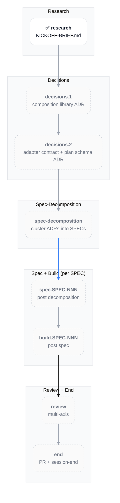
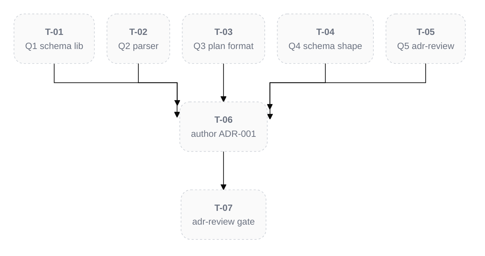

# PLAN-001: Skills Ecosystem

## Scope

Build a zero-content-drift restructuring capability for Brain knowledge-graph notes via a deterministic composition library (Bun + TS) plus four Claude Code skills (/ingest, /decompose, /recompose, /defrag). Workflow Type: Standard Development with Strategic Decision sub-flow for the architectural ADRs. Scope spans 5 per-type adapters (~1,200 LOC total) with SHA-256 char-identity hash validation as a BLOCKING invariant. Agent Sequence: orchestrator → architect (decisions.1 + decisions.2) → analyst (spec-decomposition clustering) → bun-ts-engineer (build) → qa (per-spec coverage gate) → review → end. Complexity: TIER_4. Risk: HIGH — the bootstrapping incident (3,680-line ADR split with 35% content drift on 10/12 D-Ns) is the explicit reason this work exists; the entire architecture exists to make a recurrence mathematically impossible via round-trip property testing.

**Source**: see `KICKOFF-BRIEF.md` in the project root for full background, locked design decisions (8 items), build order, LLM-script division of labor, and the 5 open design questions awaiting adjudication in decisions.1.

## Objectives

- [ ] Composition library at `_shared/composition/` produces SHA-256 char-identity verified decompose/recompose for the ADR adapter (PROOF)
- [ ] Round-trip property test (decompose ∘ recompose = identity on SHA-256) passes for ADR adapter
- [ ] /decompose and /recompose skills operational against ADR notes
- [ ] All 5 adapters (ADR, ANALYSIS, SESSION, PLAN, SPEC subtree) ship with passing round-trip tests
- [ ] /defrag skill operates as periodic curator delegating to /decompose + /recompose
- [ ] /ingest skill ships as Brain-aware variant of memory-ingest with verbatim source preservation
- [ ] Skills installed via symlinks at `~/.claude/skills/<name>` → `~/Dev/skills/<name>`
- [ ] Zero net-new content drift detected in any test fixture or production note touched by the skills

## Progress Dashboard

| Phase | DRAFT | IN_PROGRESS | BLOCKED | DONE | Total |
|:--|:--|:--|:--|:--|:--|
| research | 0 | 0 | 0 | 1 | 1 |
| decisions | 1 | 0 | 0 | 1 | 2 |
| spec-decomposition | 1 | 0 | 0 | 0 | 1 |
| spec.SPEC-NNN | 0 | 0 | 0 | 0 | 0 (created post spec-decomposition) |
| build.SPEC-NNN | 0 | 0 | 0 | 0 | 0 (created post per-spec spec phase) |
| review | 1 | 0 | 0 | 0 | 1 |
| end | 1 | 0 | 0 | 0 | 1 |
| **Total visible** | **4** | **0** | **0** | **2** | **6** |

## Workflow Plan

Research → decisions (×2 ADRs) → spec-decomposition → per-SPEC spec + build cycles → review → end. Research is short-circuited: the user provided `KICKOFF-BRIEF.md` (a comprehensive PRD-equivalent with locked architectural decisions, build order, and 5 open questions) which substitutes for the analyst-dispatch /research output per explicit user direction.

Heavy /plan create dispatches (analyst first-principles + pre-mortem + critic) were SKIPPED for the bootstrap turn — KICKOFF-BRIEF.md contains baked-in first-principles answers, an explicit post-mortem of the prior drift incident, and an explicit critique target via the 5 open questions adjudicated in Step 5 AskUserQuestion. Per the iterative-phase-reentry rule, validation phases can re-enter if gaps surface during decisions.1 adjudication.

Per-part workflow detail lives in each per-part H3 below.

## Phase Progression

| Phase | Status | Output Artifact |
|:--|:--|:--|
| research | DONE | `KICKOFF-BRIEF.md` (project root file; not a Brain note) |
| decisions.1 | DONE | [[ADR-001: Composition Library Architecture]] |
| decisions.2 | READY | [[ADR-002: Adapter Contract and Plan Schema]] (to be authored) |
| spec-decomposition | PENDING | N×[[SPEC-XXX ...]] root notes + decomposition rationale |
| spec.SPEC-NNN | PENDING | per-SPEC REQ/DESIGN/TASK subtree (created post spec-decomposition) |
| build.SPEC-NNN | PENDING | per-SPEC implementation + tests + commits |
| review | PENDING | adversarial multi-axis review across feature surface |
| end | PENDING | PR + final session-end checklist |

## Cross-Part Dependency Graph

## Decision Log

- **2026-05-19** — PLAN-001 created via /plan create with `--name skills-ecosystem`. Branch `feat/plan-001-skills-ecosystem` was pre-created during bootstrap Step 1; /plan honored the existing non-main branch per skill branch policy.
- **2026-05-19** — research part marked DONE upfront with `KICKOFF-BRIEF.md` (project root file) as outcome reference (file-path, not wikilink — the brief is a project-config file under the binary-rule, not a Brain note). Justification: user explicitly directed "skip /research dispatch — KICKOFF-BRIEF.md IS the research output". Deviation from outcome-wikilink convention documented here.
- **2026-05-19** — Heavy /plan create dispatches (analyst first-principles + pre-mortem + critic) were SKIPPED for the bootstrap turn. KICKOFF-BRIEF.md contains baked-in first-principles answers, an explicit post-mortem of the prior drift incident, and an explicit critique target via the 5 open questions adjudicated in Step 5 AskUserQuestion. Per the iterative-phase-reentry rule, validation phases can re-enter if gaps surface during decisions.1 adjudication or later.
- **2026-05-19** — complexity_tier set to TIER_4 (multi-skill ecosystem ~1,200 LOC across 5 adapters + 4 skills + composition library with cryptographic invariant). Re-evaluate at spec-decomposition if SPEC count exceeds 6.
- **2026-05-19** — Q1-Q5 of decisions.1 LOCKED via AskUserQuestion (all Recommended options selected). D-1 Zod for plan validation; D-2 unified + remark + remark-frontmatter for markdown AST; D-3 YAML at docs/_restructure/*.yaml for plan files; D-4 unified discriminated union on source_type for plan schema; D-5 YES — /brain:---adr-review BLOCKING gate before ACCEPTED. DoD checkboxes Q1-Q5 checked; D-N substatus table updated. ADR-001 authoring unblocked; awaiting user confirmation per bootstrap pause directive.
- **2026-05-19** — decisions.1 DONE. ADR-001 ACCEPTED at decisions/ADR-001-composition-library-architecture.md after brain:---adr-review Phase 4 convergence PASS round 1 (5 ACCEPT + 1 D&C + 0 BLOCK). P1 themes 1-4 resolved in-ADR refinement (hash protocol formal spec + rollback mechanism + security hardening + LOC scope); P1 themes 5-6 deferred with rationale + quantitative revisit triggers in CRIT-001-ADR-001 debate log. decisions.2 transitioned PENDING → READY.

## Progress Log

- **2026-05-19** — Bootstrap session started. Branch + docs/ subtree created (Step 1). Brain MCP project created and activated (Step 2). `KICKOFF-BRIEF.md` written verbatim (Step 3). PLAN-001 authored (Step 4). Pending: 5 open design question adjudication via AskUserQuestion (Step 5).
- **2026-05-19** — Step 5 complete: 5 open design questions adjudicated via AskUserQuestion (Q1-Q4 batched + Q5 follow-up). All Recommended options selected. PLAN updated with locked decisions in DoD checkboxes + D-N substatus table + Decision Log. Paused per bootstrap directive; ready to proceed to ADR-001 authoring via brain:🧠-architect dispatch + brain:---adr-review BLOCKING gate on user confirmation.
- **2026-05-19** — Step 6 (decisions.1 ADR-001 ACCEPTED) complete: /decisions Steps 5-9 executed (architect dispatch + detail-parity audit + 6-agent adr-review debate + Phase 3 P1 resolutions + CRIT authoring + ACCEPTED flip + state propagation). ADR-001 at decisions/ADR-001-composition-library-architecture.md (501 lines after Phase 3 refinements). decisions.2 READY; next-ready part on resume.

## Blockers

None. Awaiting user adjudication on 5 open design questions before decisions.1 can proceed.

## Analysis

### research — Bootstrap research (DONE)

**Substatus**: DONE
**Owning session**: [[SESSION-2026-05-19_01: Skills Bootstrap and PLAN-001]]
**Completing session**: [[SESSION-2026-05-19_01: Skills Bootstrap and PLAN-001]]
**Outcome**: `KICKOFF-BRIEF.md` (project root file; not a Brain note — see Decision Log 2026-05-19)
**Source artifacts**: prior session work — ADR-001 split incident in the `brain` project; `~/.claude/skills/plan/references/scope-evaluation-and-split.md`

**DoD**:

- [x] Background captured: drift root cause + architectural fix direction
- [x] Locked design decisions enumerated (8 items in KICKOFF-BRIEF.md)
- [x] Build order specified (ADR adapter FIRST; PROOF before extension)
- [x] Open questions enumerated (5 items pending decisions.1 adjudication)

#### Workflow Plan (for research)

Research-by-substitution: user provided KICKOFF-BRIEF.md as pre-baked research output. No analyst dispatch was run. Brief contains: mission, why-this-exists (post-mortem of ADR-001 split incident), locked architecture, LLM-script division of labor, per-type adapter build order, /defrag and /ingest scope, round-trip property test specification, key file references, 5 open design questions, non-negotiable constraints, out-of-scope items.

#### Tasks (for research)

None — research part is DONE.

#### Intra-part Deps Graph

N/A — single-step part.

#### Editor Mirror IDs

N/A — no tasks to mirror.

#### Pending User Decisions

None.

## Decisions

### decisions.1 — Composition library architecture ADR (DONE)

**Substatus**: DONE
**Owning session**: [[SESSION-2026-05-19_01: Skills Bootstrap and PLAN-001]]
**Completing session**: [[SESSION-2026-05-19_01: Skills Bootstrap and PLAN-001]]
**Outcome**: [[ADR-001: Composition Library Architecture]]
**Source artifacts**: `KICKOFF-BRIEF.md` (sections: Architecture, LLM-script division of labor, Constraints, Open design questions Q1-Q5)

**DoD**:

- [x] Q1 LOCKED — **Zod** for plan validation
- [x] Q2 LOCKED — **unified + remark + remark-frontmatter** for markdown AST
- [x] Q3 LOCKED — **YAML at docs/_restructure/*.yaml** for plan files
- [x] Q4 LOCKED — **Unified discriminated union on source_type** for plan schema
- [x] Q5 LOCKED — **YES — /brain:---adr-review BLOCKING gate** on architecture ADRs
- [ ] All 8 locked design decisions from KICKOFF-BRIEF.md restated verbatim in ADR-001
- [ ] ADR-001 frontmatter `status: ACCEPTED`; `date` + `updated` populated
- [ ] /brain:---adr-review PASS verdict before downstream phases (if Q5 = YES)

#### Workflow Plan (for decisions.1)

Per-D-N micro-cycle: decision-critic stress-test → AskUserQuestion (one decision at a time with Recommended default) → verbatim echo → diff approval → 2-step edit (PLAN + SESSION) → commit, repeated for D-1 through D-5. Composite ADR-001 authored once all D-Ns are locked, via `brain:🧠-architect` dispatch with detail-parity mandate. `brain:---adr-review` gates ACCEPTED status if Q5 resolves to YES.

#### Tasks (for decisions.1)

| T-ID | Group | Subject | Agent | Files | Effort | Created |
|:--|:--|:--|:--|:--|:--|:--|
| T-01 | D-1 | Adjudicate Q1: JSON Schema vs Zod | orchestrator | — | XS | (this PLAN) |
| T-02 | D-2 | Adjudicate Q2: AST vs regex parser | orchestrator | — | XS | (this PLAN) |
| T-03 | D-3 | Adjudicate Q3: plan file format | orchestrator | — | XS | (this PLAN) |
| T-04 | D-4 | Adjudicate Q4: unified vs per-adapter plan schema | orchestrator | — | XS | (this PLAN) |
| T-05 | D-5 | Adjudicate Q5: adr-review gate policy | orchestrator | — | XS | (this PLAN) |
| T-06 | ADR auth | Author ADR-001 (composite) | brain:🧠-architect | `docs/decisions/ADR-001-skills-ecosystem.md` | M | (this PLAN) |
| T-07 | ADR gate | Run brain:---adr-review on ADR-001 | brain:---adr-review | — | S | (this PLAN) |

#### Intra-part Deps Graph

#### D-N substatus list (for decisions.1)

| ID | Status | Topic |
|:--|:--|:--|
| D-1 | LOCKED | Q1 → **Zod** (TS-native, type inference, single source of truth) |
| D-2 | LOCKED | Q2 → **unified + remark + remark-frontmatter** (AST required for SPEC subtree accuracy) |
| D-3 | LOCKED | Q3 → **YAML at docs/_restructure/*.yaml** (human-readable, LLM-friendly authoring) |
| D-4 | LOCKED | Q4 → **Unified discriminated union on source_type** (clean type narrowing per adapter) |
| D-5 | LOCKED | Q5 → **YES — BLOCKING gate** (adr-review PASS required for ACCEPTED status) |

#### Editor Mirror IDs (for decisions.1)

| T-ID | CC-ID | Cursor-ID | Last synced |
|:--|:--|:--|:--|
| T-01 | — | — | not yet |
| T-02 | — | — | not yet |
| T-03 | — | — | not yet |
| T-04 | — | — | not yet |
| T-05 | — | — | not yet |
| T-06 | — | — | not yet |
| T-07 | — | — | not yet |

#### Pending User Decisions (for decisions.1)

All 5 open questions from `KICKOFF-BRIEF.md` ("Open design questions for early adjudication") surfaced via AskUserQuestion in Step 5 of the user-provided bootstrap. Adjudication unlocks ADR-001 authoring.

### decisions.2 — Adapter contract + plan schema ADR (READY)

**Substatus**: READY
**Owning session**: —
**Completing session**: —
**Outcome**: — (will be [[ADR-002: Adapter Contract and Plan Schema]])
**Source artifacts**: `KICKOFF-BRIEF.md` (Per-type adapter specifics), [[ADR-001: Composition Library Architecture]] (Q1-Q4 outcomes)

**DoD**:

- [ ] Plan schema shape defined (Distribution + Composition plan YAML structures)
- [ ] Adapter interface contract specified (parse / extract-by-range / renumber / wikilink-rewrite / serialize)
- [ ] Per-type adapter capability matrix (ADR / ANALYSIS / SESSION / PLAN / SPEC subtree)
- [ ] Hash-validation invariant codified (pre-mutation source hash vs post-reverse-mutation destination hash)
- [ ] ADR-002 frontmatter `status: ACCEPTED`; `date` + `updated` populated
- [ ] /brain:---adr-review PASS verdict before downstream phases (if Q5 = YES from decisions.1)

#### Workflow Plan (for decisions.2)

Same per-D-N micro-cycle as decisions.1. Decisions feed off decisions.1 output (plan validation lib + plan file format choices). Composite ADR-002 authored once all decisions locked.

#### Tasks (for decisions.2)

Not yet enumerated. Will be authored once decisions.1 completes (D-Ns depend on Q1/Q2/Q3/Q4 outcomes).

#### Intra-part Deps Graph

Pending — depends on decisions.1 outcomes.

#### D-N substatus list (for decisions.2)

Pending — D-Ns defined after decisions.1 completes.

#### Editor Mirror IDs (for decisions.2)

None yet.

#### Pending User Decisions (for decisions.2)

Pending — depends on decisions.1 outcomes.

## Spec-Decomposition

### spec-decomposition — Cluster ADRs into SPECs (PENDING)

**Substatus**: PENDING
**Owning session**: —
**Completing session**: —
**Outcome**: — (will be N×[[SPEC-XXX ...]] root notes)
**Source artifacts**: [[ADR-001: Composition Library Architecture]], [[ADR-002: Adapter Contract and Plan Schema]] (both pending authorship)

**DoD**:

- [ ] All ACCEPTED ADRs analyzed for coverage clustering
- [ ] SPEC decomposition surfaced via AskUserQuestion before locking
- [ ] N SPEC root notes authored (one per feature cluster)
- [ ] ADR coverage gate passes (every accepted ADR D-N is referenced by at least one SPEC)
- [ ] Conditional CVA dispatched if 3+ similar adapters share variability matrix

#### Workflow Plan (for spec-decomposition)

Stage 1 of /spec: analyst clustering dispatch + conditional CVA analysis → proposed SPEC decomposition → user adjudication via AskUserQuestion. Expected output: 4-6 SPECs aligned to KICKOFF-BRIEF.md build order (composition core + ADR adapter as SPEC-001 PROOF; subsequent adapters + skills in subsequent SPECs).

#### Tasks (for spec-decomposition)

Pending — defined post decisions.2.

#### Intra-part Deps Graph

Pending.

#### Editor Mirror IDs (for spec-decomposition)

None yet.

#### Pending User Decisions (for spec-decomposition)

Pending — SPEC decomposition shape surfaced post decisions.2.

## Review

### review — Multi-axis adversarial review (PENDING)

**Substatus**: PENDING
**Owning session**: —
**Completing session**: —
**Outcome**: — (will be CRIT note(s))
**Source artifacts**: all built SPECs + composition library + skills

**DoD**:

- [ ] All applicable axes (CODE / DOCS / CONFIG / TEST PR-type classification) pass per /review skill protocol
- [ ] All P0 + P1 findings resolved or explicitly deferred with rationale
- [ ] Verdict ACCEPT (or DISAGREE_AND_COMMIT with rationale)

#### Workflow Plan (for review)

/review skill default flow.

## End

### end — PR creation + session-end checklist (PENDING)

**Substatus**: PENDING
**Owning session**: —
**Completing session**: —
**Outcome**: — (will be PR URL or session-end final commit SHA if local-only)
**Source artifacts**: full PLAN-001 history

**DoD**:

- [ ] All PLAN parts DONE or explicitly DEFERRED/ABANDONED
- [ ] Session-end checklist complete (all [x] in current session note)
- [ ] PR created (note: project is local-only initially per locked design decision 4; PR step is gated on the user opting to add a remote)
- [ ] `npx markdownlint-cli2 --fix "**/*.md"` clean
- [ ] All commits pushed to local branch

#### Workflow Plan (for end)

/end skill default flow. PR step contingent on remote being added; if local-only, /end stops at session-end checklist completion + final session-end commit.

## Risks

1. **Content drift in subagent dispatch** — HIGH probability, HIGH impact. Mitigation: the entire composition library architecture IS the mitigation; round-trip property test gates protocol changes; LLM removed from content-modifying loop entirely.
2. **Hash validation false positives from deterministic mutations** — MEDIUM probability, MEDIUM impact. Mitigation: extract pre-mutation source, apply reverse mutation to destination, then compare. Tests exercise this on synthetic fixtures before any production note touched.
3. **Adapter complexity creep on SPEC subtree** — MEDIUM probability, MEDIUM impact (~500 LOC, recursive rewrite of filenames + relations). Mitigation: build simplest adapter FIRST (ADR ~250 LOC PROOF); validate architecture before tackling SPEC subtree.
4. **Symlink-based skill installation breaks on Claude Code reload semantics** — LOW probability, MEDIUM impact. Mitigation: install.sh provides both symlink and copy modes; if symlinks misbehave, fall back to rsync-copy install.
5. **Coexistence drift with existing memory-ingest / memory-defrag** — LOW probability, LOW impact. Mitigation: explicit locked design decision to coexist (not delete or rename); /ingest auto-detects Brain vs Basic Memory from frontmatter type and routes accordingly.

## Observations

- [decision] PLAN-001 created 2026-05-19 covering Standard Development workflow (research + decisions ×2 + spec-decomposition + per-SPEC spec/build + review + end) for the skills-ecosystem project #plan-bootstrap #workflow
- [decision] research part marked DONE upfront; KICKOFF-BRIEF.md substitutes for analyst-dispatch research output per explicit user direction #research-substitution #bootstrap
- [decision] Heavy /plan create dispatches (analyst + pre-mortem + critic) deferred to iterative re-entry post decisions.1 adjudication if gaps surface #pragmatic-bootstrap #iterative-phase-reentry
- [decision] complexity_tier = TIER_4 (multi-skill ecosystem ~1,200 LOC across 5 adapters + 4 skills + composition library with cryptographic invariant) #complexity
- [constraint] SHA-256 char-identity hash check is BLOCKING invariant — failed validation = ROLLBACK, never partial write; LLM authors plans only, never modifies content bytes #zero-drift #hash-validation
- [constraint] LLM-for-plan + script-for-execution architectural pattern is the explicit anti-drift mechanism #architecture
- [constraint] Build order: ADR adapter FIRST as PROOF (~250 LOC); validate architecture before extending to other 4 adapters #build-order
- [requirement] Every IN_PROGRESS part must have an owning session for recoverability #recoverability
- [requirement] Every DONE part must have both completing_session AND outcome reference #provenance
- [risk] Content drift in subagent dispatch is the explicit reason this work exists — the bootstrapping incident (3,680-line ADR split, 35% drift on 10/12 D-Ns) is documented in KICKOFF-BRIEF.md as the post-mortem #drift-prevention
- [risk] SPEC subtree adapter is the hardest (~500 LOC, recursive rewrite); deferred behind ADR PROOF to validate architecture first #adapter-complexity

## Relations
- contains [[SESSION-2026-05-19_01: Skills Bootstrap and PLAN-001]]
- pairs_with [[brain:---adr-review]]
- pairs_with [[sync-jira]]
