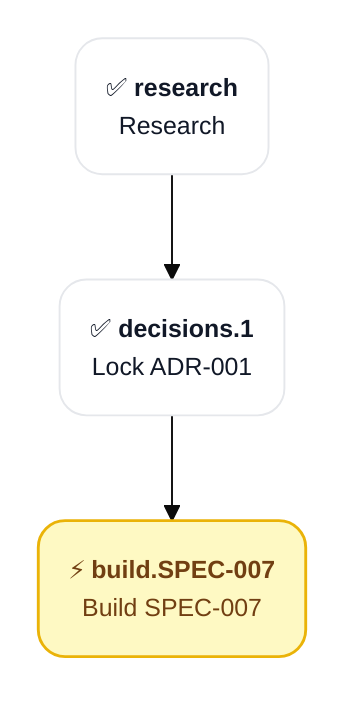

# PLAN-001: Sample Render Fixture

## Scope

Sample plan for round-trip fixture. Covers minimum viable structure to exercise every renderer code path.

**Source**: [[ANALYSIS-002: Plan/Session Note Render Architecture]]

## Objectives

- [ ] Round-trip parser and renderer
- [x] Cross-field invariants enforced

## Progress Dashboard

| Phase | PENDING | IN_PROGRESS | BLOCKED | DONE | Total |
|:--|--:|--:|--:|--:|--:|
| research | 0 | 0 | 0 | 1 | 1 |
| decisions | 0 | 0 | 0 | 1 | 1 |
| build | 0 | 1 | 0 | 0 | 1 |
| **Total** | **0** | **1** | **0** | **2** | **3** |

## Cross-Part Dependency Graph

## Phase Progression

### research

- **Phase**: research
- **Title**: Research
- **Substatus**: DONE
- **Completing Session**: SESSION-2026-05-19_01
- **Outcome**: [[ANALYSIS-001: Sample]]
- **Source Artifacts**: (none)
- **Depends On**: (none)

**DoD**:

- [x] Findings captured

### decisions.1

- **Phase**: decisions
- **Title**: Lock ADR-001
- **Substatus**: DONE
- **Completing Session**: SESSION-2026-05-19_02
- **Outcome**: [[ADR-001: Sample]]
- **Source Artifacts**: [[ANALYSIS-001: Sample]]
- **Depends On**: research

**DoD**:

- [x] ADR ACCEPTED

**Decisions**:

| ID | Status | Topic |
|:--|:--|:--|
| D-1 | LOCKED | Use Zod |
| D-2 | LOCKED | Use unified+remark |

### build.SPEC-007

- **Phase**: build
- **Title**: Build SPEC-007
- **Substatus**: IN_PROGRESS
- **Owning Session**: SESSION-2026-05-20_04
- **Source Artifacts**: [[SPEC-007: Sample]]
- **Depends On**: decisions.1

**DoD**:

- [ ] All tasks DONE
- [ ] Round-trip PASS

**Build Workflow Items**:

#### impl-TASK-001-SPEC-007

- **Type**: impl
- **Task Ref**: TASK-001-SPEC-007
- **Status**: IN_PROGRESS
- **Owning Session**: —
- **Transitioned At Event**: —
- **Failed Iterations**: 0
- **QA Ref**: —
- **Fix Brief For Event**: —

#### qa-TASK-001-SPEC-007

- **Type**: qa
- **Task Ref**: TASK-001-SPEC-007
- **Status**: PENDING
- **Owning Session**: —
- **Transitioned At Event**: —
- **Failed Iterations**: 0
- **QA Ref**: —
- **Fix Brief For Event**: —

## Tasks

### Active

| ID | Subject | Part | Status | Effort | Agent | Files | Created | Resolved |
|:--|:--|:--|:--|:--|:--|:--|:--|:--|
| T-01 | Implement parser | build.SPEC-007 | IN_PROGRESS | M | — | src/parsers/plan-note.ts | 1 | — |

### Backlog

(none)

### Archive

| ID | Subject | Part | Status | Effort | Agent | Files | Created | Resolved |
|:--|:--|:--|:--|:--|:--|:--|:--|:--|
| T-02 | Implement renderer | build.SPEC-007 | DONE | M | — | src/renderers/plan-note.ts | 1 | 3 |

## Pending User Decisions

### PUD-001

- **Part**: build.SPEC-007
- **Surfaced At Event**: 2
- **Surfaced Session**: SESSION-2026-05-20_04
- **Question**: Group Mermaid by phase by default?

**Options**:

- **Yes**: groupBy phase as default
- **No**: Flat graph as default

## Editor Mirror IDs

| Task | CC ID | Cursor ID | Last Synced |
|:--|:--|:--|:--|
| T-01 | cc-123 | — | 2026-05-20T12:00:00Z |
| T-02 | — | cur-456 | — |

## Blockers

(none)

## Observations

- [decision] Markdown is authoritative state #adr-003 #render
- [fact] Round-trip property test gates correctness #proof
- [constraint] SHA-256 char-identity required #invariant

## Relations

- implements [[ADR-003: Plan/Session Render Architecture]]
- depends_on [[ANALYSIS-002: Plan/Session Note Render Architecture]]
- part_of [[PLAN-001: Skills Ecosystem]]
